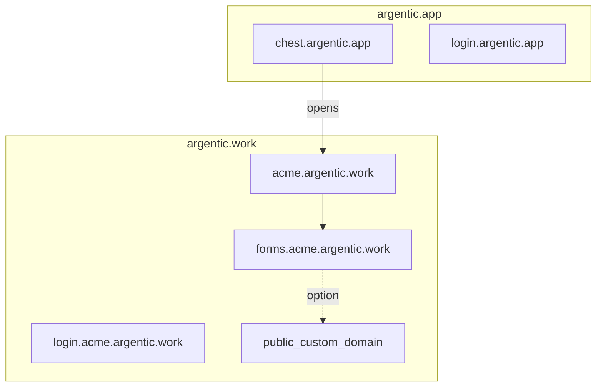

# Addresses

Two families of domains. The Argentic domain serves only Argentic code and
services. Customer Chests live under a **second base domain** reserved for
them, so that no customer application shares the domain of the Chest
account.

## Map

| What the user sees | Address (example) |
|---|---|
| Central (subscription, tracking) | `chest.argentic.app` |
| Owner account sign-in (central) | `login.argentic.app` |
| Chest portal (members) | `acme.argentic.work` |
| Chest sign-in | `login.acme.argentic.work` |
| Tool (Compartment) | `forms.acme.argentic.work` |

Two sign-ins not to be confused: **central** (Owner account / subscription) and
**Chest** (members, including the Owner for daily use). The user mostly
remembers their Chest’s address to work; `login.…` only appears for the
time it takes to identify.

## Rules

- **Every tool** has its own address, catalogue or custom.
- A Chest identifier that would read like an official address (`login`,
  `chest`, `www`, `support`…) is never assigned.
- The customer base domain will have to be listed on the Public Suffix List before
  broad opening to third-party applications, to also isolate customers
  from one another.

## Custom domain

On a tool’s **public face**, the company can plug in its own domain
name (shop, branded form). Chest manages DNS and TLS for that
domain.

A full white-label of the Chest portal (the whole Chest under the customer’s
domain) is outside this scope: broader than a public tool’s custom
domain.

## Embedded in the company’s website

Decided by Paul on 7 October 2026. A tool’s **public face** can also be shown
inside a page of the company’s own website — a job application form on
`acme.fr/careers`, as Calendly or Typeform are embedded.

- **Who decides:** the owner or an admin, in the tool’s Public tab, lists the
  sites allowed (`https://acme.fr`). HTTPS sites only, written exactly; no
  wildcard (each site is listed: a subdomain wildcard brings nothing a
  company with a few sites needs, and would let any subdomain frame the page).
  No fixed number of sites: the Chest's capacity is the only bound, as for its
  team; when it is reached, adding a site is refused with a clear message.
- **What can be framed:** the public face only, on its Chest address and on
  its custom domain. The members’ part is never shown in a frame, by anyone.
- **The code to paste:** the Public tab gives it once a site is allowed and
  the public face is open — a frame of the public address and a small script
  of the Chest that sets the frame to the height of the page, nothing else.
- **What the visitor sees:** the tool’s page, at its height, in the company’s
  page; while the tool wakes up, the Chest’s waiting page in the frame. A
  site not listed shows nothing.
- **Interface:** one section, “Embed on your website” / “Intégrer à votre
  site”: the sites (one per row, Remove), a field to add one, the code with
  its copy button.

## Diagram

## Where to go next

- [How it works](how-it-works.md)
- [Security](security.md)
