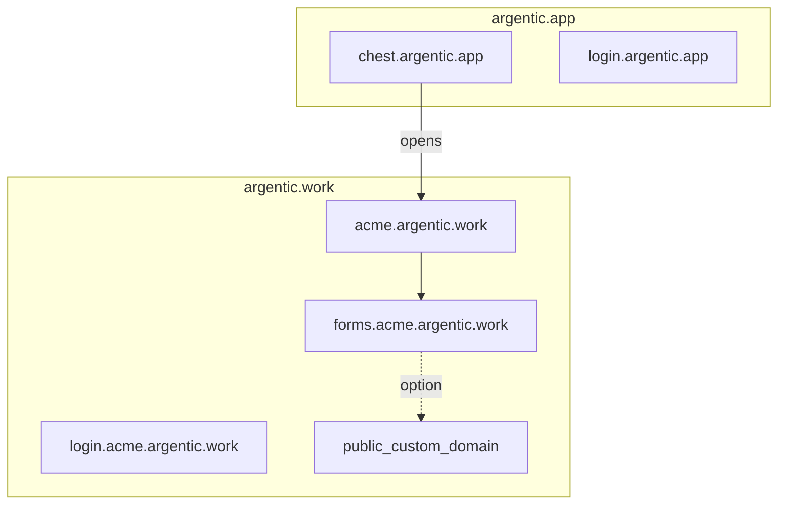

# Addresses

Two families of domains. The Argentic domain serves only Argentic code and
services. Customer Chests live under a **second base domain** reserved for
them, so that no customer application shares the domain of the Chest
account.

## Map

| What the user sees | Address (example) |
|---|---|
| Central (subscription, tracking) | `chest.argentic.app` |
| Owner account sign-in (central) | `login.argentic.app` |
| Chest portal (members) | `acme.argentic.work` |
| Chest sign-in | `login.acme.argentic.work` |
| Tool (Compartment) | `forms.acme.argentic.work` |

Two sign-ins not to be confused: **central** (Owner account / subscription) and
**Chest** (members, including the Owner for daily use). The user mostly
remembers their Chest’s address to work; `login.…` only appears for the
time it takes to identify.

## Rules

- **Every tool** has its own address, catalogue or custom.
- A Chest identifier that would read like an official address (`login`,
  `chest`, `www`, `support`…) is never assigned.
- The customer base domain will have to be listed on the Public Suffix List before
  broad opening to third-party applications, to also isolate customers
  from one another.

## Custom domain

On a tool’s **public face**, the company can plug in its own domain
name (shop, branded form). Chest manages DNS and TLS for that
domain.

A full white-label of the Chest portal (the whole Chest under the customer’s
domain) is outside this scope: broader than a public tool’s custom
domain.

## Diagram

## Where to go next

- [How it works](how-it-works.md)
- [Security](security.md)
