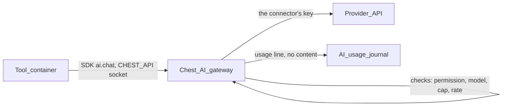

# AI gateway

**Specified 28 September 2026 from Paul's decisions of the same day; to build**
(batch AI in [status.md](../03_roadmap/status.md)). Replaces the “LLM gateway”
line of the [SDK and agents vision](../98_travail/sdk-and-agents-vision.md).
The owner's screen: [Owner space and billing](owner-space-and-billing.md);
the Chest's own agent, which spends through this gateway:
[Perseus](chest-agent.md).

## Goals

1. **One AI gateway for the whole Chest.** Tools call `ai.chat(…)`,
   `ai.embed(…)` through the SDK. **No tool ever sees a key**, and a tool needs
   no `network` entry to use AI.
2. **AI connectors with the company's own keys (BYOK) first.** The owner or an
   admin adds a connector — OpenRouter, Anthropic, OpenAI, Mistral, Google, or
   any OpenAI-compatible endpoint — and enters its key. Tools and Perseus use
   the connector's key through the gateway. No commission: the provider bills
   the company directly.
3. **Managed AI by Argentic comes later**: credits sold with a commission
   (e.g. through a partner agreement), a future revenue line (below).
4. **Private by default.** Zero-retention options where the provider offers
   them, a per-Chest model allowlist, usage logs **without prompt content**.
5. **Spend under control.** A monthly cap per tool set by the owner or an
   admin, an optional Chest-wide cap, alerts before the end.
6. **One path for everything that uses AI** — tools, Perseus, “Ask your
   Chest” — metered and observed the same way.

## Journeys

| Who | Journey |
|---|---|
| Builder (or agent) | Adds `"capabilities": ["ai"]` and an `ai` block to `chest.json`, calls `ai.chat({model: "default", messages})`; tests locally with `chest dev` ([develop and test](develop-and-test-tools.md)); proposes. |
| Owner, approving | Reads “Uses AI models through the Chest, up to €20 a month: summarises support tickets.” Approves; can change the cap later without a new approval. |
| Owner or admin, first AI tool | Settings → AI → Add a connector: picks the provider, pastes the key; the Chest checks it and sets sensible default aliases for that provider. |
| Member | Uses the tool. If the cap is reached or the key stops working, the tool says “AI features are paused” and the rest works. |
| Owner, month end | Settings → AI (and a summary in Plan & usage): estimated spend per tool; raise a cap. |

## How a call flows



The gateway runs **in the Chest** (the node process), not in the central: the
central stays out of business requests, a central outage does not stop AI, and
latency is one hop. The Chest itself, not the tool, reaches the provider,
over a pinned list of provider hosts (plus the base URL of a compatible
connector).

## SDK and wire shape

```ts
import { ai } from "@argentic/chest-sdk";

const r = await ai.chat({
  model: "default",                       // an alias or an allowed model id
  messages: [{ role: "user", content: "Summarise: …" }],
  maxTokens: 800,
  tools: [/* JSON-schema tools, passed through */],
  responseFormat: { type: "json_schema", schema },
  member: m.id,                           // optional: attribution in the usage log
});
// r: { text, message, toolCalls, finishReason, model, usage: {input, output, cached, cost} }

for await (const chunk of ai.chat({ model: "fast", messages, stream: true })) { … }

const e = await ai.embed({ model: "embedding", input: ["a", "b"] });
const models = await ai.models();          // allowed models, aliases, prices per million tokens
```

| SDK | Tool API (on `CHEST_API`) | |
|---|---|---|
| `ai.chat` | `POST /ai/chat` | OpenAI Chat Completions shape; SSE when `stream` |
| `ai.embed` | `POST /ai/embeddings` | |
| `ai.models` | `GET /ai/models` | |
| `ai.usage` | `GET /ai/usage` | this tool's month: spent, cap |

**Compatible endpoint.** Many libraries (OpenAI SDK, Vercel AI SDK, LangChain)
expect an OpenAI-style base URL. The launcher also serves, inside the
container only, `http://127.0.0.1:<port>/v1` (same mechanism as the egress
proxy's local port) and sets `CHEST_AI_BASE_URL` and `CHEST_AI_KEY` (a
per-instance value worthless outside that container). Pointing a library at
it goes through the same gateway, checks and metering.

**Aliases.** `default`, `fast`, `smart`, `embedding`, `agent`, each mapped by
the owner or an admin to a connector and a model. Tools should use aliases:
the model changes for the whole Chest without touching code. Exact model ids
work when they are in the allowlist. The `agent` alias is set on
[Perseus's page](chest-agent.md#perseus).

**Pass-through features.** Tool use (`tools`, `tool_choice`; the gateway never
runs a tool), structured outputs, images in messages, reasoning options,
prompt caching where the provider supports it. The gateway translates the
OpenAI shape to each direct provider's API; through an OpenRouter connector it
sets `provider.require_parameters: true` so routing picks only providers that
support what the request uses.

## Manifest

```json
{
  "capabilities": ["ai"],
  "ai": { "monthly": 20, "models": ["default", "embedding"], "purpose": "Summarises support tickets" }
}
```

| Key | Default | Sentence at approval |
|---|---|---|
| capability `ai` | — | “Uses AI models through the Chest, up to €20 a month: summarises support tickets.” |
| `monthly` | 5 (euros) | the amount in the sentence; the owner's cap replaces it |
| `models` | `["default"]` | “Models: default, embedding” when not only `default` |
| `purpose` | required, 120 characters | the end of the sentence |

Gaining `ai` is a new permission (owner or admin approval). The **cap is the
owner's**, set on the tool's page or in Settings → AI, raised or lowered at any
time without a new version. A later version asking a higher `monthly` only
suggests it; it never raises the cap by itself.

## AI connectors (BYOK)

- **One connector per provider**: OpenRouter, Anthropic, OpenAI, Mistral,
  Google, or OpenAI-compatible (base URL + key: a company proxy, a
  self-hosted model). The owner or an admin adds it and enters the key.
  Write-only, stored like secret variables (encrypted with the node key),
  checked with a cheap call (list models) before being saved, never returned
  by any route.
- **Several connectors may coexist**; each alias names one connector and one
  model.
- **Metering**: tokens always; cost from OpenRouter's `usage.cost`, or from a
  price table the Chest keeps for direct providers (refreshed with the SDK
  releases; marked “estimated”). Caps are in estimated euros. The company's own
  provider account is the final limit.
- **Privacy through OpenRouter**: `provider.zdr: true` (only endpoints that
  keep nothing) and `provider.data_collection: "deny"` on every request; the
  owner may switch off “Only providers that keep nothing” to reach more
  models. **Direct providers**: retention follows the company's account with
  that provider; the page says so and links to its settings. EU residency =
  an EU provider (Mistral) or an EU compatible endpoint.

## Later: managed AI by Argentic

A future revenue line, **not built now**: prepaid AI credits per Chest, sold
through Stripe with a commission (“model price + m %”), so an owner without
provider accounts gets AI in one click. It needs:

- **A partner agreement.** OpenRouter's terms (read 28 September 2026,
  section 7) forbid reselling API access; selling metered calls with a markup
  needs its written agreement (resale with commission, one sub-key per Chest
  with its limit set to the Chest's balance, EU routing, DPA, volume pricing)
  — or direct commercial agreements with Anthropic, OpenAI and Mistral.
- **Payment** ([Owner space and billing](owner-space-and-billing.md), batch
  PAY) and a credit ledger on the central: packs, optional auto top-up,
  expiry aligned with the partner's (OpenRouter: 365 days), alerts, a Chest
  balance with a hard stop.
- **Commission** covering the partner's purchase fee (OpenRouter 5.5 %),
  Stripe fees, exchange risk (USD cost, euro price), fraud and support, then a
  margin.
- Legal checks (LEG): prepaid credits usable only for Argentic's service, VAT
  at purchase, subprocessor register.

When it comes, it is one more connector (“Argentic AI”) in the same list; the
gateway, SDK and caps do not change.

## Limits and quotas

| | Default | Set by |
|---|---|---|
| Monthly cap per tool | the manifest's `monthly` (5 € if absent) | owner, admins |
| Monthly cap for the Chest (optional) | none | owner |
| Rate per tool | 60 requests a minute, 8 streams at once | owner, admins (up to 600 / 32) |
| Request body | 10 MiB (images included) | fixed |
| `maxTokens` | required ≤ the model's limit; the gateway fills a default of 4,096 | tool |
| Stream duration | 10 minutes | fixed |
| Chest-wide concurrency | 32 streams | fixed per plan (larger plans more) |

**No overshoot.** Before forwarding, the gateway reserves the worst case —
estimated input tokens + `maxTokens` at the model's price — against the tool's
cap and the Chest's cap; after the answer it settles to the real cost. A
request whose worst case does not fit is refused before any spend. A client
that disconnects mid-stream aborts the upstream request; the tokens already
produced are counted.

**Month totals survive restarts** (`installation/ai/month.json`, written with
each settlement), unlike in-memory rate counters.

**Alerts**: per tool at 80 % and 100 % of its cap (owner, admins, the tool's
builders); a connector's key refused (owner, admins).

## Errors

| Code | HTTP | When | SDK |
|---|---|---|---|
| `ai_not_granted` | 403 | the tool has no approved `ai` | `CapabilityNotGranted` |
| `model_not_allowed` | 403 | model or alias not in the allowlist | `AiModelNotAllowed` |
| `cap_reached` | 402 | the tool's or the Chest's month cap (`scope`) | `AiCapReached` (`resetsAt`) |
| `rate_limited` | 429 | per-tool rate or streams; `Retry-After` | `RateLimited` |
| `no_connector` | 503 | no connector behind the alias, or the Chest is paused | `AiUnavailable` (`reason`) |
| `provider_key_invalid` | 502 | the connector's key refused by the provider | `AiUnavailable` (`reason`) |
| `provider_unavailable` | 503 | the provider failed | `AiUnavailable` |
| `content_refused` | 422 | the provider's moderation | `AiRefused` |
| `too_large` | 413 | body or context too large | `TooLarge` |

**Graceful degradation is part of the contract.** The template and the SDK
docs show the pattern: catch `AiCapReached` and `AiUnavailable`, keep the tool
usable without AI, say “AI features are paused” to the member. The build-time
check warns when a tool calls `ai` without handling these errors (a hint, not
a refusal).

## Screens

**Settings → AI** (owner and admins)

```
AI
Connectors
  Anthropic      key ending …a1F2 · checked today                    Edit
  Mistral        key ending …9QxT · checked today                    Edit
                                                              Add a connector ›
Privacy         Only providers that keep nothing (OpenRouter)            On
                Keep prompts in usage logs                               Off

Models
  default       Anthropic · claude-sonnet-…    $3 / $15 per M tokens   Change
  fast          Mistral · mistral-small-…      $0.1 / $0.3             Change
  embedding     Mistral · mistral-embed        $0.1                    Change
  Allowed models: 6                                                   Edit ›

Tools                         This month (est.)  Cap
  CRM assistant               €5.10             €20        ━━━━━━━━━──────
  Perseus                     €2.50             €10        ━━━━━─────────
  Support desk                €0.00             €5

Usage                                               30 days · by tool · by model
  (one bar chart of daily spend; below it: requests, errors, p50 / p95 latency)
```

- **Add a connector**: a sheet with the providers, one key field (and a base
  URL for a compatible endpoint), checked before saving.
- **Models**: the allowlist is a searchable list from the connectors' model
  lists (price, context length, “keeps nothing” and EU marks where known);
  starting aliases per provider chosen by Argentic, updated with the SDK
  releases.
- **Tool page**: one line in Overview, “AI: €3.20 of €20 this month”, the cap
  editable there.

## Privacy and logs

- Usage line per call, `installation/ai/usage-YYYY-MM.jsonl`: time, tool,
  member id (if the tool gave one), agent id (for agent runs), alias,
  connector and model, input / output / cached tokens, cost, latency, status,
  request id. **Never the prompt, the answer, tool arguments or files.** Kept
  13 months, then aggregates only.
- **Keep prompts** (off; per tool, owner only, 24 hours at a time): for
  debugging, the Chest stores requests and answers encrypted on the server,
  shown on the tool's page to the owner and the tool's builders, deleted after
  24 hours; a banner on the tool's page says it is on.
- Nothing of AI usage reaches the central in v1.
- The providers of the configured connectors are the company's own
  subprocessors; the Settings → AI page says so.

## Agents and MCP

- **Perseus** calls the gateway with its own principal and the `agent` alias,
  through the connector chosen on its page; its monthly budget is a cap like a
  tool's ([Perseus](chest-agent.md)).
- **Connected agents** (Claude Code on a laptop…) pay their own reasoning; they
  do not use the Chest's connectors. An owner may allow a connected agent to
  call `POST /api/v1/ai/chat` (scripts, evaluations) with its own cap; off by
  default.
- `GET /api/v1/ai/usage` and the MCP tool `ai_usage` (per tool, per model,
  per day) for Maintainer agents and above; connectors and caps are changed
  by humans only.

## Data model

| Where | Record |
|---|---|
| Chest | `installation/ai/config.json`: connectors (provider, base URL, key fingerprint, last check), aliases, allowlist, privacy switches, per-tool caps and rates, Chest cap, alert state |
| Chest | `installation/ai/keys.enc`: connector keys, encrypted with the node key, never returned by any route |
| Chest | `installation/ai/month.json` (running totals, reservations), `usage-YYYY-MM.jsonl` |

## What to build, in lots

| Lot | Content | Depends on |
|---|---|---|
| **AI1 Gateway + connectors** | `chest/aigateway`: routes on the tool API, checks, reservations, streaming, usage journal, BYOK connectors (OpenRouter, Anthropic, OpenAI, Mistral, Google, compatible), price table; Settings → AI; manifest `ai` and its sentence | — |
| **AI2 SDK** | `ai.chat`, `embed`, `models`, `usage`, error classes; compatible endpoint in the launcher; `fakeChest` AI (canned or pass-through); template example with graceful degradation | AI1 |
| **AI3 Observability** | Usage chart, per-model view, keep-prompts switch, `/api/v1/ai/usage`, MCP `ai_usage` | AI1 |
| *Later: managed AI* | Partner agreement, “Argentic AI” connector, credits ledger, packs, commission, EU routing | AI1, PAY, the agreement |

Proofs: VM proof with a fake provider (streaming, tool calls, cap reached,
key refused, disconnect mid-stream counted, restart keeps totals, key never in
any response or log); a real BYOK call on a trial Chest.

## Open questions

1. Which connectors in AI1 (proposed: OpenRouter, Anthropic, OpenAI, Mistral,
   compatible; Google next)?
2. Starting allowlist and default aliases per provider (quality versus price;
   EU default?).
3. Managed AI, later: which partner (OpenRouter or direct providers) and what
   commission.
4. Per-member caps (a member who over-uses a tool)? Later, from real use.
