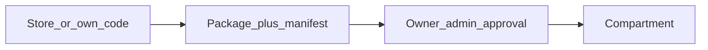

# Building a tool

How a tool enters a Compartment: store, fork, proposal, manifest,
SDK, runtimes. The **SDK primitives** below are fixed as intent;
the exact API format evolves with the first real tools.

## Same contract for everyone

Catalogue and custom tools follow the **same** package contract. No second
path of the “free-form Docker Compose” kind.

## Store

- GitHub organisation [`chest-by-argentic`](https://github.com/chest-by-argentic):
  one **public** repository per tool. Installing from the catalogue therefore requires
  no GitHub App and no account: the Chest reads a public repository, at
  a pinned version. First repository: `chest-by-argentic/forms`.
- Install as is into a Compartment, or **fork** to adapt.
- A fork is no longer the catalogue tool: proposal, approval, Builder;
  no automatic store updates on that fork.
- First reference tool of the store: **Forms** (Next.js + database) —
  several forms, response collection, tracking per form. Part
  of the [expected success](../01_vision/journey.md#expected-success). Minimal foundation to
  keep: draft, explicit publication, anonymous response, protected
  viewing, closing collection without deleting responses; a member
  without access bypasses nothing through the direct URL. The Core does not carry
  Forms’ business logic.

**What exists** (22 September 2026, phase 1): a Chest opens **empty**,
nothing is preinstalled or shipped with it, Forms included; it discovers the
catalogue by reading the organisation (public repositories with a `chest.json`, head
of the default branch), at most once a day, when the owner
opens “Outils” (Tools); the owner approves the displayed accesses in one click and the Chest reads the public
archive of that commit, builds it and installs it on its own, saying how far along it is;
code that does not declare what its published manifest announces is refused before
any build. When the catalogue moves forward, an installed tool offers
“Mettre à jour <outil> (commit abc1234)” (Update <tool>) with what the new version
asks for in addition: a decision for the owner, never automatic; rollback to the
previous version in one click.

Lead listed in [still-open decisions](../01_vision/concepts.md#still-open-decisions):
third-party publishers and paid apps in the store.

## Proposal, GitHub and agents

1. A member connects **GitHub** and can issue an **agent key**.
2. The agent (or the human) pushes the package to the linked repository; Chest fetches and
   builds. See [For agents](for-agents.md).
3. **Proposal** (default): the Owner or an admin reads the manifest and decides — nothing
   runs before that. **Auto-deploy**: possible if the Owner has allowed it for
   this member / this key, under the manifest rules.
4. After the first validation: the author becomes the Builder of this tool.

### Updates by the Builder

The Builder can publish a new version **without** going back through the Owner/admin
as long as the manifest **does not ask for more** permissions than the
already approved version. As soon as it widens permissions: new
approval required.

Installing ≠ opening to the whole team. Compartment access is set separately.

## Manifest

Similar in spirit to a Chrome extension’s `manifest.json`: the tool **declares** what
it needs (private/public access, files, mail, Postgres, connectors,
etc.). The platform **grants** nothing on the mere presence of the file.
A human approves; the server enforces.

The manifest is the **gatekeeper**, in three places:

1. **At build** — the code must reflect the requested permissions: the SDK
   building blocks the code uses are compared with the manifest. A mismatch
   (the code sends mail, the manifest does not ask for it) is flagged before
   any execution. It is a consistency check, not a proof: code
   can lie.
2. **At run time** — the server grants only what has been approved, whether
   the tool goes through the SDK or not. This is the real boundary.
3. **At each version** — the manifest difference is put into words for
   the Owner: “asks for in addition: sending mail”. Without a difference, the Builder
   (or the agent) deploys alone.

## SDK — primitives

The builder / agent **does not rewrite** these building blocks. No provider keys
in the app: **capabilities**, not credentials.

| Primitive | Intent |
|---|---|
| **Member** context + **role** | Private access: the member’s identity and their role in this tool |
| **End-user** auth | Public access: tool accounts |
| **Files** | Storage isolated to the Compartment |
| **Mail** | `mail` capability: the tool sends through the **mail connector** that the company has plugged into its Chest (its own service, its domain), under a per-Compartment quota, without seeing the secret. The Chest’s sign-in emails are another circuit, relayed by central. |
| **Postgres** | One database per Compartment if requested |
| **Connectors** | Bounded external calls (an admin configures the connector; the tool does not have the key) |

Payments inside a tool: later, through a **Stripe connector** on public access (the company’s Stripe account). AI models: through the [AI gateway](ai-gateway.md) (`ai` capability).

The SDK makes calls easier. It is **not** the security boundary. Bypassing
the SDK does not bypass server-side controls.

Language of the first SDK: TypeScript. Runtime: **Node first**; Python
next, once Node has been proven by a real tool.

## Connectors

An admin (or the Owner) configures a connector once (e.g. a SaaS service).
Tools declare in the manifest the capabilities they want. At run time
they call through the SDK; they **never see** the secret. Deny by default
outside the approved scope.

## Groups and roles (private access)

The **group** is at the Chest level, the **role** at the tool level. The tool declares its roles
in the manifest (“manager”, “seller”), including a default role. The
owner sets the Compartment’s access: who enters, and as what —
“all members → reader; Sales → seller; Camille → manager”. At
run time, the tool reads the calling member’s role through the SDK; it knows
neither the groups nor the other tools.

## Runtimes and data

- A Compartment runs on **Node**. **Python** comes after, once the first
  runtime has served a real tool (Forms in Next.js).
- **PostgreSQL**: one database **per Compartment** that asks for it in its
  manifest. No database shared between tools.

## Access in the package

The package declares whether it exposes **private** access, **public** access, or
both.

Never run an untrusted package’s script under the origin of the Chest
session. Technical isolation of internal UIs: [Security](security.md).

## Where to go next

- [For agents](for-agents.md)
- [Members and notifications](members-and-notifications.md)
- [Tool storage](tool-storage.md)
- [Journey](../01_vision/journey.md)
- [Security](security.md)
