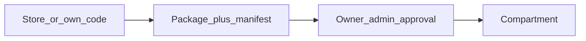

# Building a tool

How a tool enters a Compartment: store, customization, proposal, manifest,
SDK, runtimes. The **SDK primitives** below are fixed as intent;
the exact API format evolves with the first real tools.

## Same contract for everyone

Catalogue and custom tools follow the **same** package contract. No second
path of the “free-form Docker Compose” kind.

## Store

- GitHub organisation [`chest-by-argentic`](https://github.com/chest-by-argentic):
  one **public** repository per tool. Installing from the catalogue therefore requires
  no GitHub App and no account: the Chest reads a public repository, at
  a pinned version. First repository: `chest-by-argentic/forms`.
- Install into a Compartment, then **customize** it with Perseus if needed:
  the changes live in the Chest on top of the catalogue commit, the store's
  updates are re-applied and offered, the name and data stay
  ([Customize an installed tool](perseus-build.md#customize-an-installed-tool)).
- First reference tool of the store: **Forms** (Next.js + database) —
  several forms, response collection, tracking per form. Part
  of the [expected success](../01_vision/journey.md#expected-success). Minimal foundation to
  keep: draft, explicit publication, anonymous response, protected
  viewing, closing collection without deleting responses; a member
  without access bypasses nothing through the direct URL. The Core does not carry
  Forms’ business logic.

**What exists** (22 September 2026, phase 1): a Chest opens **empty**,
nothing is preinstalled or shipped with it, Forms included; it discovers the
catalogue by reading the organisation (public repositories with a `chest.json`, head
of the default branch), at most once a day, when the owner
opens “Outils” (Tools); the owner approves the displayed accesses in one click and the Chest reads the public
archive of that commit, builds it and installs it on its own, saying how far along it is;
code that does not declare what its published manifest announces is refused before
any build. When the catalogue moves forward, an installed tool offers
“Mettre à jour <outil> (commit abc1234)” (Update <tool>) with what the new version
asks for in addition: a decision for the owner, never automatic; rollback to the
previous version in one click.

Lead listed in [still-open decisions](../01_vision/concepts.md#still-open-decisions):
third-party publishers and paid apps in the store.

## Proposal, GitHub and agents

1. A member connects **GitHub** and can issue an **agent key**.
2. The agent (or the human) pushes the package to the linked repository; Chest fetches and
   builds. See [For agents](for-agents.md).
3. **Proposal** (default): the Owner or an admin reads the manifest and decides — nothing
   runs before that. **Auto-deploy**: possible if the Owner has allowed it for
   this member / this key, under the manifest rules.
4. After the validation: the author becomes a **builder** (a Chest status,
   if they were not one yet) who can change this tool — one of their tools
   ([Perseus Code](perseus-build.md), “Builders”).

Or, without GitHub, a builder builds the tool with Perseus in the Chest:
**Add a tool → Build with Perseus** ([Perseus Code](perseus-build.md)).

### Updates by the Builder

The builder of a tool (a builder who created it, or whom the Owner or an admin gave it) can publish a new version **without** going back through the Owner/admin
as long as the manifest **does not ask for more** permissions than the
already approved version. As soon as it widens permissions: new
approval required.

Installing ≠ opening to the whole team. Compartment access is set separately.

### When an installation fails

**The address and the repository are the tool's only once it runs**
(decided 30 September 2026 by Paul, after Japan on `test9`). While an
installation runs, its address and its repository are only held, so two
installations cannot take them. If it fails, both are **free at once** —
nothing to cancel to get them back —, and the attempt is never left without
a way out: it stays a row of **Tools** — “<Tool> — The installation
failed”, the reason in plain words, **View the log** — and, for the Owner
and the admins, two actions, also on the tool's Deployments:

- **Retry** checks the address is still free — taken meanwhile, the
  install sheet of the repository opens with it, to choose another — and
  the repository linked to no other tool, holds them again, then installs
  the build if it is ready, otherwise builds the **same commit** again and
  installs it. The address and the link become the tool's when it runs.
- **Cancel** (confirmed) removes the row and the failed build.

Nothing is prepared for an address before the tool runs (the tools' hosts
are covered by the Chest's wildcard certificate). A repository already
linked, or held by an installation under way, says **to which tool** (“This
repository is already linked to the tool X (installation in progress).
Open it.”). A Chest links **as many repositories as it wants**: the owner
manages their own server (decided 30 September 2026 by Paul).

### Room for a new tool

What limits the tools of a Chest is its server, nothing else — no count of
tools, of builds or of linked repositories (decided 30 September 2026 by
Paul). A new tool is installed only if the server can still hold it:

- **Memory**: every tool **awake at once**, each with its memory, plus the
  new one, within **95 %** of what tools may use — the memory the tools'
  sleep and Settings → Server count.
- **Disk**: the disk used plus the image its build is expected to take (the
  average of the images the Chest keeps, 1 GB before any), within **90 %**
  of the disk. Every build weighs the disk, a new version too.

The install sheet stays as it is. When **Install** is clicked and the tool
would not fit, the same window becomes **“Your server is full”**: one
sentence of why (memory or disk), the numbers of the meters in **Details**,
and what resolves it, by role:

- the **owner**: **Move to the larger server** — a confirmation naming the
  next size (Starter → Team → Business → Scale), then **Request sent —
  Argentic enlarges your server; the Chest restarts for a few minutes.**
  Payment is not wired yet: the request reaches the operators (the central's
  Admin and their alert mail), who enlarge the server; it is where the
  one-click upgrade of [Owner space and billing](owner-space-and-billing.md)
  will be wired;
- the **owner and the admins**: **Free some space** — the tools, the
  largest first, each with **Remove** (the usual confirmation) — then
  **Retry the installation** once it fits;
- **anyone else**: “The server is full: ask the owner or an admin to
  enlarge it or to remove a tool.” (a proposal still reaches the owner,
  whose approval then shows the owner's screen).

The same screen follows **Retry**, an approval and a Perseus Code project
published as a new tool; an agent receives the typed reason (`server_full`
with the resource). The images of former versions are removed by the Chest:
it keeps the version in service and exactly one before it (Rollback), and
what waits for a decision.

The **Tools** page offers **Add a tool** alone; **Build with Perseus** is one
of its sources, at the top of Add a tool.

## Manifest

Similar in spirit to a Chrome extension’s `manifest.json`: the tool **declares** what
it needs (private/public access, files, mail, Postgres, connectors,
etc.). The platform **grants** nothing on the mere presence of the file.
A human approves; the server enforces.

The manifest is the **gatekeeper**, in three places:

1. **At build** — the code must reflect the requested permissions: the SDK
   building blocks the code uses are compared with the manifest. A mismatch
   (the code sends mail, the manifest does not ask for it) is flagged before
   any execution. It is a consistency check, not a proof: code
   can lie.
2. **At run time** — the server grants only what has been approved, whether
   the tool goes through the SDK or not. This is the real boundary.
3. **At each version** — the manifest difference is put into words for
   the Owner: “asks for in addition: sending mail”. Without a difference, the Builder
   (or the agent) deploys alone.

## SDK — primitives

The builder / agent **does not rewrite** these building blocks. No provider keys
in the app: **capabilities**, not credentials.

| Primitive | Intent |
|---|---|
| **Member** context + **role** | Private access: the member’s identity and their role in this tool |
| **The Chest** | What is the same for every member: the organization’s name, the Chest’s **time zone** (and “today” there) and its language — given to every tool, in a request or not (a scheduled job); the zone is also that of the tool’s database, so `current_date` is the company’s day. The tool never asks its own admin for them |
| **End-user** auth | Public access: tool accounts |
| **Files** | Storage isolated to the Compartment |
| **Mail** | `mail` capability: the tool sends through the **mail connector** that the company has plugged into its Chest (its own service, its domain), under a per-Compartment quota, without seeing the secret. The Chest’s sign-in emails are another circuit, relayed by central. |
| **Postgres** | One database per Compartment if requested |
| **Connectors** | Bounded external calls (an admin configures the connector; the tool does not have the key) |

Payments inside a tool: later, through a **Stripe connector** on public access (the company’s Stripe account). AI models: through the [AI gateway](ai-gateway.md) (`ai` capability).

The SDK makes calls easier. It is **not** the security boundary. Bypassing
the SDK does not bypass server-side controls.

Language of the first SDK: TypeScript. Runtime: **Node first**; Python
next, once Node has been proven by a real tool.

## Connectors

An admin (or the Owner) configures a connector once (e.g. a SaaS service).
Tools declare in the manifest the capabilities they want. At run time
they call through the SDK; they **never see** the secret. Deny by default
outside the approved scope.

## Groups and roles (private access)

The **group** is at the Chest level, the **role** at the tool level. The tool declares its roles
in the manifest (“manager”, “seller”), including a default role. The
owner sets the Compartment’s access: who enters, and as what —
“all members → reader; Sales → seller; Camille → manager”. At
run time, the tool reads the calling member’s role through the SDK; it knows
neither the groups nor the other tools.

## Runtimes and data

- A Compartment runs on **Node**. **Python** comes after, once the first
  runtime has served a real tool (Forms in Next.js).
- **PostgreSQL**: one database **per Compartment** that asks for it in its
  manifest. No database shared between tools.

## Access in the package

The package declares whether it exposes **private** access, **public** access, or
both.

Never run an untrusted package’s script under the origin of the Chest
session. Technical isolation of internal UIs: [Security](security.md).

## Where to go next

- [For agents](for-agents.md)
- [Members and notifications](members-and-notifications.md)
- [Tool storage](tool-storage.md)
- [Journey](../01_vision/journey.md)
- [Security](security.md)
