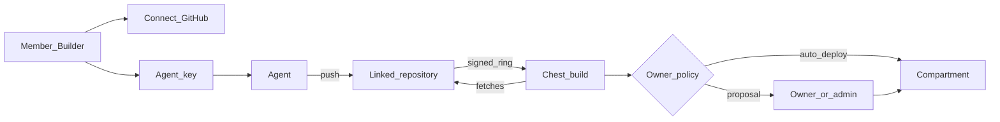

# For agents

Chest is designed so that the Builder’s **usual agent** (Cursor, Claude Code,
Codex…) ships a tool quickly: SDK for security, **GitHub as the code
relay**, **agent key** to talk to the Chest — **without** general access to the VPS.

## Intent

1. The human connects **GitHub** to their Chest and gets an **agent key** (scoped
   to member / Builder, one Chest, quotas).
2. The agent develops with the **SDK** (end-user auth, files, mail, Postgres,
   roles, connectors) and a manifest.
3. The agent **pushes** to the linked GitHub repository.
4. GitHub **rings** the Chest (a signed call, without code); the Chest **fetches**
   the code, builds and prepares the Compartment. Central plays no part
   in this.
5. Depending on the **Owner policy**: a proposal to approve, or auto-deploy if
   allowed (see below).

The agent does **not** configure provider secrets, does **not** choose
a parallel stack, has **no** shell on the VPS.

## Agent key

The agent is a **separate member** of the Chest: it appears in “Équipe” (Team) (“Agent de
Camille”, Camille’s agent), has its own log, and the Owner sets it a **ceiling**. Ceiling
of a new agent: private access, files, Postgres — no public access,
mail or connector without a human. Within the ceiling it creates, deploys,
updates; beyond it, it **proposes** and carries on with the rest. Inviting, opening to the public,
configuring a connector, deleting data: always a human.

- Issued in the Chest’s portal for a **member** (in practice a Builder or
  a member allowed to propose / deploy).
- Lets the agent act on **this** Chest only (status, link a repo,
  trigger proposal / deploy according to rights) — not central, not the
  other Chests, not the neighbour.
- Revocable. Not SSH access nor a connector secret.

## GitHub as a relay

- In the portal, the member **connects their GitHub to their Chest**: in one click,
  they install the service’s GitHub App, “Chest by Argentic”, on their
  account. Central holds the app’s key, issues the tokens and
  relays the rings; it never reads the code.
- They choose from a list the repositories the Chest can **read** — nothing
  else, never write.
- A repository (or a path) is **linked** to a Compartment or to a proposal.
- The agent pushes with its usual Git credentials (or the flow the kit documents).
- Chest **pulls** the code, builds it, runs it in the Compartment — the agent does not
  “get into” the server. The direction is always Chest → GitHub: no
  inbound Internet entry is opened for GitHub on the Chest.

Aligned with the store (GitHub repositories); a tool installed from GitHub can
also be customized in the Chest with Perseus, without writing to the repository
([Customize an installed tool](perseus-build.md#customize-an-installed-tool)).

**What exists** (22 September 2026, phase 2): a single GitHub App,
“Chest by Argentic”, which the owner installs on their account in one click
from their Chest; they link a repository and a branch; on a signed push (relayed by
central, which never reads the code) or on “Vérifier maintenant” (Check now) the Chest
fetches the commit and builds it: a tool not yet installed is
**proposed**; a tool in service is **updated with no one involved** if the
new version asks for nothing more (the Builder rule below), otherwise
it waits for the owner with “Demande en plus : …” (Also asks for: …). The
previous version comes back in one click, the data stays. No agent key yet
and no links by members: only the owner links, so auto-deploy
is theirs.

## The target scenario

A customer pays for a Chest, gives their agent access, goes away; on their return
the sites are **ready**. What stayed within the ceiling set by the Owner
is already running; what exceeded it is waiting for them, as readable proposals.
The **manifest is the gatekeeper** of this scenario: see
[Building a tool](building-tools.md#manifest).

## Owner policy — “without waiting”

Two modes, chosen by the Owner (or an authorised admin):

| Mode | Behaviour |
|---|---|
| **Proposal** (safe default) | Push → package pending; Owner/admin approves manifest + install |
| **Auto-deploy** | Push → runs without waiting **if** the policy allows it for this Builder / this key |

Rules fixed even in auto-deploy:

- update: OK without re-approval if the manifest **does not widen**
  permissions (Builder rule already decided);
- **new** tool / first Compartment / wider manifest: either
  mandatory proposal, or auto-deploy only if the Owner has
  explicitly allowed it for this member / this key (permission ceiling).

“Without waiting” = a controlled policy, not a total bypass of the Owner.

## SDK primitives

| Primitive | Use |
|---|---|
| **Member** context + **roles** | Private access |
| **The Chest** | The organization’s name, the time zone and “today”, the language |
| **End-user** auth | Public access |
| **Files** | Per-Compartment storage |
| **Mail** | Governed sending |
| **Postgres** | One database per Compartment if requested |
| **Connectors** | Capabilities, no keys in the app |

Payments inside a tool: later, through a **Stripe connector** on public access (the company’s Stripe account). AI models: through the [AI gateway](ai-gateway.md).

## Quickstart (target)

1. Open / join a Chest; connect **GitHub**; create an **agent key**.
2. Give the agent the key + the template + the SDK docs.
3. The agent implements (manifest + SDK) and **pushes**.
4. Chest builds; proposal or auto-deploy depending on policy.
5. Iterate: next push = update (re-approval only if the manifest is widened).

## Where to go next

- [Building a tool](building-tools.md)
- [Security](security.md)
- [Connected agents](chest-agent.md) (specified, after Perseus Code: statuses, safety limits, OAuth consent; code stays on GitHub)
- [Develop and test tools](develop-and-test-tools.md)
- [Perseus Code](perseus-build.md) (first priority: builders build a tool with Perseus, the Chest's own agent, without GitHub)
- [SDK and agents vision](../98_travail/sdk-and-agents-vision.md) (proposal: agents with powers)
- [Overview](../01_vision/overview.md)
