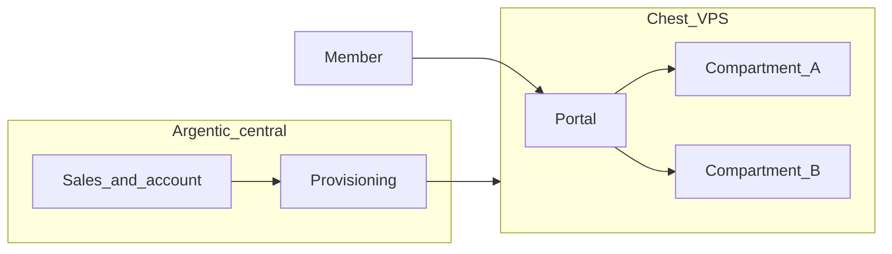
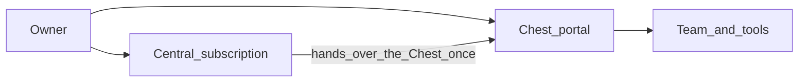
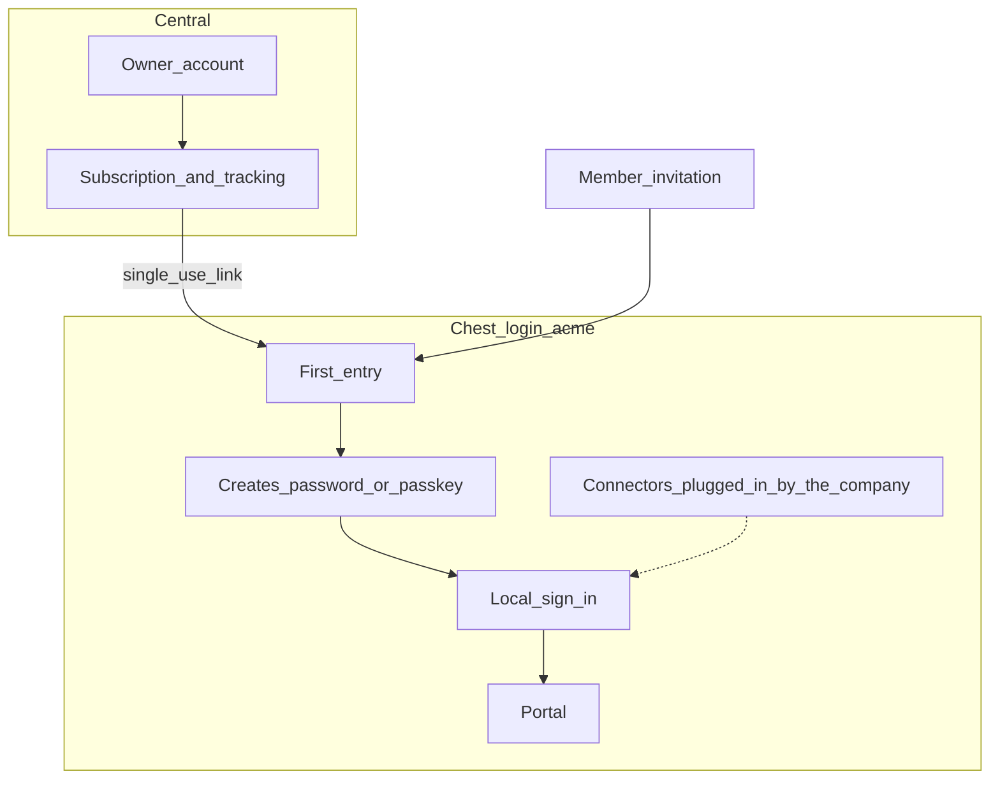
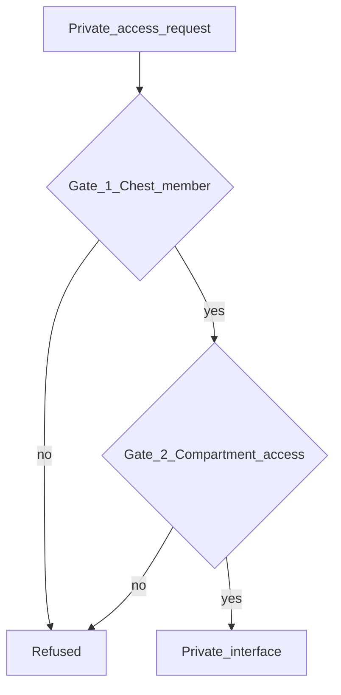
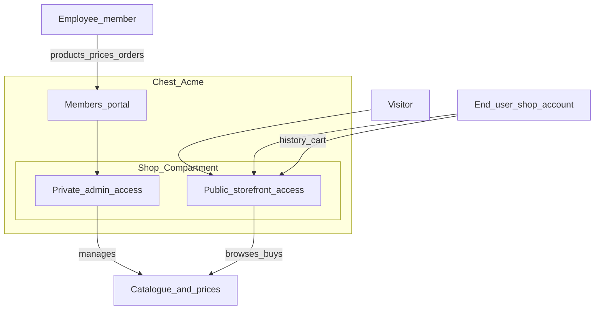
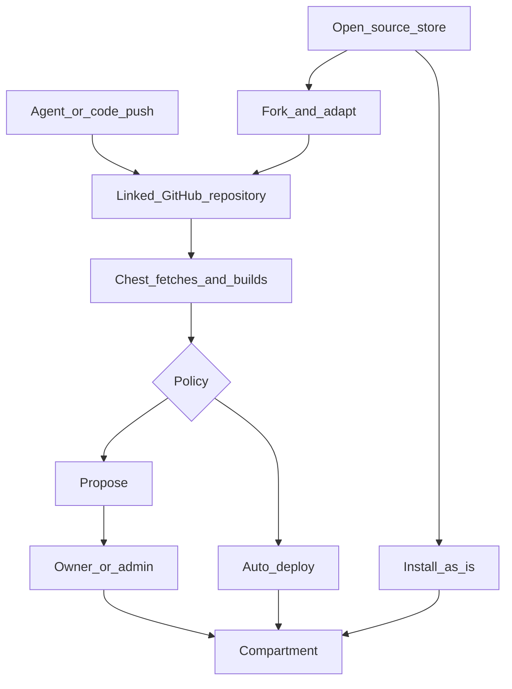

# How it works

The mental model on one page: central and the Chest, Compartments, two access
paths (**members** vs **end users** / visitors), store and tool proposals.

## Topology

A **central site** sells and opens the service. **One separate VPS per customer
Chest** hosts the portal and all of that company’s Compartments. Chests do not
share a machine.

The customer installs neither Linux nor Docker and does not repair their server
over SSH. Provisioning, operation, controlled updates, monitoring and backups
belong to the managed service.

A temporary outage of central must not block the use of an already deployed
Chest.

## Purchase, then the Chest

### Two places, one Owner

The Owner has **two** separate **surfaces**:

| Where | Role |
|---|---|
| **Central** (`chest.argentic.app`) | Argentic account: subscription, billing, tracking the Chest’s opening |
| **Chest** (`acme.argentic.work`) | Access to the Chest: portal, team, store, Compartments |

These are **two accounts**: the central one for the subscription, the Chest one
for use. Central hands the Chest over to the Owner only once, at opening;
afterwards the Owner always enters through `login.acme.argentic.work`, like
any member.

Other **members** generally have **only** Chest access (invitation). They
do not manage the subscription on central.

### Sign-in

**The Chest alone manages its members’ sign-in.** Central is never on the
path: no relay, no shared account. A central outage changes nothing about
entering an opened Chest.

| On the Chest | |
|---|---|
| Baseline | Email + password, or **passkey** |
| Reinforcement, if the Owner enables the option | In addition: a **six-digit code** sent by email at each sign-in |
| Sign-in connectors | Company SSO, GitHub, Google…: the **company** plugs them into its Chest, with its own credentials at the provider. Argentic manages no OAuth for Chests. |

**The Owner.** They sign in to central, subscribe, track the opening. When the
Chest is ready, the tracking page hands them a **single-use entry
link**; they arrive on their Chest and **create their password** there (or their
passkey). From then on, their sign-in to the Chest always happens from
`login.acme.argentic.work`. The link works only once. If the Owner loses all access, central
hands them another one, and the Chest logs it.

**Members.** Same step: invitation link, creation of the password or
passkey, then `login.acme…`. They have no account on central.

A tool’s **end users** (tool account) remain a third circuit, specific to
the Compartment.

Open details: [Open questions](../98_travail/debates.md).

### Sequence

1. The Owner creates their account and subscribes on central.
2. Argentic prepares the Chest and shows faithful tracking: a prepared step
   is not yet an available Chest.
3. The Owner enters the Chest’s portal: **empty Chest**.
4. Then: team, store, installations, capacity, status.

Commercial management stays on central. Team and tools are managed in the
Chest.

## Compartments

Each tool occupies a **Compartment**. This vocabulary does not create an extra
execution layer: the application’s technical identifier remains that of
the package.

A Compartment exposes zero, one or two faces. There are only **two** types
of access:

| Access | Who enters | Examples |
|---|---|---|
| **Private** | Authorised Chest **members** | Shop admin, CRM, internal messaging |
| **Public** | **Visitors** and **end users** (tool account) | Showcase, checkout, open form |

An app can therefore be:

- **private only** — internal tool, no business entry from the Internet;
- **public only** — open page or service, with no member interface;
- **both** — private for the team, public for customers (e.g. shop: employees in the admin, customers with a shop account).

Default public URL: derived from the tool’s name under the Chest’s domain.
A **custom domain** can be plugged into the public access.

## Two access paths

One becomes a **member of the Chest**, never of a Compartment. **Private** access to
each tool is a Compartment setting: all members, or some
(people, groups).

On private access, two gates:

The **public** path is separate: the person is not a member. Without an account,
they are a **visitor**. With a **tool account**, they are an **end user** of *that*
Compartment only — no access to the team or to other tools.

### Example: a shop in the Chest

A single “Shop” Compartment exposes both accesses.

- **Members** (employees): enter through the Chest’s portal → **private** access to
  manage products, prices, stock, orders.
- **Visitors**: open the shop’s URL (or custom domain), without an account.
- **End users**: same **public** access, with a **tool account** (linked cart,
  orders, etc.). They are not members of the Chest.

Vocabulary: [Concepts](../01_vision/concepts.md).

## Team

- The Owner invites **members** to the Chest (invitation link).
- Members sign in on the **Chest** only: invitation link, then
  email + password or passkey; company SSO and other connectors if
  the company has plugged them in.
- Organisation by **groups**: a member is placed in a group from the
  invitation onward. Each Compartment says which groups enter, and with which
  **role** of the tool (“Sales → seller”).

Installing a tool and deciding who enters it are two separate decisions. A
freshly installed Compartment is open only to the owner until decided
otherwise.

## Store, fork, proposal

- The **store** lists Argentic tools (open source on GitHub), ready to install
  or to fork.
- A member can link **GitHub** and issue an **agent key**; the agent pushes, Chest
  fetches and builds ([For agents](for-agents.md)).
- Any **member** can propose. Submission runs nothing while the mode
  is “proposal”.
- Only the **Owner** or an authorised **admin** approves (or enables bounded
  auto-deploy). The manifest sets the requested permissions.
- After validation, the author becomes **Builder**: updates without
  re-approval as long as the manifest does not widen permissions.

## SDK and platform

A tool’s frontend holds no secrets. Authority lives on the tool’s server side
and in Chest’s controls. The SDK exposes **primitives**:

- **member** context and **roles** (private access);
- **end-user** auth (public access);
- **files**, **mail**, **Postgres**;
- **connectors** (capabilities, no keys in the app).

Payments inside a tool: later, through a **Stripe connector** on public access (the company’s Stripe account). LLM: not in the SDK for now.

The SDK **is not** the security boundary. The manifest **requests**;
human approval **grants**.

Details: [Building a tool](building-tools.md), [For agents](for-agents.md),
[Security](security.md).

## Where to go next

- [Concepts](../01_vision/concepts.md)
- [For agents](for-agents.md)
- [Journey](../01_vision/journey.md)
- [Addresses](addresses.md)
