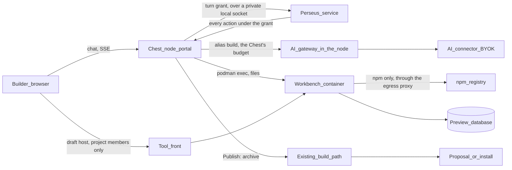

# Perseus Code

**Specified 28 September 2026 from Paul's direction of the same day; to build**
(batch PB in [status.md](../03_roadmap/status.md), **first priority after
AI1**). Named by Paul on 28 September **Perseus Build**, renamed on 29
September **Perseus Code** (French **Persée Code**), entered through
**Build with Perseus** at the top of Add a tool and of the Tools page,
which leads to its own page (redesigned on 29 September from Paul's
direction: “a page to build with it, with a conversation… like I'm
talking to you now in a chat”; simplified the same day: one button, a
calm page). **In French the agent is Persée** (the myth's French name):
the button reads **Créer avec Persée** everywhere,
the projects and drafts are “Les projets Persée Code”, “Brouillon · Persée
Code”. The code's identifiers and the `perseus` service keep their name.

A **builder** opens **Add a tool**, clicks **Build with Perseus**, describes
what the team needs, and talks with **Perseus**, the Chest's own agent, which
writes the tool, runs it in a **live preview** next to the conversation,
iterates with the builder, and hands over a tool ready to **publish into the
Chest** through the normal approval. Like v0, Lovable, Bolt or Replit Agent —
but inside the company's own Chest, on its own server, producing **governed
Chest tools**: a `chest.json` that asks, a human who grants, the SDK for
members, data and files, no key in the code. The same conversation also
**customizes a tool already installed** — from the catalogue or from
someone's GitHub — keeping its name, its data and its author's updates
([Customize an installed tool](#customize-an-installed-tool)).

## Perseus

**Perseus** is the Chest's own agent. The name comes from the myth: Perseus
was found in a chest. **Perseus v1 is the build agent and nothing else**
(Paul, 28 September): conversations to create and evolve tools, a live
preview, publishing with approval — this page. It acts **for the builder who
writes to it**, within that person's rights, only on the project's workspace,
preview and budget; it has no status, no sponsor and no power of its own on
the Chest. Everything else once imagined for Perseus (answering questions
about the Chest, maintenance, reacting to events, reports, its own statuses)
is in [Later (not planned)](#later-not-planned). Agents that people connect
from outside (Claude Code, Cursor, Codex) are a separate, lower-priority
topic: [Connected agents](chest-agent.md).

Research behind this page (open-source agents and harnesses, sandboxes, the
app builders) is summarised at the end of this page, “What we take from each project”.

## Goals

1. **From a sentence to a tool in service, without leaving the Chest.** No
   GitHub account, no laptop, no terminal. The builder sees the tool work
   before anyone approves it.
2. **A real agent product.** Conversations, sessions that resume, a plan the
   builder can read, questions when Perseus is unsure, checkpoints to go back,
   the cost of every turn shown.
3. **Perseus knows the Chest.** A built-in knowledge pack (SDK, `chest.json`,
   the rules, templates, catalogue examples) versioned with the Chest, plus a
   memory of the company's conventions.
4. **Safe by construction.** The code Perseus writes runs in an isolated
   sandbox with no secret, no production data and almost no network. Nothing
   reaches service without a builder's click and the usual approval.
5. **Simple for the user, simple to run.** One Chest, one page, no Git
   service to operate, GitHub unchanged.
6. **Builders are a Chest status.** Being a builder is what opens Perseus
   Build; a builder finds their projects and their tools in one place
   (below, “Builders”).

## What it is not

- Not a way around approval: a published tool follows the rules of every tool
  (proposal, owner approval of new permissions, builder updates).
- Not a way to write to GitHub: Perseus never writes to a repository (see
  “Where the code lives”). A tool installed from GitHub is customized in the
  Chest, its changes layered on the branch it follows.
- Not a general-purpose cloud IDE: no terminal for the builder, no arbitrary
  stack. Node tools on the Chest's contract, as for every tool.
- Not required: connected agents (Claude Code, Cursor, Codex) and GitHub
  remain a first-class path.

## Builders

**Decided (Paul, 28 and 29 September 2026): builder is a Chest-level
status**, between member and admin: **guest, member < builder < admin <
owner** (a guest has exactly a member's rights: [Members and
notifications](members-and-notifications.md)).
A builder uses Perseus Code and creates or imports tools, and **changes
only their tools**: those they created (published from their Perseus Code
project, or proposed from GitHub or the catalogue, and approved) and those
the owner or an admin gave them. **Nobody changes a tool they neither
created nor were given** — a builder included; the owner and the admins
change every tool.

One becomes a builder in three ways, all the same status: the owner or an
admin grants it directly; **the owner or an admin gives a member a tool**
(the member becomes a builder, said on screen: “Camille is now a builder
and can change CRM.”); **a member's proposal is approved** (its author
becomes a builder given that tool). There is no builder of a tool without
Perseus.

| | Member | **Builder** | Admin | Owner |
|---|---|---|---|---|
| Uses the tools they have access to | ✓ | ✓ (those granted, like a member; a tool they created is granted to them) | ✓ (every tool) | ✓ (every tool) |
| Proposes a tool from their GitHub | ✓ (becomes a builder when approved) | ✓ | installs | installs |
| **Uses Perseus Code** (projects, sessions, preview, publish) | — | ✓ | ✓ | ✓ |
| **Changes a tool** (deployments, build logs, rollback, variables — secrets write-only —, public part, network, redeploy, Perseus changes) | — | **the tools they created or were given**; their new versions go live on their own only where they see the data | all | all |
| **Sees a tool's data** through the Chest (database console, files, what the tool prints in its runtime log) | — | **only where the owner or an admin allowed it**, per builder and tool | all | all |
| Decides who has a tool and with which role (a builder's own access included) | — | — (reads it) | ✓ | ✓ |
| Domains, deleting a tool, approving a new permission, installing a new tool | — | — | ✓ | ✓ |
| Grants or removes the builder status, gives a tool to a builder or a member | — | — | ✓ | ✓ |
| Admin status, billing, the owner's settings | — | — | — | ✓ |

- **The status** is a flag on the member in the team (`builder`, like
  `admin`), granted and removed by the owner or an admin, in Team or the
  invitation, or given with a tool.
- **“Their tools”** are the policy's assignments (`builds`), held by
  builders only (the owner and admins, who change every tool, hold none).
  What a builder can do on them is exactly the per-tool powers of T2.
- **Removing a tool** from a builder (Team, or the tool's Access tab) keeps
  the status, even the last one: a builder without a tool is still a
  builder (Perseus Code, creating tools). Only the owner or an admin takes
  the status back, explicitly.
- **Removing the status**: a sheet lists what goes with it — Perseus Code
  and the tools they change (the tools stay, changed by the owner and the
  admins), and the projects (they stay, open to the owner and admins and to
  their other project members). A member who leaves the Chest loses both.
- **Tools see no change**: `Chest-Member`'s `builder` and the SDK's
  `isBuilder` keep meaning “can change *this* tool” (its builder), which is
  what a tool cares about.
- **Connected agents**: the agent status “Builder” ([Connected
  agents](chest-agent.md)) follows the same rule — its tools, the ones it
  proposed or was given.

**Decided (Paul, 29 September 2026): changing a tool is not seeing its
data.**

- **Access like a member; the creator has their tool** (Paul, 29
  September: otherwise the UX would be odd). A builder has a tool as any
  member does: a grant, a group, the tool open to all. **The member who
  created a tool** (published from Perseus Build, proposed from GitHub or
  the catalogue, and approved) **is given it at its approval**: an ordinary
  grant with the tool's default role (its first declared role), which the
  owner or an admin changes or takes back like any other. A builder only
  **given** a tool to change gets no access by default; the tool refuses
  them like any member without access, and they manage it from its page
  (no Open link). With access, the tool sees them as its builder
  (`isBuilder`) with their role.
- **Who has the tool is the owner's and the admins'.** A builder reads the
  tool's Access tab (who has it, with which role) but changes nothing of it
  — not for others, not for themselves. Access is a decision about people
  and their data, not about the tool's code.
- **The database console and the files browser** open to a builder — its
  creator included — only when the owner or an admin allowed it, per
  builder and per tool: on the
  tool's Access tab, each builder's line has **Can see its data** (one box,
  off by default). Allowed, the Database and Storage tabs appear to that
  builder; not allowed, they do not, and their routes answer 403. Taking
  the tool back from the builder, or the status, takes the permission with
  it. Variables (secrets write-only), build logs, rollback and settings
  stay the builder's without it.
- **Code is data access** (decided 29 September 2026, security audit H1).
  A tool's code reaches its database, its files and its secret variables:
  a builder not allowed to see the data would read it by deploying code
  that prints it. So **a version whose code is such a builder's** — a push
  on the repository they linked, their Perseus Code publication, their
  "Update" — **is built, not put in service**: it waits on the tool's
  Deployments ("Needs approval", "Written by Léo, who does not see this
  tool's data. Once approved, it runs with its data and its secret
  variables."), the owner and the admins get an inbox item ("Léo has a
  version of CRM to approve", **Review**), and **Approve and update** puts
  it in service in one click. The builder reads "You do not see this
  tool's data: the owner or an admin approves your versions before they
  run." and the publish sheet says so before publishing. A builder allowed
  to see the data puts their versions in service as before (they could
  read the data anyway); a version asking more waits whoever wrote it.
  Rolling back to a version that ran before needs no new approval.
- **What a tool prints is its data.** Its Logs tab shows such a builder the
  Chest's own lines only (starts, stops, health), with one line saying
  why; the overview hides its error count. Build logs stay theirs: a build
  has no data.
- **Perseus changing an existing tool** previews on a copy of the tool's
  data only for a builder allowed to see that data; otherwise on sample
  data ([Customize an installed tool](#customize-an-installed-tool)).
- **Coherent for the creator**: using the tool shows them what its roles
  show a member; the console and the files show everything, beyond any
  role — a separate trust the owner gives on purpose.
- No migration: nobody was allowed before; existing builders keep their
  tools, lose the implicit role and the data until the owner decides.

**Migration from per-tool builders.** No compatibility layer: `chest
migrate` rewrites the team once — every member with at least one `builds`
entry gets the builder flag, and the entries stay as their tools; the owner
and admins keep none; members without an entry stay members.

**Screens**

- **Team** (owner and admins): each member row shows the status as a quiet
  label after the name — *Owner*, *Admin*, *Builder*, nothing for a member;
  guests in their own **Guests** section below. Opened, the member's sheet
  has the menu **Status: Guest · Member · Builder · Admin** (Admin offered
  to the owner only) with one line saying what the
  status is — *Builder*: “Can build new tools with Perseus.” — and, for any
  member but the owner and the admins, **Builds**: the tools they can
  change (“CRM, Forms”), with **Add** (the other tools of the Chest; for a
  member: “Adding a tool makes them a builder…”) and **Remove**. The
  invitation sheet has the same status choice (default Member).
- **A tool's Access tab**: a **Builders** line — who can change this tool,
  its creator marked “Created it”, then those given it, each with **Can see
  its data** (a box for the owner and admins; to a builder, “Can see its
  data” or “Does not see its data”) — with **Add builder** (owner, admins):
  a short list of the members' names, the owner and the admins aside; one
  click, and “A member added becomes a builder.” under it. To a builder the
  access tree below is read only: “Only the owner and the admins change who
  has this tool.”
- **Tools page** (`/tools`), in the bar for builders, admins and the owner:
  - **A builder** sees one list, **Your projects**, with **Build with
    Perseus** and **Add a tool** at the top right. One row per project or
    tool, most recent activity first: drafts (Perseus Code projects never
    published) show “Draft · Perseus Code” and their state (*Building…*,
    *Waiting for you*, *Idle*); tools they run show their source
    (*Perseus Code*, *GitHub*, *Catalogue*) and the usual state rules
    (a state only when the tool needs attention; *Changes not published* for
    a Perseus Code tool whose project is ahead of the version in service).
    A tool published from a project is **one row** (the tool), with **Open
    project** in its menu — never a draft row and a tool row. Columns:
    name and icon, source, state, last activity, AI this month (Perseus
    Build only). A draft opens `/build/{project}`; a tool opens
    `/tools/{name}`. A shared project shows its members' photos.
    Empty (a builder with nothing yet): “Nothing yet. Describe a tool and
    Perseus builds it.” with **Build with Perseus**, and a line “or add one
    from the catalogue or GitHub”.
  - **The owner and admins** see the tools list as today (all tools), then a
    **Drafts** section when any exists: every Perseus Code project not yet
    published, with its creator, state, last activity and cost this month.
- **Build with Perseus**, for a member who is not a builder: the Perseus
  Code page says “Building with Perseus is for builders” with **Ask to
  become a builder**,
  which sends one inbox item to the owner and admins (who grant it from Team
  in one click, from the item).

## Journey

| Step | What the builder sees |
|---|---|
| 1. Start | **Build with Perseus** (Tools, or Add a tool) opens the Perseus Code page, `/build/new`: “What should we build?”, one field, examples for people who never built a tool (“A leave request tool for my team”…), the builder's recent projects. The words sent (Enter) create the project, named after them, and open its page with them as the first message. |
| 2. Plan | Perseus answers in **Plan** mode first: what it understood, the screens, the data (tables), the roles (“manager, member”), what it will ask the owner (“A PostgreSQL database of its own; Private files”), and at most three questions as a form. The builder corrects or says “Build it”. |
| 3. Build | Perseus switches to **Build**: a checklist appears and ticks as it works; each file change is one line (“Edited `app/chest/page.tsx` +42 −3”). The preview on the right comes alive within a minute and refreshes as files change. |
| 4. Try | The builder clicks through the preview, switches “View as” to another role, adds rows; the preview has its own empty database and fake members. An error in the preview shows **Fix with Perseus**. |
| 5. Iterate | “Make the status a dropdown and let managers export CSV.” Each turn ends with a checkpoint; any checkpoint can be restored (code and preview database). |
| 6. Publish | **Publish** opens a sheet: name and address, what the tool will ask in sentences, the review's findings, then **Publish**. For a builder, a new tool is a **proposal** the owner or an admin approves; for the owner or an admin, an installation; for a tool already published from this project, a new version under the builder rule (deploys if it asks nothing more). The Chest builds it like any source. |
| 7. Evolve | The tool's page shows “Source: Perseus Code · Open project”. Later changes happen in the same project and publish as versions. The builder who published runs the tool (it is one of **their tools**) and finds it in **Your projects**. |

## Where the code lives

**A build workspace inside the Chest.** Each Perseus Code **project** keeps
its source on the Chest's server, with a history of checkpoints. It is not a
Git service: no remote, no push, no pull, nothing to run or open to the
outside. The history is an internal repository the Chest writes to
(one commit per checkpoint), the way Cline and Dyad keep a hidden repository
for undo.

| Decision | Why |
|---|---|
| Source in the Chest, not on GitHub | Simplest for the builder (no account, no repository), and the code stays on the company's server |
| GitHub flow unchanged | The 24 September decision (“read, never write”) stands; the GitHub App asks for nothing new; connected agents keep pushing with their human's credentials |
| Perseus writes code **only in Perseus Code workspaces** | It never writes to GitHub and never changes a tool in service directly; publishing is a builder's click |
| Export, v1 | “Download source” (`.zip`, and a Git bundle with the history): the builder can push it to any repository by hand |
| Push to GitHub, later | A separate decision: it needs write access (the GitHub App's `contents: write`, or a new repository created for the builder), which reverses the 24 September decision. Not needed for v1 |
| Chest-hosted Git remote, later | The same internal repositories could become a remote for connected agents (`git push chest main`, [SDK and agents vision](../98_travail/sdk-and-agents-vision.md)). Deferred with the code-hosting decision |

**A tool's source** becomes one of three: catalogue, GitHub repository, or
Perseus Code project. A tool keeps one source at a time. Switching a tool
from GitHub to Perseus Code (“Copy into Perseus Code”, which then updates
it from the project) is open question 4.

**Publishing path.** Publish packs the project as `git archive` would (the
same archive limits), then hands it to the Chest's existing build path
(`chest/sourcebuild`, the same generated recipe, the same checks): nothing
new between a source archive and a tool in service. The build log appears in
the chat.

## Architecture



Four parts, each with one job:

| Part | Runs | Holds | Never holds |
|---|---|---|---|
| **Perseus service** (the engine) | Its own process, `chest perseus`, as the systemd unit `perseus.service` next to the node ([The Perseus service](#the-perseus-service)) | The agent loop, context assembly, the knowledge pack and core instructions (embedded in the binary), the command policy, verify-then-checkpoint logic | Any key or secret, the connector key, the node's files, the team, any tool's data, a network route, Podman |
| **Node** | The Chest's node process, as today | The portal and its sessions, the AI gateway and its budgets, the workbenches (Podman), the preview databases and data copies, transcripts, checkpoints, the journal, turn grants | Code execution of drafts |
| **Workbench** | One rootless Podman container per active project, driven by the node | The project's files, `node_modules`, the dev server, the command runner | Any key, secret, token of the Chest or production data |
| **Draft host** | The Chest's tool front | Routing to the workbench's dev server, the Preview banner, member sign-in | — |

**Why the loop runs outside the sandbox** (OpenHands' split between agent and
runtime, Mindwire's daemon): the model's key never enters the container (the
gateway calls the provider from the node), the policy cannot be edited by the
code it governs, and a compromised dependency in the workbench sees only
files it could have read anyway.

**Engine — decided 28 September 2026 (Paul): our own thin loop** (option A
of the [PB0 spike](../98_travail/pb0-harness-spike.md)), specialised for the
Chest — its SDK, `chest.json`, the rules — rather than a general coding
agent. The spike measured it at about 640 lines of Go, 15 MiB resident, five
times fewer input tokens than opencode for the same work, with the key and
the policy kept out of the sandbox. opencode (MIT) stays a **lab benchmark
only**, re-run at each Chest release; its good ideas are adopted (the
`.env` denied by default, `doom_loop`,
per-message revert, event names, compaction with pruning), never its
runtime. The Claude Agent SDK and Claude Code are proprietary (Anthropic's
commercial terms) and tied to one provider: they do not fit BYOK and are
ideas only.

## The Perseus service

**Decided 28 September 2026 (Paul): the engine runs as its own service on
the Chest server** — the same binary (`chest perseus` internally), as its
own systemd unit, hardened, restartable alone; a crash never affects the
portal or the tools. **Its name is simply Perseus** (Paul, 28 September):
the unit is `perseus.service` (one Chest per server), and every name a
user or an operator sees — the unit, the journal, `chest service-status`,
the screens — is “Perseus” or `perseus`, never a Chest-prefixed name.

### Where it runs — the three options

| | (a) Inside the node process (a Go package) | **(b) A separate process on the Chest server** | (c) On the central |
|---|---|---|---|
| Blast radius | A panic, a runaway context or a parser bug on model output takes down the portal, the sign-in, the supervision of every tool | A crash restarts Perseus only; the portal and the tools keep running | — |
| Secrets in reach | The node key, the connector keys, the database superuser, the GitHub token are in the same address space as the code that reads model output | None: the process sees its binary and one socket, nothing else ([Hardening](#hardening)) | The central would hold a Chest's code, transcripts and data copies |
| Resources | Shares the node's 1 GiB and 128 tasks; a heavy turn competes with the portal | Its own cgroup and limits, low CPU weight | — |
| Cost | Nothing to add | One unit, one local socket, ~15–40 MiB | Traffic, and the central on the path of a Chest's work |
| Verdict | Rejected: it puts the widest untrusted input next to the most secrets | **Chosen** | **Rejected**: code and data stay in the Chest; the central is never on the path of a Chest's work |

No decisive reason against (b) was found: its cost is one unit and a local
protocol, both small, and it is the only option where a flaw in the engine
reaches nothing but its own grants.

### Process model

- **One process per Chest**, `chest perseus -directory <node>`, from the
  same `runtime/bin/chest` as the node (one binary per role, as today:
  `cmd/chest` gains the command, nothing is downloaded). It serves every
  running turn of the Chest, one goroutine per turn; per-project isolation
  comes from the node's grants, not from separate processes (per-project
  processes would cost memory and add no boundary: a turn only ever holds
  what its grant gave it).
- **Stateless between turns.** Everything durable — transcripts, plans,
  checkpoints, the internal history, costs, the journal — is written **by the
  node** from the events Perseus sends. A killed process loses at most the
  step in flight.
- **No listener of its own, no network.** Perseus opens one connection to the
  node's socket at start and keeps it (reconnecting with backoff); the node
  pushes turns on it; Perseus sends its requests and events back on it.
- **Started after the node** (`After=` and `Wants=` the node's unit); the node
  never depends on it (no `Requires=` or `BindsTo=` from the node): the
  portal starts, serves and stops without Perseus.

### IPC with the node

| | |
|---|---|
| **Channel** | A Unix socket the node creates, `<node>/run/perseus/node.sock`, in a 0700 directory of the service account. It is the only path of the node's directory bound into Perseus's namespace; no tool container and no workbench mounts it (their only mount stays `/run/chest` of their own instance). The node checks the peer's uid (`SO_PEERCRED`) |
| **Identity** | Reachability is the identity, as for a tool's instance socket (“the instance is the identity”): no long-lived secret to store or leak. What Perseus may do is bounded by **turn grants**, not by who it claims to be |
| **Handshake** | Perseus sends its build id; the node refuses a Perseus of another build (after an update, the new unit reconnects with the right one) |
| **Turn grant** | When a builder sends a message, **the node** (which holds the session) creates a grant: a random 32-byte id, the project, the session, the builder it acts for, the mode (Plan or Build), the turn's cost ceiling (the gateway's reservation), the Chest memory and the project's `AGENTS.md` for the context, an expiry (25 minutes, the turn limit plus margin). The node pushes it with the message |
| **Scopes** | Every request from Perseus names its grant. The node serves it only for that grant's project: its workbench's files and commands, its preview database (as the project's role `pb_<project>`), its dev server and draft host, `chest check`, the `build` alias charged to the session. **Stop**, the turn's end, a cap reached or the builder losing the builder status revoke the grant at once; later requests get `grant_revoked` |
| **Never offered** | The node key, connector keys, the team and members' data (fake members only, or the copy's members for a customization, served by the node), any tool in service or its database, variables, GitHub, publishing, proposing, approving, the Chest memory in write (Perseus proposes, the node records the proposal for a human) |
| **Policy, twice** | Perseus applies the command policy (forbidden, or run without asking) before it asks the node. The node re-checks the forbidden list and the file scope before running anything (the same Go package), so a flaw in the engine cannot run what the policy forbids; the sandbox stays the boundary behind both |
| **Events** | Perseus sends turn events (text deltas, tool calls, file changes, interactions, verify, cost); the node writes the transcript and serves the builder's resumable SSE. The browser never talks to Perseus |

### AI calls

**The node proxies every model call; the key never leaves the node.**
Perseus sends `ai.chat` (alias `build`, or `fast` for summaries and
compaction) with its grant; the node's [AI gateway](ai-gateway.md) reserves
the worst case against the session, builder and Chest caps, calls the
provider with the connector's key, streams the answer back and records the
cost on the session. Perseus never sees a key, not even for a call, and
cannot spend beyond its grant. (Asking the node for the key per call was
rejected: a key in the engine's memory is a key a flaw could leak.)

### Workbenches: driven by the node

**The least privileged choice is that Perseus never runs Podman.** Rootless
Podman under the Chest's account controls every container of that account —
the tools in service, PostgreSQL, Keycloak — so giving it to the engine
would give it all of them; and Perseus's own user namespace makes Podman
unusable inside it anyway. The node already owns the containers (its
`chest/runtime`, the scope labels, capacity accounting, the egress proxy):
Perseus asks “run `npm test` in my project's workbench”, the node maps the
grant's project to its container, applies the time and output limits, and
streams the bounded output back. Creating, stopping and recreating
workbenches, the data copy (`pg_dump`) and checkpoints (the internal history
outside the workspace) are the node's.

### Hardening

The unit runs under the Chest's service account, like every unit of the
Chest (user units, no root action), and confines itself with systemd:

| Setting | Effect |
|---|---|
| `PrivateUsers=yes`, `ProtectSystem=strict`, `ProtectHome=tmpfs`, `PrivateTmp=yes`, `BindReadOnlyPaths=<node>/runtime/bin/chest`, `BindPaths=<node>/run/perseus` | Its own user and mount namespace: the node's directory (keys, `node.json`, the connector store, the tools' data, the backups) does not exist for it; only the binary and the socket directory are visible |
| `PrivateNetwork=yes`, `RestrictAddressFamilies=AF_UNIX` | No network at all; the node's socket is its only way out |
| `NoNewPrivileges=yes`, empty `CapabilityBoundingSet=`, `RestrictNamespaces=yes`, `SystemCallFilter=@system-service`, `SystemCallArchitectures=native`, `MemoryDenyWriteExecute=yes`, `LockPersonality=yes`, `ProtectKernelTunables=yes`, `ProtectKernelModules=yes`, `ProtectControlGroups=yes`, `UMask=0077` | Nothing to escalate with, no Podman, no new namespaces |
| `MemoryMax` by plan — **512M** on Starter (Paul, 28 September: 256M was too low), 768M on Team, 1G above —, `MemorySwapMax=0`, `TasksMax=64`, `LimitNOFILE=256`, `CPUWeight=20` | Bounded on its own; tools in service and the portal come first. The loop measured 15 MiB; contexts of the running turns take the rest. Counted in capacity as a fixed cost of the Chest |
| `Restart=on-failure`, rising delay, `TimeoutStopSec=30` | Restarts alone; the node is not touched |

**Fail closed:** if the host's user manager cannot apply the namespaces, the
unit does not start — Perseus is shown as unavailable; it never runs
unconfined. The VM proof runs an escape script inside the unit: reading the
node key, `node.json`, the connector store or a tool's files, opening a
network connection, running `podman`, calling the socket with another
project's id or a revoked grant — all refused.

### Logs

The unit writes to the journal (`journalctl --user -u perseus`):
turn start and end, ids (project, session, grant), steps, durations, errors,
restarts — **never** message content, code or data rows, which live only in
the transcripts the node keeps. `chest service-status` reports the unit with
the node's other services. The agent journal (`agent-journal.jsonl`) is
written by the node.

### Crash, restart and Chest updates

- **Crash or out-of-memory**: systemd restarts the unit; the node marks the
  turns in flight *Interrupted* (the last checkpoint and the workbench are
  intact) and the chat shows “Perseus restarted — **Continue**”. The portal,
  the tools and the other pages never notice. If Perseus stays down, Add a
  tool and the Build page say “Perseus is unavailable right now”; nothing
  else changes.
- **The knowledge pack is inside the Chest bundle**: the core instructions,
  the SDK reference, the `chest.json` rules, the approval sentences,
  templates and examples are embedded in the `chest` binary of the release,
  generated from the SDK and the rules that ship with it. Perseus therefore
  always knows the exact SDK and rules of **its** Chest, never a newer or
  older one. Each turn records the pack's version in the transcript.
- **Updating the Chest** replaces the binary and restarts the node, then
  Perseus. A turn in flight receives `SIGTERM`, stops at the next step
  boundary and is marked *Interrupted by a Chest update — **Continue***;
  the next turn runs with the new pack. The handshake guarantees no turn
  ever runs an old engine against a new node.

## The workbench (sandbox)

One container per **active** project, created on the first message, stopped
after 15 minutes without a message or a preview request, recreated on the
next (a few seconds, said on the page).

| | Value |
|---|---|
| Image | The tools' pinned Node image + `git`, `ripgrep`, the `chest` CLI (`chest check`, the `chest dev` runner); versions pinned together per Chest release, like Mindwire's harness catalogue |
| Container profile | The server tools' profile ([architecture](../../03_code/01_chest-by-argentic/docs/architecture.md), “Server tools”): rootless, `--network=none`, capabilities dropped, `no-new-privileges`, seccomp, read-only root; plus a writable `/workspace` (the project) and a `node_modules` cache |
| Memory | 1 GiB on Starter, 2 GiB from Team; counted in capacity like a tool; shown in Activity as “Perseus Code · <project>” |
| CPU, processes | 1 CPU at low weight (tools in service come first), 512 processes |
| Disk | Project 1 GiB (without `node_modules`), `node_modules` cache 2 GiB, `/tmp` 256 MiB |
| Command time | 5 minutes a command, 10 for an install; the dev server is the only long-running process |
| Network | **Only the npm registry**, through the Chest's egress proxy (the same carriers and log as a tool's declared egress), `GET` only; everything else refused and logged. The AI gateway is not reachable from the container: only the node calls it, for the Perseus service |
| Driven by | **The node** (Podman, exec, files, idle stop); the Perseus service asks it under its turn grant and never runs Podman itself ([Workbenches: driven by the node](#workbenches-driven-by-the-node)) |
| Secrets | None. No tool variable, no connector, no token of the Chest. A project declares the variables it expects in `chest.json`; in the preview they are empty or fake values the builder types for the draft (kept in the project, never a production secret) |
| Data | Its own preview database on the Chest's PostgreSQL (`pb_<project>`, its own role, dropped with the project); the Chest's functions through the draft's own `CHEST_API` (below, “The Chest's functions in a preview”) |
| Concurrency | Active workbenches: Starter 1, Team 2, Business 4, Scale 8; a new one waits or stops the oldest idle one |

**The workbench is `chest dev` on the server** ([Develop and test](develop-and-test-tools.md), level 2):
the same runner, the same fake `CHEST_API` (`fakeChest` as a server), the same
migrations rules, the same `chest check`. Batch DT2 builds it once for both.

**Memory on a Starter server.** Publishing needs the build's 1.5 GiB; on a
VPS-1 the workbench may have to pause while the build runs. The page says so
(“The preview pauses while the Chest builds your tool”).

**Hardening, later.** The workbench runs code an agent wrote and packages it
installed, with their install scripts: stronger than a tool in service, which
runs reviewed code. After v1, measure gVisor (Apache-2.0) or a microVM runtime
(Firecracker, Kata; Apache-2.0) for workbenches only.

This work also closes a known limit of the tools' builds: npm through the
proxy, registry only (architecture, “Build through the proxy”).

## Live preview

| | |
|---|---|
| **Addresses** | Team part `<project>--build-chest.<chest>…/chest`, public part (if the draft declares one) `<project>--build.<chest>…`, like [previews](develop-and-test-tools.md#level-3--previews-on-the-chest). Both require a session of a member with access to the project (its builders, the owner, admins); never on the Internet |
| **Dev server** | `build.dev` in `chest.json` (`npm run <script>`, optional); by default the `dev` script of `package.json`; without one, build and start on each checkpoint (slower, said once) |
| **Hot reload** | The dev server's own (Next.js, Vite) through WebSocket pass-through on draft hosts; requires the tool front's WebSocket support (batch RT1a, [Realtime](realtime.md)) |
| **Banner** | “Perseus Code · draft · not in service”, inserted like the previews' banner (stylesheet, no script) |
| **Member** | The front signs a `Chest-Member` assertion with `env: "draft"`; **View as** picks one of the fake members and a role declared by the draft, like `chest dev`'s panel |
| **Embedding** | The portal frames the draft host (`frame-ancestors` = the portal's origin, draft hosts only); the draft is signed in by a single-use ticket from the portal, then a cookie of its own host. The draft's scripts never run on the portal's origin |
| **Database** | Empty, migrations, then `seed.sql` if present; restoring a checkpoint rebuilds it from that checkpoint's migrations and seed (Replit's checkpoints include the database; ours reproduce it) |
| **Errors** | Server errors from the dev log and failed requests appear as a red dot on the Logs tab and a **Fix with Perseus** button (Dyad's “Fix error”) |
| **The SDK** | Every draft depends on the SDK **this Chest ships**, kept in its workspace (`vendor/chest-sdk-<version>.tgz`, put there by the Chest) — never on a version from the npm registry, which may not have it yet (found on chest8, 29 September: a draft pinned an unpublished 0.3.0, fell back to 0.2.0 and crashed). The published tool carries the same file. A project never keeps another version: before each build turn the Chest moves it to the SDK it ships (the tarball replaced, the package and its lock naming it, installed again) and says so in the conversation (decided 1 October, Paul) |
| **A draft that stopped** | A dev server that runs but no longer answers (a crash its watcher waits on) is shown as stopped, and the draft host says “The draft stopped answering — ask Perseus to read the preview's log and fix it”, never the Chest's “Tool unavailable”; Perseus's verification asks the members' part as the preview does and treats an error there as a failure |
| **Language** | The draft host's own pages speak the language of the member entered (before any entry, the browser's) |
| **The Chest's functions** | A draft reaches the Chest's API as it will once published (`CHEST_API`), under one rule (Paul, 1 October 2026): **a preview acts as its project's builders only, never reads what they could not, never reaches a member of the Chest.** Members: the draft's three fake members (owner, manager, member, with the roles it declares; addresses that reach no one), the same View as shows — never the Chest's team. Notifications and badges: kept in the draft, delivered to no one, each notification shown in the preview's log for the builder and Perseus. Files: the draft's own, removed with the project, their links opened only in the draft host's session. AI: the Chest's models, counted as Perseus Code's under the project, within the Chest's monthly limit. Each is granted by what the draft's `chest.json` declares at the time, so a missing declaration shows before publishing |

## The agent harness

The harness is the loop of the [Perseus service](#the-perseus-service);
every action below goes through the node under the turn's grant.

### Turn loop

1. The builder sends a message (text, pasted image, a file).
2. The harness assembles the context: the core instructions, the Chest memory,
   the project's `AGENTS.md`, the plan, the transcript (compacted when long).
3. One model call through the [AI gateway](ai-gateway.md) (alias `build`,
   streaming to the page); tool calls are checked by the policy, then run.
4. Repeat until the model ends its turn or a limit is reached.
5. **Verify**: after any change, automatically: type check if TypeScript,
   `chest check`, the tests if present, the dev server's health and the routes
   the change touched. Failures go back to the model; after three attempts on
   the same failure, Perseus stops and asks.
6. **Checkpoint**: a commit in the project's history with a one-line summary;
   the turn's cost is added to the session.

| Limit per turn | Value |
|---|---|
| Steps (model calls) | 150 |
| Duration | 20 minutes |
| Cost | The session's remaining ceiling (below) |
| Identical call repeated | 3 times in a row → stop and ask (opencode's `doom_loop`); a call that only looks (reading files, the docs, `chest check`, the preview's status or log) is never counted: watching a preview start is no loop |

### Modes

| Mode | Perseus may | Like |
|---|---|---|
| **Plan** | Read files and docs, ask questions, write a plan; no file changes, no commands but read-only ones | Cline Plan, Claude Code plan mode, opencode's `plan` agent, Replit plan mode |
| **Build** | Everything in the tool list, under the policy | Cline Act, opencode's `build` agent |

A new project starts in Plan; the builder moves to Build with one click or
“Build it”.

### Tools given to the model

Small, bounded, designed for a model (SWE-agent's agent–computer interface):
line-numbered windows, outputs truncated with a note, an explicit message for
empty results.

| Tool | Does |
|---|---|
| `list_files`, `read_file` (window of lines), `search` (ripgrep) | Read the project |
| `write_file`, `edit_file` (exact replacement, refused if not unique), `delete_file`, `move_file` | Change the project |
| `run` | A command in the workbench, under the command policy; output bounded |
| `add_package` | `npm install <name>@<version>` with the supply-chain card (below) shown in the conversation; runs without asking, as `run` does |
| `check` | `chest check --json`: the Chest's own rules and the permissions in sentences |
| `test` | The `test` script |
| `dev` | Start, restart or read the dev server's state and log tail |
| `open_page` | Request a path of the preview as a chosen member and role: status, text, errors of the server log; v2 adds a screenshot and the browser console (headless Chromium on demand) |
| `db` | SQL on the preview database only |
| `docs` | Search and read the knowledge pack |
| `plan` | Write or update the visible checklist |
| `ask` | A form of one to three questions, options and free text (Mindwire's interactions, Claude Code's `AskUserQuestion`) |
| `remember` | Propose a note for the Chest memory; saved only if a builder, an admin or the owner accepts |

**Not given:** web browsing or fetching (open question 6), any Chest API write,
Git commands beyond the harness's own checkpoints, `npm publish`, anything
that reaches a tool in service.

### Subagents

**v1: none, except one fixed reviewer.** Before Publish, a separate model call
with a fresh context reads the difference since the last published version and
reports: secrets in code, authorisation done on the server through the SDK
(roles checked where data is read or written), SQL parameterised, public part
exposing what it should, `network` entries justified, dependencies added
(Lovable's scan before publishing). Findings are shown in the publish sheet;
none blocks in v1, a finding marked “serious” needs a second click.

**Later:** scoped subagents with their own context and tool list (Claude
Code, Roo Code's orchestrator, Goose): “explore the Forms source and summarise
how it stores answers”, “write the tests”. Only when measured to help.

### Models

Alias `build` in Settings → AI, mapped to a strong coding model with tool
calls; defaults chosen by Argentic per provider. The harness can use `fast`
for cheap steps (summaries, compaction, titles) — Aider's architect/editor
split in its simplest form.

## Knowledge

| Layer | Content | Who writes it | When it is read |
|---|---|---|---|
| **Core instructions** | Who Perseus is, the Chest's contract in one page, the workflow (plan → build → check → verify → checkpoint), the rules below | Argentic, versioned with the Chest | Every turn |
| **Knowledge pack** | SDK reference (generated from its types and README), `chest.json` reference (the SDK's `contract/README.md`, rendered from the Chest's Go rules), the approval sentences, migrations rules, `CHEST_API`, AI gateway use with graceful degradation, Next.js on Chest, security do's and don'ts, the starter (below), and the source of catalogue tools (Forms) as read-only examples | Argentic, versioned with the Chest release: embedded in the Chest bundle's binary, so Perseus always knows the exact SDK and rules of its Chest | On demand through `docs`: a short index always, pages when needed (progressive disclosure, as OpenHands' and Claude Code's skills) |
| **Chest memory** | The company's conventions: language of the tools, naming, currency, look, “our clients are called accounts”, decisions (“never public without a captcha”) | Owner and admins edit it in Settings → Perseus; Perseus proposes additions (`remember`) that the builder accepts | Every turn, bounded to 4,000 tokens |
| **Project `AGENTS.md`** | This tool's purpose, data model, decisions, commands | Perseus keeps it current at each checkpoint; the builder may edit it | Every turn |
| **Session** | The conversation, the plan, a summary of older turns when the context fills (compaction, OpenHands' condenser) | Perseus; stored by the node | Every turn |
| **Past sessions** | One summary per closed session of this project, searchable | Perseus; stored by the node | On demand |

The rules in the core instructions, among others: use the SDK for the
member, roles, database, files; never put a secret in code; declare what the
tool needs in `chest.json` and nothing more; migrations only add, never edit a
shipped one; handle `AiCapReached` and `AiUnavailable`; server-side checks for
every write; English source with translatable strings; extend the starter,
never start over.

**The starter** (Paul, 1 October 2026). Every new project starts from one
official starter, laid by the node in the empty workspace before the first
turn that builds, so Perseus extends a project that already builds, runs and
passes its test instead of inventing one: TypeScript, a Hono server, React
rendered on the server and hydrated only where a page needs it (islands),
Vite for the build, the Chest SDK as the packed tarball the Chest ships; a
`/chest` page that greets the member, a public `/` only if the tool has a
public part; a strict Content-Security-Policy with a nonce; a database
example only when the tool needs one; `dev`, `build`, `start` and `test`
scripts that work in the workbench and in the Chest's build; a test on the
SDK's fake Chest; `AGENTS.md`; `chest.json` on contract 0.4. Lean: little
memory at rest, a fast cold start. Its page in the knowledge pack is
generated from it (one source), and the core instructions describe it.

## Permissions and forbidden actions

Three layers; only the first is a security boundary, the others are the
product's courtesy and clarity (the MCP server's own two-step confirmation,
a courtesy of that kind, was removed on 29 September 2026: the Chest's rules
are the boundary).

1. **The sandbox** — what the workbench cannot do whatever it runs: no
   network but the npm registry, no secret, its own files and preview database
   only, bounded resources.
2. **The command policy** — a forbidden list on the command's words (what
   could leave the sandbox); everything else runs. Each rule has examples
   tested with the Chest.
3. **Chest powers** — what a Build session may do on the Chest: nothing but
   its own project, preview and budget.

**Command policy, defaults**

| Decision | Commands |
|---|---|
| **Run without asking** | Everything not forbidden: `npm install` of a new package (with the supply-chain card), `npm run <script>`, `npm test`, `npm ci`, `npx chest check`, `node <file>`, `npx tsc`, file tools, `git status`, `git diff`, `git log` — the workbench is the sandbox, and Perseus is free inside it as a coding agent is in its own (Paul, 1 October 2026: no permission prompt) |
| **Forbidden** | `npm publish`, `npm login`, `git push`, `git remote`, `curl`, `wget`, `ssh`, `scp`, `nc`, `sudo`, `su`, `docker`, `podman`, `npm install -g`, writing outside `/workspace`, reading `/run/chest`, changing `.git` directly, background processes other than the dev server |

Nothing in a Build session waits on the builder but Perseus's questions;
the forbidden list is never relaxed. The owner can tighten the defaults for
the Chest (Settings → Perseus).

**Chest powers.** A Build session acts **for the builder** who writes, in the
builder's name and within the builder's rights, and only on:

- its project's files, workbench, preview database and draft host;
- its budget;
- in a customization session only, the **copy** of the tool's data and
  members the Chest takes at session start, for people who already see that
  data ([Preview data](#preview-data)).

It **never**: publishes, deploys, proposes or approves (publishing is the
builder's click); changes a tool in service, its data, files, variables or
logs, or reads them other than through that copy; reads members' real data
outside that copy (a new tool's preview uses fake members);
sends mail or notifications to real members; writes to GitHub; changes the
policy, the budget, the Chest memory (it proposes) or its own instructions.

Journal: every tool call, question, approval and checkpoint goes to the
session's transcript; the agent journal (`agent-journal.jsonl`) gets one line
per session start, publish and policy decision, with `agent: perseus`,
`member` (the builder), `project`, `session`.

## Sessions

| | |
|---|---|
| **Project** | A tool being built: name, starter, source, builders who can open it, linked tool once published, last activity, total cost |
| **Session** | One conversation in a project, with a title Perseus proposes; several per project; one running turn at a time per project |
| **List** | The Tools page: **Your projects** for a builder, **Drafts** for the owner and admins (“Builders”, above); a project's sessions are listed in its page |
| **Resume** | Opening a session restores the conversation, the plan, the preview (the workbench is recreated) |
| **Share** | Add builders to a project (only builders, admins or the owner can be added): they see the conversations and the preview and can write; each message shows its author. The owner and admins can open any project |
| **Reconnect** | A turn keeps running if the page closes; the page reattaches to its event stream (Mindwire's reconnectable runs); a notification in the inbox when a turn that took more than a minute ends or needs an answer |
| **History** | Transcripts kept while the project exists, then 90 days after it is deleted; included in the nightly backup (they are company work) |
| **Cost** | Each turn: “€0.06 · 18k tokens”; each session and project: a total; the builder's month; Settings → AI shows Perseus Code per builder |

## AI budget

Perseus Code spends through the Chest's AI connector (BYOK, lot AI1).
Decided 1 October (Paul): **an agent like Claude Code, left free** — no
limit of its own on what Perseus writes or spends:

- **No answer-length limit**: each model call may answer as much as its
  model allows (the provider's published maximum); an answer still cut
  there is carried on where it stopped, never dropped.
- **No cap per conversation, per builder or for Perseus Code**. The one
  limit is the **Chest's monthly AI budget**, which the owner sets in
  Settings → AI (none by default: the key's own limits at the provider
  apply). Every call is reserved at its worst case against it before any
  spend, so it is never overshot; when it is reached, the turn stops
  cleanly after its checkpoint and says so — “The Chest reached the
  monthly AI budget its owner set. It starts again next month, or the owner
  raises it in Settings → AI.” The cost of each conversation stays shown
  beside the composer, and each call's line in the usage journal names its
  builder and project.
- The real safety bounds stay: the workbench's isolation, per-call and
  per-turn time limits, the command policy.

## Safety

| Threat | Answer |
|---|---|
| **Prompt injection** from package READMEs, install output, catalogue code, pasted text, files | Everything that is not the builder's message or the core instructions is fenced as data; the sandbox holds nothing worth stealing; the network cannot carry it out (npm registry `GET` only, logged); nothing reaches service without a builder's click and the approval |
| **Exfiltration through npm requests** | Residual: package names in URLs could carry a few bytes. Accepted for v1 because the workbench holds only the draft's code and fake data; the proxy log records every request; the rate of registry requests is capped |
| **Secrets** | None in the workbench. A builder who pastes a key in the chat gets a warning, the value is masked in the transcript and Perseus proposes a declared variable instead, set after publishing by whoever runs the tool (its builder, an admin) |
| **Supply chain** | `add_package` shows a card before asking: version, publish date (warning under 14 days), weekly downloads, licence, maintainers, known advisories (npm's advisory endpoint), a warning for names close to popular packages. `package-lock.json` always; install scripts run only in the workbench |
| **Poisoned memory** | Chest memory changes only by a human's acceptance, with the author and date; the owner sees its history |
| **Runaway work** | Turn limits, budgets, the doom-loop stop, CPU at low weight, one dev server |
| **Draft code reaching members** | The preview is for the project's builders, the owner and admins only, fake data, `env: "draft"`; the published version is built again from source by the normal path and approved like any tool |
| **Real data in a customization preview** | A copy, never the tool's database; only for people who already see that data; the workbench's network closed except during an approved install; mail, notifications and events captured in the Outbox; the owner can impose an anonymised copy or sample data; the start card says the copy reaches the AI provider |
| **A customization breaking the author's data** | Customization migrations are additive only, checked by `chest check` and again by the Chest's build; every update rehearsed on a copy of the real data, applied all or nothing as the tool's role after a snapshot ([Migrations over time](#migrations-over-time)) |
| **Undo deleting more than its change** | Only the Chest-generated undo step may drop anything, and only the `custom_` objects the undone change recorded as its own; a confirmation names the data in plain words with counts; a snapshot precedes it, kept 7 days ([Changes and Undo](#changes-and-undo)) |
| **A flaw in the engine** (a parser bug on model output, a runaway context) | The engine is its own confined service: no secret, no network, no Podman, only its turns' grants; a crash restarts it alone ([The Perseus service](#the-perseus-service)) |
| **Quality and security of generated code** | The reviewer before publish; `chest check`; the manifest's permissions in sentences for the owner; [previews on the Chest](develop-and-test-tools.md) after publishing |

## Screens

### Add a tool (`/tools/new`)

The page keeps its two columns, the catalogue and GitHub, under one
search; at the top, beside the title, one button **Build with Perseus**
(“Créer avec Persée”), the same label as on the Tools page, for whoever
the Chest offers Perseus Code to. It opens the Perseus Code page
(`/build/new`, below), which says, to a member who is not a builder,
“Building with Perseus is for builders” with **Ask to become a builder**,
and without an AI connector whom to see.

### The Perseus Code page (v3, 29 September)

Paul, after trying Perseus on chest8: one dedicated page, like Claude Code
or Claude.ai. **Build with Perseus** (the Tools page, Add a tool) opens it
in place — no reload, no detour through Add a tool.

```
┌ Projects ───────────┬ Conversation ──────────────────┬┬ Preview ─────────────┐
│ [ + New tool ]      │ CRM for sales        ⋯ [Publish]││        ▭ ▯  ⟳  ↗  Code │
│ PROJECTS            │ ▸ Plan · 2 of 4 done            ││ ┌──────────────────┐  │
│ C CRM for sales     │ ...the conversation...          ││ │ the running draft│  │
│   │ A CRM for our…  │                                 ││ └──────────────────┘  │
│   │ Export as CSV   │ [ Message Perseus…           ]  ││                       │
│   + New conversation│ 📎                €0.34 [Send]  ││                       │
│ L Leave requests    │                                 ↔ drag                   │
└─────────────────────┴─────────────────────────────────┴┴───────────────────────┘
```

- **Left**: **New tool** first, then the builder's projects (those where
  something was said), the open one with its conversations under it — a
  click opens a conversation, **+ New conversation** starts one. On a phone
  the list is a drawer (☰).
- **Middle**: for a new tool, what to build (below); for a project, its
  conversation.
- **Right**: the live preview, **only once there is something to
  preview** (a checkpoint, or a dev server that runs, starts or
  stopped answering). The split between conversation and preview is **dragged** (or
  moved with the arrow keys on its handle) and remembered on this browser.
  On a phone, a switch Chat | Preview.
- **Without an AI key**, the page itself says so calmly — “Perseus needs an
  AI connector” — with one button to Settings → AI (the owner and admins),
  or whom to ask.
- A project is **listed** (here, in Your projects, in Drafts) only once the
  builder said something in it; it is **named** after the builder's first
  words, then after the title of what Perseus builds (its `chest.json`) as
  soon as Perseus writes it, until a builder renames it. Its preview has
  an address of its own — a separate origin, as the draft runs code
  nobody reviewed yet, never the portal's origin or cookies — named by the
  project's identifier (`prj-…--build-chest…`), fixed at its creation:
  nobody reads it but in Open in a new tab (decided 1 October, Paul).

### Start a project (`/build/new`)

The Perseus Code page before a project exists, like the first screen of
Claude.ai, v0 or Lovable: one centred column beside the projects.

```
What should we build?
Describe the tool your team needs, as you would to a colleague…
┌──────────────────────────────────────────────────────┐
│ A tool for my team to…                               │
│ Enter to send · Shift+Enter for a new line  [Start →]│
└──────────────────────────────────────────────────────┘
EXAMPLES
001  A leave request tool for my team                  ↗
002  Follow our clients and their quotes               ↗
003  An order form for our customers                   ↗
004  Book the meeting rooms and the van                ↗
005  A weekly dashboard of our figures                 ↗
```

- An example puts its fuller description in the field, to adjust before
  sending (the examples are written for people who never built a tool, in
  both languages).
- Sending creates the project, named after the first words, and opens its
  page (`/build/{project}`) with the words as the first message; Perseus
  answers in Plan mode.
- The projects are in the list beside the page, each leading to its
  conversations, kept whole.
- A member who may not build reads why, with **Ask to become a builder**.

### A project (`/build/{project}`)

```
CRM                                                            ⋯   [ Publish ]
┌─────────────── Chat (460 px) ──────────┬──────────────── Preview ───────────────────┐
│ ▸ Plan · 2 of 4 done                   │                     ▭  ▯   ⟳  ↗    Code   │
│ ☑ Tables: accounts, contacts, notes    │ /chest/accounts                  View as ▾ │
│ ☑ Roles: manager, seller               │ ┌─────────────────────────────────────────┐ │
│ ☐ Pipeline view                        │ │ Perseus Code · draft · not in service  │ │
│                                        │ │                                         │ │
│ ▸ 6 steps · Edited app/…/page.tsx      │ │   (the running draft)                   │ │
│ Checkpoint · …   See changes  Restore  │ │                                         │ │
│                                        │ └─────────────────────────────────────────┘ │
│ ┌ Install date-fns 4.1.0 ────────────┐ │                                             │
│ │ MIT · 30M a week · 2 years old     │ │                                             │
│ │ [ Allow ]  Allow for session  Deny │ │                                             │
│ └────────────────────────────────────┘ │                                             │
│ [▢▢ Message Perseus…                ]  │                                             │
│ 📎                   €0.34   [■ Stop]  │                                             │
└────────────────────────────────────────┴─────────────────────────────────────────────┘
```

- **Calm first** (Paul, 29 September: the first version “feels a bit
  overloaded”): few controls at once, like Claude.ai. **Header**: the
  project's name, **renamed in place** (a click on it, Enter saves, Escape
  cancels; the draft host keeps its address); for a published project
  only, a quiet “In service · Open CRM” or “Changes not published” (a
  draft says nothing); **one menu ⋯** — Checkpoints, Rename, Delete
  project (the conversations are in the list beside the page) —;
  **Publish**.
- **Chat** (460 px by default, dragged wider or narrower): the builder's
  messages as blocks on the right, Perseus's answers **streaming as the
  model writes them** and rendered from their **Markdown** — paragraphs,
  lists, headings, code, stress shown as a highlight (the brand has no
  bold), links —, never as HTML, one answer per model call (never two run
  together); the plan as a checklist at the
  top of the running turn, folded (“Plan · 2 of 4 done”); Perseus's steps
  (reading, writing files, running, checking) **folded into one quiet line
  per run of work** — “6 steps · 1 failed ·
  Edited app/…/page.tsx”, the last one live while Perseus works —, opened to
  one line each, expandable (the command's output, the failure); questions
  and approvals as cards with only the choices really offered (never an
  invented “allow all”), a question's options as **choices** one click
  selects, with a free answer; each checkpoint as a quiet rule whose
  **Restore** and **See changes** show on hover or focus (always on a
  touch screen); “Perseus is working…” or “Perseus waits for your answer.”
  while a turn runs. **Plan, then Build it** (Paul: “Dis-moi de passer en
  mode Build” is friction for people who are not developers): a new
  project's messages are planned; under Perseus's plan a single **Build it**
  button has it built — the calmest way that still lets the builder correct
  the plan before anything is written or spent; from then on messages are
  built. No mode switch is shown, and Perseus never asks to switch. The
  composer: a field that grows with the text, **Enter sends, Shift+Enter a
  new line**, the session's cost, Send — **Stop** while Perseus works —, and **pictures**
  (below). Other attachments (files, data): not wanted now.
- **Pictures** (Paul, 29 September): a screenshot, a sketch, a logo,
  pasted, dropped on the composer or chosen with the paperclip; four at
  most a message, PNG, JPEG or WebP, drawn again at 1,568 px on their long
  side when larger (what the models read without scaling), 3 MiB each, 64
  MiB a project. Each shows as a thumbnail with its removal while the
  message is written, is kept at once in the project's directory beside
  the workspace (never in a checkpoint nor a published tool; gone with
  the project), and shows in the builder's message, the conversation
  replaying with them. The model sees them as image parts the node adds
  on the way to the provider — Perseus names them, never holds them;
  counted as pictures in the session's cap, not as text. When the model of
  the alias `build` reads no picture, the paperclip is off and says so
  plainly: “The AI model Perseus uses cannot read pictures.”
- **Preview** (right, by default): the draft in a frame with a minimal bar
  of icons, each with its name as a tooltip — desktop and phone widths,
  reload, open in a new tab —; **View as** (fake member and role) is the
  draft's own bar. Beside the icons a small text **Code** (for IT, not a
  peer tab) shows instead:
  - **Code** (built 29 September, read only): the files of a
    checkpoint — the last one, following the turns, or the one **See
    changes** names — each marked added, changed or removed, and a
    read-only viewer: a changed file shows **Changes** (line by line, the
    unchanged lines folded) or the **Whole file**; binary and very large
    files are named, not shown. The difference since the last published
    version: later;
  - **Data**: the preview database in the existing read-only grid (the
    Database tab's component);
  - **Logs**: the dev server's log in the existing log view;
  - **Check**: `chest check`'s findings and the permissions in sentences.
- **Checkpoints** (the menu, and each checkpoint in the conversation): the
  list of turns with their one-line summaries, See changes and **Restore**,
  which brings back code and preview database; the conversation stays.
- **Resume**: opening a project (from Your projects, Drafts, a tool's page
  or `/build/new`) shows its running conversation, or its most recent, whole
  — every event is kept in the session's transcript and replayed.
- **Publish**: a sheet in the portal's dialog, over the page — name and address (for a new tool), what it asks
  (sentences, and “in addition” for a new version), the reviewer's findings,
  who decides (“The owner approves new permissions”), then **Publish** or
  **Propose**. After: the build log in the chat, then “CRM is in service ·
  Open”.
- Components come from the portal (panels, lists, log view, grid, copy
  buttons); the look follows the Chest's design. Screens are drawn in the
  code and validated by the owner, as every screen.

### Mobile (below 760 px)

One column with a switch **Chat | Preview** at the top; the projects in a
drawer (☰); the preview takes the full width, at the phone's own width (the
width switch hidden); the header keeps ☰, the name, the menu and Publish on
one line. Code reads on a phone too (the files above the file); Data on a
wider screen.

### Tools page

**Your projects** (builders) and **Drafts** (owner and admins), described in
“Builders”, above. There is no separate Perseus Code list.

## Customize an installed tool

**Paul's direction, 28 September 2026:** Perseus also **changes tools already
installed**, by talking to it — add a field, an export, a view, change a
label or a rule — for **catalogue tools and for tools installed from
someone's GitHub repository**. Hyper-personalisation: every company gets the
Notes, the CRM, the Forms that fits it, without forking a repository,
without a developer, and without losing the author's updates. This replaces
the “fork” of lot F.

### The model

```
base                  +  your changes                      =  your version
catalogue commit         a list of changes, each one          what runs under
or GitHub branch head    a set of commits in the Chest        the same name,
(read, never written)    with a one-line summary              with the same data
```

- **Base**: the commit the tool follows — the catalogue entry's commit, or the
  head of the linked GitHub branch. The Chest reads it as it does today
  (catalogue anonymously, GitHub with the linking member's token) and
  **never writes to it**: the 24 September rule “read, never write” stands.
- **Your changes**: a **customization project** in Perseus Code (kind
  `customization`, linked to the installed tool). Its internal history has
  two lines: `base` (one commit per base imported) and `main` = base + the
  changes' commits. A **change** is what the builder asked for in one
  sentence (“Add a priority to notes”), made of one or more checkpoints, with
  a plain-language summary, its migrations and its test.
- **Your version**: `main` packed and built by the existing path, put into
  service as the **next version of the same tool** — same name, binding,
  data, access, builders. The tool's source stays the catalogue or GitHub;
  the page adds “Customized · 3 changes”.
- **One idea per tool**: a tool published from a Perseus Code project has
  no base — it evolves in its own project (**Open project**), not through a
  customization.
- **Who customizes**: a builder of that tool (one who created it or was
  given it), an admin, the owner (“Builders”, above).

### Journey

| Step | What the builder sees |
|---|---|
| 1. Start | On the tool's page, **Customize with Perseus** (builders of that tool, admins, owner). It opens the tool's customization project — created on first use, reopened after. Perseus has read the tool: “What do you want to change in Notes?” with three suggestions drawn from its code (“Add a field to notes”, “Export to CSV”, “A view per author”). |
| 2. Talk | The builder writes “Add a priority, high/normal/low, and sort by it”. Perseus plans in one short message, then builds. The **live preview** is the tool itself, on a **copy of its data** taken when the session started. |
| 3. Try | **View as** switches role (“manager”, “member”) or a member of the tool (“Camille, seller”). The builder clicks through; errors show **Fix with Perseus**. |
| 4. Review | The **Changes** list says what is different from the original, one line per change, each with **Undo**. |
| 5. Publish | **Publish 2 changes**: the sheet lists them, what the database gains (“adds 1 column; nothing removed”), the reviewer's findings, and who decides. Asks for nothing more → in service now, under the same name and data, **without the owner's or an admin's approval** (confirmed by Paul on 28 September). A new permission → the usual approval by the owner or an admin. |
| 6. Live | The tool's page shows **Customized · 2 changes** with **See changes** and **Revert to original**, and, right after the publish, **Roll back to the previous version** in one click. Going back is always one step away. |
| 7. Updates | When the author ships a new version, Perseus re-applies the changes on it, tests them, and offers “Notes 1.4 is available — your 2 changes re-applied and tested — **Update**”. Never automatic. |

### Preview data

| | |
|---|---|
| **Default** (confirmed by Paul, 28 September) | A **copy of the tool's data** taken at session start: the database (`pg_dump` of the tool's database into the project's preview database, by the node, never by the workbench) and files up to 500 MiB (beyond, file reads return a placeholder, said once). The copy's time is shown (“Copy from 10:42 · Refresh”); **Refresh** takes a new copy and discards what the preview changed |
| **Who may see it** | Only people who already see the tool's data: the owner, the admins, and the builders of the tool the owner or an admin allowed to see its data (“Can see its data”, the Database tab's rule — [Builders](#builders)). A customization project can be shared only with them, so everyone in the session may see the copy |
| **Otherwise, sample data** | The tool's `seed.sql`, else a small seed Perseus writes from the schema in its first turn. Used when the owner chose it in Settings → Perseus (“Data in customization previews: Copy · Anonymised copy · Sample”), when the tool's database is above 2 GiB, when the builder is not allowed to see the tool's data (the start card says “You don't see Notes' data: Perseus previews on sample data.”), or when the builder picks **Use sample data** on the start card |
| **Anonymised copy** | For a tool that declares `preview.anonymise` ([Develop and test](develop-and-test-tools.md), DT5), the owner may require it instead of the raw copy |
| **Members** | `fakeChest` serves the tool's real members as the tool sees them (ids, names, roles, photos; addresses only if the tool has `members.email`), so the copy's rows show real names; **View as** picks one of them or a role |
| **Nothing leaves** | Mail, notifications, events and badges from the preview are captured and shown in the preview's **Outbox** panel, never delivered. Variables: as for a draft (empty or draft values), never the production secrets |
| **What Perseus sees** | Perseus reads the copy to test its changes (`db`, `open_page`), so rows reach the AI provider under the Chest's own key. The start card says it in one line: “Perseus will see a copy of Notes' data to test its changes (sent to Anthropic with your key) · Use sample data” |
| **Network** | With a data copy, the workbench's npm access opens only for the duration of an install the builder approved; otherwise it has none |
| **End** | The copy is dropped when the workbench stops (15 minutes idle) and taken again on the next session |

### Changes and Undo

- Perseus groups its checkpoints into **changes**, one per request, and
  names each in plain language for someone who never saw the code (“Notes
  have a priority: high, normal, low; lists sort by it”). The builder can
  rename a change.
- Each change carries **a test** Perseus writes (`tests/custom/<change>.test`,
  run by the `test` script) when it can be tested — confirmed by Paul on
  28 September —, the routes it touches and the base objects it depends on
  ([Migrations over time](#migrations-over-time), 4).
  These are what “re-applied and tested” means on an update.
- **Each change records the `custom_` objects it owns** — the tables,
  columns and indexes its own custom migrations created — and the
  `custom_` objects of other changes it relies on. An object has exactly one
  owner; `chest check` and the Chest's build refuse a custom migration that
  creates a name another change already owns.
- **Undo** reverts that change's commits on `main`, then verifies. A change
  another change depends on (by its `custom_` objects or its code) **cannot
  be undone alone**: the card says which (“*Export by priority* uses the
  Priority column — **Undo both** · Cancel”). An undone published change
  becomes *Removed, not published* until the next publish.
- **Undo removes the change's data — decided by Paul on 28 September.** For
  a change that is in service, the publish that carries the undo **drops
  the `custom_` objects that change owns**, and their values with them:
  - **Before**: clicking **Undo** on a published change opens a
    confirmation that says plainly, with counts read from the real database
    at that moment, which data will be deleted: “Undo *Notes have a
    priority*? **The Priority column and its values on 1,204 notes will be
    deleted** when you publish. A snapshot is kept 7 days. **Undo** ·
    Cancel”. The publish sheet repeats the same lines under “Deletes”, and
    **Publish** needs a second click when anything is deleted.
  - **When**: only at publish, as a **Chest-generated undo step** in the
    same all-or-nothing transaction as the version's migrations (base, then
    the undo step, then the pending custom migrations, so that a change
    re-made under the same name starts clean), as the tool's role, with the
    same lock and statement limits ([Migrations over time](#migrations-over-time), 5).
    The step is built from the change's recorded ownership, checked against
    `chest_migrations` (each object must come from a migration of that
    change); it drops those objects, **never anything else**, and removes
    that change's rows from `chest_migrations` so that re-applying it later
    runs its migrations again (on empty objects).
  - **Snapshot**: a `pg_dump` of the tool's database is taken just before,
    kept 7 days, shown in the tool's Database tab (“Before undoing
    *Priority* · 12 Oct 10:42”); restoring it is an owner or admin action
    with a confirmation that says it also undoes what was written since.
  - Undoing a change **never published** deletes nothing in service: it
    reverts the code and the preview's copy only, without this confirmation.
  - Files the change's code wrote through the SDK are not objects of the
    database and stay.
- **Roll back and Undo are different, on purpose.** **Roll back to the
  previous version** is a version switch: it **keeps all data**, so rolling
  forward again finds everything as it was. **Undo** of a change and
  **Revert to original** are explicit removals: they **delete the changes'
  data**, after the confirmation above.
- The list shows each change's state: *Not published*, *Published*,
  *Removed, not published*.

### Updates of the base

The base moves when the catalogue discovers a newer commit (the update
offer) or when the tracked GitHub branch receives a push.

1. Instead of offering or deploying the base alone (which would drop the
   changes), the Chest starts a **re-apply job**: a workbench imports the new
   base on `base`, replays `main`'s changes on it, runs `npm ci` (npm open
   only for it), `chest check`, then the **rehearsal** of
   [Migrations over time](#migrations-over-time) (3): a fresh copy of the
   real database, base then custom migrations, the author's tests and every
   change's test, the routes the changes touch as each role, the measured
   duration. A clean replay uses **no AI**.
2. **Clean** → an offer on the tool's page and one inbox item for those who
   run the tool: “Notes 1.4 is available — your 3 changes re-applied and
   tested — **Update**”, with **See what changes** (the author's commits in
   one list, then yours unchanged), the base's destructive database steps in
   plain words (7), the measured database time, and **Try it** (opens the
   result in the preview). **Update** applies exactly what was rehearsed
   (5). **Update** follows today's rule: nothing more asked → the
   tool's builder decides; more → the owner or an admin.
3. **Conflict** (the replay stops, a test fails, a migration fails on the
   copy, a dependency breaks — (4)) → the version in service keeps running;
   Perseus explains in one sentence and proposes a resolution:
   “Notes 1.4 rebuilt the notes list; your *Priority* column needs to move
   into the new layout. **Try the fix** · **Drop this change** · **Later**”.
   Proposing costs one Perseus turn on the Chest's Perseus Code line (caps
   apply; when a cap is reached, the card says so and offers **Open in
   Perseus**). The builder decides; the fix — always new migrations, never
   an edited one — is tried in the preview and rehearsed before any publish.
   A base that uses a `custom_` name blocks the update without a proposal
   (1).
4. **Never auto-publishes.** A customized GitHub tool no longer auto-deploys
   on push; the tool's page says “Updates from GitHub are re-applied and
   offered while Notes is customized”. A newer base replaces a pending
   offer. Staying behind is allowed: the version in service keeps running.
5. The customization tracks its base **by repository**, so a catalogue tool
   installed under another name gets its offers too.

### Migrations over time

**Paul's concern, 28 September 2026:** a customized tool stays reliable and
safe for years while its base keeps shipping migrations on top of which the
customization's migrations already ran. The guarantees below are what the
Chest enforces; each one is checkable (by `chest check`, by the Chest at
build or apply time, or on the tool's database) and is proven in the lots'
VM proof.

**1. Two streams, one namespace each.**

| Stream | Files | Written by | Names it may create |
|---|---|---|---|
| Base | `migrations/NNNN_*.sql` | the author (catalogue or GitHub) | anything except the prefix `custom_` |
| Custom | `migrations/custom/NNNN_*.sql` | Perseus, in the customization project | only `custom_…` (tables, columns, indexes) |

A new base migration that creates, alters or drops a name starting with
`custom_` **blocks the update**: the rehearsal (3) stops before running
anything and the tool page says “Notes 1.4 uses the name `custom_priority`,
which is reserved for your changes. This update waits; tell the author or
**Open in Perseus**.” A custom file outside `migrations/custom/`, or a
change touching a file of the base's `migrations/`, is refused.

**2. A fixed order, and applied migrations never change.**

- On every version put into service (install, update, publish, node
  startup), the Chest runs **the pending base migrations first, in the
  base's name order, then the undo step if the version carries one, then the
  pending custom migrations, in name order**. Never interleaved, never
  another order.
- `chest_migrations` records, per migration, its `stream` (`base` \|
  `custom`), its `sha256` and the **base commit it was written against**
  (for a base migration, the commit that introduced it; for a custom one,
  the base of the project when Perseus wrote it).
- An applied migration is **immutable**: a version whose file for an applied
  migration has a different hash is refused before any effect, in both
  streams (today's rule, extended to `custom/`). A fix is always **a new
  migration**; Perseus never edits an applied one and `chest check` refuses
  the edit in the session. Absence stays tolerated for custom migrations
  only, in two distinct cases: after a **rollback**, what they created
  stays, unused, so rolling forward finds it again; after an **Undo** or a
  **Revert to original**, the Chest-generated undo step has dropped the
  change's objects and removed its rows ([Changes and Undo](#changes-and-undo)).

**3. Every update is rehearsed on a copy first.** Before any offer, the
re-apply job (“Updates of the base”, below) runs, in this order, in the
workbench:

1. a **fresh copy of the real database** (`pg_dump` by the node, as for the
   preview; sample data never counts as a rehearsal);
2. the **new base migrations** on it;
3. the **pending custom migrations**;
4. the **author's tests** (the base's `test` script) and **every change's
   own test** (`tests/custom/<change>.test`), plus every route the changes
   touch opened as each role;
5. the **measured duration** of steps 2 and 3, and of each statement.

The offer appears **only if every step passes**. Its card shows the
measured time (“Database update: about 4 s on a copy of your data”). The
rehearsal's report (hashes, order, results, durations) is kept with the
offer and is what **Update** applies: the same files, byte for byte.

**4. Dependency breaks are caught before production.** A custom change
relies on base objects (it adds a column to `notes`, its code reads
`notes.author_id`). Perseus records these **dependencies** with the change
(tables and columns read or altered, from its migrations and code). A
break — the base renames, drops or retypes something a change relies on —
is detected in the rehearsal: by the lint (7) matching a destructive base
statement against a recorded dependency, or by a custom migration or test
that fails. Then:

- the tool **keeps running on its current version**; nothing is applied;
- Perseus explains **in one sentence** (“Notes 1.4 renames `notes.author_id`
  to `notes.owner_id`; your *Export per author* change reads the old name”)
  and proposes **a new adapting migration** and code fix, tried in the
  preview; it never edits an applied migration;
- the conflict card offers **Try the fix** · **Drop this change** · **Later**
  (3 in “Updates of the base”).

**5. Production apply: all or nothing, as the tool.**

- A **snapshot** of the tool's database (`pg_dump` by the node) is taken
  right before, kept 7 days and at least until the next successful update,
  shown in the tool's Database tab (“Before the update to 1.4 · 12 Oct
  10:42”); restoring it is an owner or admin action with a confirmation.
- The version's pending migrations — base then custom — run in **one
  transaction**, with `lock_timeout` 5 s and `statement_timeout` 60 s per
  statement (5 min for a base statement the rehearsal measured above 60 s,
  said on the card). This replaces today's one transaction per file for a
  customized tool.
- They run **as the tool's role**, never the superuser nor `SET ROLE` from
  it (today's rule): a migration can do nothing the tool itself could not.
- **Any failure** — a statement, a lock not obtained in 5 s, a timeout — rolls
  **everything** back; the version in service keeps running and the tool
  page says why (“The update to 1.4 waited: the notes table was busy.
  **Retry**”). A lock failure is retried twice, a minute apart, before
  being shown.
- Custom migrations are additive (6), so neither this rollback nor a later
  **Roll back** of the version ever loses data a customization wrote. Only
  an explicit **Undo** or **Revert to original** deletes a change's data,
  through the undo step, after its confirmation and a snapshot.
- Exception: `CREATE INDEX CONCURRENTLY` cannot run in a transaction. A
  custom concurrent index runs after the commit and before the switchover;
  if it fails, the Chest drops the invalid `custom_` index and refuses the
  version (the migrations already committed are additive and leave the
  version in service working).

**6. What a custom migration may contain — and nothing else.**

| Allowed | Refused |
|---|---|
| `CREATE TABLE custom_…` (its foreign keys may reference base tables) | `DROP`, `TRUNCATE`, `DELETE`, `RENAME`, `ALTER … TYPE`, `ALTER COLUMN` |
| `ALTER TABLE <any> ADD COLUMN custom_…` (nullable or with a constant default) | Any write (`INSERT`, `UPDATE`, `COPY`) to a base column or base table |
| `CREATE INDEX [CONCURRENTLY] custom_… ON` a `custom_` object or a base table (concurrently on a base table whenever the size allows it) | Constraints, triggers, policies, functions, views, grants, extensions, roles |
| `UPDATE <table> SET custom_… = …` — a backfill that writes only `custom_` columns | Anything the checker cannot classify, and a file that ends its own transaction |

**Dropping a `custom_` object is never allowed in a custom migration**,
whoever writes it: Perseus cannot delete data by a migration. The only
`DROP` a customization ever runs is the **Chest-generated undo step** of an
Undo or a Revert to original ([Changes and Undo](#changes-and-undo)):
generated by the Chest, never by Perseus, from the undone change's recorded
objects only, `DROP TABLE custom_…`, `ALTER TABLE <table> DROP COLUMN
custom_…`, `DROP INDEX custom_…`, nothing else, and not a file in the
project.

Checked **twice** with the same rule (one implementation, the statement
analyser the database console already uses): by `chest check` in the
session — Perseus rewrites additively and says so (“I added a column
instead of renaming one, so your data stays safe”) — and by the Chest before
it builds the version, so a refused migration never reaches a database.
Seed rows for a custom table are not a migration: the change's code writes
them on first use.

**7. Destructive base migrations are said plainly.** The same analyser lints
every new base migration of an update. A `DROP` (table, column, index), a
`RENAME`, a `TRUNCATE`, a `DELETE` without `WHERE`, or a column type change
is listed on the update card in plain words, one line each: “This update
**removes the column** `notes.color`”, “**renames** `notes.author_id` to
`notes.owner_id`”. The builder decides knowingly; a statement the lint cannot
read is shown as “1 database step we cannot describe” with its file name.

**8. Drift is visible.** After every rehearsal (each new base, and weekly
against the latest base while an offer waits), the tool page shows the
customization's health on its source line:

- “**3 changes, all compatible**” — the last rehearsal passed;
- “**1 change to review**” — a change breaks on the latest base, with its
  one sentence and **Open in Perseus**.

When a change was written against a base several versions old (its recorded
base commit), Perseus may offer to **rewrite it cleanly on the new base**:
the code is rewritten as a new checkpoint; its applied migrations stay as
they are, and what differs becomes new migrations. Same rehearsal, same
publish.

**9. What is guaranteed, and what is not.** The Chest **cannot guarantee**
that an author's future versions stay compatible with your changes. It
guarantees:

- **no data loss** from a customization — custom migrations only add, a
  failed apply rolls back entirely, a snapshot precedes every update; the
  one exception is the data a builder explicitly deletes by **Undo** or
  **Revert to original**, named with its counts before, limited to that
  change's own `custom_` objects, with a snapshot kept 7 days;
- **never broken in production** — nothing is applied that did not pass the
  rehearsal on a copy of the real data, and a failure in production keeps
  the version in service;
- **always a clear reason** when an update waits — one sentence on the tool
  page (a reserved name, a broken dependency, a failing test, a busy table).

### Limits and lifecycle

| Case | What happens |
|---|---|
| **Private to your Chest** | Your version exists only in this Chest. Contributing a change back to the author (a patch, a pull request through the author's own flow) is later |
| **One session per tool** | One customization project per tool and one open session at a time. A second person who runs the tool sees “Camille is customizing Notes · **Join**” and joins it as a shared project (each message shows its author) |
| **AI budget** | The Chest's monthly budget applies, as to every Perseus Code call; re-apply jobs without conflict cost nothing |
| **Rollback** | **Roll back to the previous version** restores the previous version in service — the previous published version of your version, or the original if it was the first publish — and **keeps all data**: custom migrations are not undone, their objects stay, so rolling forward again finds everything. For a customization version that asked nothing new, it is **one click** on the tool page (it changes no permission and deletes nothing, so it asks nothing more; a notice offers **Roll forward**); otherwise today's guided rollback. The changes list shows what is no longer in service |
| **Revert to original** | Puts the current base into service as the next version and **deletes every change's data**: the undo step drops all the customization's `custom_` objects, after a confirmation that lists them with counts and a snapshot kept 7 days ([Changes and Undo](#changes-and-undo)). The changes stay in the project, marked *Not applied*, with **Re-apply** (a new publish; their columns and tables come back empty — the snapshot holds the old values while it is kept). A later rollback to the customized version recreates its objects empty and says so. Updates of the base are offered as before |
| **Uninstall** | Removing the tool removes its data as today; the customization project is kept 30 days in **Your projects** as *Detached* (read, download source), and installing the same base again offers “You had 3 changes on Notes — re-apply them?” |
| **Source replaced** | When the owner or an admin replaces the tool's source (catalogue → GitHub, repository A → B, keeping name and data), the sheet says “Notes has 3 changes. They are not carried over — **Re-apply them on the new source**”: the same re-apply job on the new base, offered, never automatic. Without it, the project becomes *Detached* |
| **Base gone** | The catalogue entry or the repository disappears, or the linking member's GitHub is disconnected: your version keeps running, no update comes, and the page says why (“Base frozen: Camille's GitHub is disconnected — reconnect or replace the source”). A new customization session needs the base readable |
| **Unknown origin** | A version whose commit the Chest does not know (an archive before origins were kept) cannot be customized until updated from its source |

### Screens

**Tool page (`/tools/{name}`).** In the header, next to **Open**, a
secondary button **Customize with Perseus** (builders of that tool, admins,
owner; absent for others and for a tool from Perseus Code, which shows
**Open project**). Once published, the source line reads:

```
Notes   Catalogue · abc1234 · Customized · 3 changes, all compatible   See changes · Revert to original
```

The health (“all compatible” or “1 change to review”) comes from the last
rehearsal ([Migrations over time](#migrations-over-time), 8).

**See changes** opens a sheet: the changes with author, date, state and
**Open in Perseus**. While a session is open: “Camille is customizing ·
Join”. The Tools page row says *Catalogue · customized* (or *GitHub ·
customized*).

**The workspace (`/build/{project}`, customization).** The project page with
three differences: the header names the tool and its base, the preview runs
on the copy, and a **Changes** tab sits first among the preview's tabs.

```
← Notes   Customizing Notes · base abc1234 (catalogue)            Share   [ Publish 2 changes ]
┌─────────────── Chat ───────────────────┬──────────────── Preview ───────────────────────┐
│ Perseus will see a copy of Notes'      │ Changes  Preview  Data  Logs  Check  Outbox    │
│ data to test (Anthropic, your key)     │ ┌ Customizing · copy from 10:42 · Refresh ──┐ │
│ · Use sample data                      │ │ ● Notes have a priority; lists sort by it │ │
│                                        │ │   Not published · 1 column · test ✓ Undo  │ │
│ What do you want to change in Notes?   │ │ ● Managers can export notes to CSV        │ │
│ Add a field · Export to CSV · …        │ │   Not published · test ✓            Undo  │ │
│                                        │ └───────────────────────────────────────────┘ │
│ [ Message Perseus…              ] ⏎    │  View as: Camille · seller ▾                  │
└────────────────────────────────────────┴───────────────────────────────────────────────┘
```

The preview's banner reads “Customizing Notes · copy of its data · not in
service”. Code shows “Changes from the original” by default.

**Publish sheet.** “Publish 2 changes to Notes” — the changes, then
“Database: adds 1 column (`custom_priority`); nothing removed”, the
reviewer's findings, “Asks for nothing more — in service in about a minute”
or “Also asks for: sending mail — the owner approves”, **Publish** or
**Propose**.

**Update offer card** (tool page, top; inbox item):
“Notes 1.4 is available — your 3 changes re-applied and tested.
Database update: about 4 s on a copy of your data. This update **removes
the column** `notes.color`. **Update** · See what changes · Try it” (the
destructive line only when the lint finds one).

**Conflict card**: the one sentence, the change concerned, Perseus's proposal
in one line, **Try the fix** · **Drop this change** · **Later**.

**Right after a publish** (tool page, top): “2 changes published to Notes ·
**Roll back to the previous version**” — one click, data kept, then “Rolled
back · **Roll forward**”. The source line keeps **See changes** and
**Revert to original** for as long as the tool is customized, so going back
is always one step away.

**Undo confirmation** (a published change, from the Changes tab or See
changes): “Undo *Notes have a priority*? **The Priority column and its
values on 1,204 notes will be deleted** when you publish. A snapshot is kept
7 days (Database tab). **Undo** · Cancel”. When another change depends on
it: “*Export by priority* uses the Priority column. **Undo both** · Cancel”,
the deleted data of both listed. The counts are read from the real
database when the card opens.

**Publish sheet with an undo**: a **Deletes** block above **Publish**, the
same sentences, and **Publish** asks a second click (“Publish and delete
this data”).

**Revert confirmation**: “Revert Notes to the original? Your 3 changes stop
being in service; Notes becomes catalogue abc1234. **This deletes their
data: the Priority column and its values on 1,204 notes; the table Exports
(312 rows).** A snapshot is kept 7 days (Database tab). You can re-apply
the changes from See changes; their data comes back empty. **Revert and
delete this data**”. To keep the data and just go back, the sheet offers
**Roll back to the previous version** instead.

**Phone** (below 760 px): the tool page's button full width under the title,
the Customized line wraps under it; the workspace is one column with a switch
**Chat | Preview | Changes**; cards (offer, conflict) stack full width with
their buttons below the text.

### Failure modes

| Failure | What the builder sees |
|---|---|
| Base unreadable at session start | “Notes' source cannot be read (Camille's GitHub is disconnected). Reconnect or ask Camille.” No session starts |
| Copy too large or failing | Sample data, with the reason in the start card |
| Workbench capacity full | “Waiting for a workbench (Paul's CRM is building)”, starts when free; re-apply jobs wait at the lowest priority |
| A migration refused by the rule | Perseus rewrites it additively in the same turn and says so |
| A migration fails in production (real data changed since the rehearsal's copy) | The whole transaction rolls back, the version in service keeps running; the reason in the chat and on the tool page with **Fix with Perseus** |
| A table stays locked beyond 5 s at apply time | Rolled back, retried twice a minute apart, then “The update to 1.4 waited: the notes table was busy. **Retry**” |
| A new base migration uses a `custom_` name | The update is blocked before the rehearsal runs anything: “Notes 1.4 uses the name `custom_priority`, reserved for your changes” |
| The base renames, drops or retypes what a change relies on | Caught in the rehearsal; no offer; the health line reads “1 change to review”; Perseus's one sentence and a new adapting migration to try |
| The base removes or rewrites data (drop, rename, truncate, type change) | Nothing blocks it; the update card lists each step in plain words (“This update removes the column `notes.color`”); the snapshot before the update is kept 7 days |
| An applied migration edited (base or custom) | The version is refused before any effect: “`0003_priority.sql` was already applied and has changed; a fix is a new migration” |
| A custom concurrent index fails after the commit | The invalid `custom_` index is dropped, the version is refused, the version in service keeps running |
| The base moved during a session | The session continues on its base; publishing is allowed; the update is then offered as usual |
| Undo of a change another change depends on | Refused alone: “*Export by priority* uses the Priority column — **Undo both**” |
| A custom migration written by Perseus contains a `DROP` | Refused by `chest check` in the session and by the Chest's build; Perseus says only Undo can remove data |
| The undo step fails at publish (a lock not obtained, a timeout) | The whole transaction rolls back: nothing is dropped, the version in service keeps running, the snapshot is kept; retried twice a minute apart, then **Retry** on the tool page |
| An object the change owns is already missing | Skipped and said in the publish log; nothing else is touched |
| A `custom_` object exists that no change owns (created by hand in the console) | Never dropped by an undo; shown as “not owned by a change” in the Database tab |
| Perseus (the service) crashes or is restarted | The turn is marked *Interrupted*, the last checkpoint and the workbench are intact, “Perseus restarted — **Continue**”; the portal and the tools are unaffected |
| Re-apply job fails for a reason outside the code (npm down) | Retried; after three attempts, “Could not check Notes 1.4 — Retry” |
| The update asks for a new permission | The offer card says “Also asks for: …”; only the owner or an admin updates |

### Data model

| Where | Record |
|---|---|
| `installation/build/projects.json` | A project gains `kind` (`tool` \| `customization`) and, for a customization, `tool` (id and name) and `base` {`source`: catalogue \| github, `repository`, `branch`, `commit`, `linked_by` for GitHub} |
| `installation/build/<project>/repo.git` | Branches `base` (one commit per base imported) and `main` (base + changes) |
| `installation/build/<project>/changes.json` | Changes: id (`chg_`…), summary, detail, author, created, commits, migrations, test, state (`draft` \| `published` \| `removed` \| `not_applied`), version published in |
| `installation/build/<project>/offer.json` | The pending re-apply: base commit, state (`checking` \| `ready` \| `conflict` \| `failed`), report (tests, migrations, the sentence, the proposed fix's checkpoint) |
| The tool's inventory origin | Per version: commit, base commit, number of changes (“Version in service: abc1234 + 3 changes, from <date>”) |
| `chest_migrations` (the tool's database) | Gains `stream` (`base` \| `custom` \| `undo`) and `base_commit` next to `name`, `sha256`, `applied_at`; custom migrations keyed by `custom/<name>` |
| `changes.json` (per change) | Also: `dependencies` (base tables and columns read or altered, and the other changes' `custom_` objects it relies on), `owns` (the `custom_` tables, columns and indexes its migrations created, each owned by one change only), `base_commit` it was written against, migrations with their `sha256` |
| `chest_migrations`, undo | The undo step is recorded as `undo/<change id>` (stream `undo`) with the objects dropped, and removes that change's `custom/` rows |
| The tool's undo snapshots | `pg_dump` taken by the node before a publish that carries an undo step, kept 7 days, listed in the Database tab with the change's name |
| `offer.json` report | Also: the rehearsal's ordered migrations with hashes and durations, test results per change, destructive base steps in plain words, the blocking reason if any; `health` (`compatible` \| `to_review`, with the changes concerned) |
| The tool's pre-update snapshots | `pg_dump` taken by the node before an apply, kept 7 days and at least until the next successful update, listed in the Database tab |

Routes (session only, those who run the tool): `POST /api/build/customizations {tool}`
(opens or creates), `GET /api/build/projects/{id}/changes/{cid}/undo-impact` (the data an undo deletes, with counts from the real database), `POST /api/build/projects/{id}/changes/{cid}/undo`,
`POST …/data/refresh`, `POST …/publish` (as for any project),
`GET /api/tools/{name}/customization`, `POST …/offer/accept`,
`POST …/offer/drop-change {cid}`, `GET …/revert-impact`, `POST …/revert`, `POST …/reapply`.

### Lots

| Lot | Content | Depends on |
|---|---|---|
| **PB-C1 Customize catalogue tools** | Project kind `customization`, base import from the catalogue, **Customize with Perseus**, the workspace with Changes, Undo and tests per change, ownership of `custom_` objects per change and the **undo step** (Undo and Revert delete the change's data after a confirmation with counts, a snapshot kept 7 days, a depended-on change never undone alone), data copy (database, files, members) and sample fallback, Outbox, **View as** a member, `migrations/custom/` statement rule (6) in `chest check` and in the Chest's build, `custom_` namespace, fixed order base then custom, immutable applied migrations (hash and base commit in `chest_migrations`), all-or-nothing apply as the tool's role with `lock_timeout`/`statement_timeout` and a snapshot before, tolerated absence of custom migrations, publish as next version without approval when nothing new is asked, tool page line, See changes, Revert, one-click **Roll back to the previous version** (data kept) and Roll forward, uninstall and replacement (*Detached*), one session per tool with Join | PB4 (publish), PB5 (share) |
| **PB-C2 Updates** | Re-apply job on a catalogue offer with the **rehearsal** on a fresh copy (base then custom migrations, author's and per-change tests, measured duration), **linting** of new base migrations (`custom_` names block, destructive steps in plain words on the card), dependency-break detection, offer card and inbox item, conflict card with Perseus's proposal (new adapting migration), customization health line and weekly re-check, rewrite of an old change on the new base, snapshot restore in the Database tab, re-apply on a new install or a new source | PB-C1 |
| **PB-C3 GitHub-sourced tools** | Base from the linked branch with the linking member's token, a push starts the re-apply job instead of auto-deploy, “Base frozen” states | PB-C2, real GitHub (the GitHub application in service) |

**Place:** right after the first PB lots — once “describe → preview →
publish” works (PB4) and projects can be shared (PB5). Estimate: PB-C1 the
week of 2 November, PB-C2 the week of 9 November, PB-C3 the week of
16 November. Proof in VM: customize the test bench from the lab catalogue
(add a column and a page), publish, see the data kept; push a new catalogue
commit, get the clean offer, update; push a conflicting one, get the conflict
card; push a base that drops a column a change reads, see “1 change to
review” and the adapting migration; push a base using a `custom_` name, see
the block; hold a lock on a table during **Update**, see the rollback and the
version in service unchanged; edit an applied custom migration, see the
refusal; undo a published change and see exactly its column dropped after
the confirmation, the snapshot listed and restorable; try to undo a change
another one depends on, see the refusal; roll back and forward, see the
data kept; revert, see all the changes' data dropped; a `DROP` in a custom
migration refused by `chest check` and by the build; an additive-only
violation refused by the build.

## API and events

Perseus Code is a portal feature for builders, admins and the owner (pages' API under `/api`, refused with 403 to a member). The
agents' `/api/v1` gains nothing in v1: connected agents keep their own
workflow. Later, a connected agent could work on a project's files through MCP
if the workspace becomes a Git remote (the code-hosting decision).

Page routes (session only): `GET/POST /api/build/projects`,
`GET /api/build/projects/{id}`, `POST …/sessions`, `POST …/sessions/{sid}/messages`,
`GET …/sessions/{sid}/events` (SSE, resumable from an event id),
`POST …/interactions/{iid}` (answer, approve), `POST …/stop`,
`POST …/checkpoints/{cid}/restore`, `POST …/publish`, `GET …/export`.

## Data model

| Where | Record |
|---|---|
| `installation/build/projects.json` | Projects: id (`prj_` + 26 base32), name, slug, starter, creator, builders who can open it, linked tool, created, last activity, cost totals |
| `installation/build/<project>/repo.git` | The internal history (one commit per checkpoint) |
| `installation/build/<project>/sessions/<sid>.jsonl` | The transcript as events (messages, tool calls, outputs bounded, interactions, checkpoints, costs) |
| `installation/build/<project>/draft.env.enc` | Draft-only variable values typed by the builder, encrypted with the node key |
| `installation/build/memory.md` and `memory-history.jsonl` | The Chest memory and its changes |
| `installation/build/policy.json` | The owner's tightening of the defaults, budgets |
| PostgreSQL `pb_<project>` | The preview database |
| The team (policy) | Per member, the `builder` flag next to `admin`; `builds` = the tools a builder is assigned to (“Builders”, above) |

Quotas: 20 projects per Chest (Starter), 50 from Team; 1 GiB per project
without dependencies.

## What to build, in lots

| Lot | Content | Depends on |
|---|---|---|
| **PB0 Spike** | Done 28 September ([report](../98_travail/pb0-harness-spike.md)): option A (our own thin loop) against opencode with a scripted fake model; **decided: our own loop** (Paul, 28 September), as its own service. The ten-task benchmark with a real key remains, in PB2 | — |
| **PB-B Builder status** | Chest-level builder flag, `chest migrate` from per-tool builders, `Team.Runs` on flag ∧ assignment, Team status menu and invitation choice, “Builders” line and **Assign a builder** on a tool's Access tab, approval sheet (“becomes a builder”), **Ask to become a builder**, Tools page **Your projects** (tools first; drafts join with PB2) and **Drafts**; `docs/architecture.md` rewritten | — |
| **PB1 Workbench** | Workbench container profile, `/workspace` and cache, npm-only egress through the proxy, **driven by the node only** (create, exec, files, idle stop through the node's `chest/runtime`; the Perseus service never runs Podman), preview database, internal history and checkpoints outside the workspace, capacity accounting; proof: the spike's escape script inside the container, all refused | DT2's `fakeChest` server and runner |
| **PB2 Engine (the Perseus service) and chat** | **The engine as its own service**: `chest perseus`, the unit `perseus.service` with its hardening and limits, the node's socket and turn grants (its projects only, revoked on Stop), the node proxying every AI call (key never in Perseus), the node re-checking the forbidden list, events to the node's resumable SSE, interruption and **Continue** after a crash or a Chest update, the knowledge pack embedded in the bundle; the loop promoted from the spike: tools, command policy, modes, verification, compaction by `fast`, budgets on the gateway; **Build with Perseus** in Add a tool, `/build/{project}` chat, interactions, Stop; `chest service-status` and the installer know `perseus`; the ten-task benchmark with a real key (opencode as lab reference). Proof: the escape script inside the unit (node key, `node.json`, connector store, a tool's files, network, `podman`, another project's id, a revoked grant — all refused), a crash during a turn leaves the portal serving | AI1, PB1, PB-B |
| **PB3 Live preview** | Draft hosts, project-only ticket, banner, View as, WebSocket pass-through, frame, Logs, Check, Data tabs | PB1; front WebSocket support ([RT1a](realtime.md#what-to-build-in-lots)) |
| **PB4 Publish** | Archive → existing build path, source kind “Perseus Code”, reviewer, publish sheet, builder rule for next versions, export | PB2 |
| **PB5 Sessions and memory** | Drafts in **Your projects** and **Drafts** with states and costs, share, resume, reconnect, inbox notifications, Chest memory with `remember`, Settings → Perseus (policy, budgets), mobile | PB2 |
| **PB-C1 to PB-C3 Customize** | Customize catalogue tools, updates re-applied, GitHub-sourced tools — detailed in [Customize an installed tool](#lots) | PB4, PB5 |
| **PB6 Later** | Screenshots and browser console, select an element in the preview to change it (Lovable's visual edits, Dyad's selector), scoped subagents, stronger sandbox runtime, push to GitHub (with the code-hosting decision), Python | — |

**Order decided 28 September 2026 (Paul):** AI1 (AI connectors with the
company's own keys, which Perseus Code uses) and PB0 **now**, then the PB
lots. [Connected agents](chest-agent.md) (batch AG) come after.

**Timeline (estimate):** AI1 and PB0 from 28 September, through the week of
5 October; PB-B and PB1 the week of 12 October (PB1 needs DT2's runner), PB2
the same week or the next; PB3 and PB4 the week of 19 October — a first
“describe → preview → publish” on `chest8` around 23 October; PB5 the week of
26 October; then Customize (PB-C1 to PB-C3) from the week of 2 November.

Proofs: VM proof with a fake AI provider scripted to build the test bench
(plan, build, check, preview reachable by the project's builders only, npm install through
the proxy, a forbidden command refused, cap reached, restore a checkpoint,
publish → proposal → approval → in service); the workbench cannot reach the
Internet, the gateway, the node's services or another workbench; no secret in
its environment or files; the Perseus service cannot read the node's
secrets, reach the network, run Podman or act on another project, and its
crash leaves the portal serving; a real BYOK run on a trial Chest building a
small CRM.

## What we take from each project

Ideas only; no code copied. Licences noted in case a component is ever reused
(checked on GitHub, 28 September 2026).

| Project | Licence | What we take | What we leave |
|---|---|---|---|
| **OpenHands** (All Hands) | MIT (`enterprise/` separately licensed) | Agent loop outside, runtime container inside; every action and observation an event (our transcript); condenser for long sessions; `AGENTS.md` always on and `SKILL.md` on demand; confirmation mode | Generic browsing agent, Docker socket control |
| **Aider** | Apache-2.0 | A commit per change with a clear message (our checkpoints); lint and test after each edit, errors fed back; architect/editor split (strong model plans, cheap one edits); a repository map for large projects (later) | Chat-in-terminal UX |
| **Cline** | Apache-2.0 | Plan / Act; approvals per action with “auto-approve” toggles; checkpoints in a hidden repository, restore files or task; cost per task; rules files | IDE-bound |
| **Roo Code** | Apache-2.0 (repository archived in May 2026) | Modes with tool groups and file limits; an orchestrator giving subtasks their own context | A reminder not to depend on one project's future |
| **Continue** | Apache-2.0 | Rules with file globs; model roles (chat, edit, embed) — our aliases | IDE extension shape |
| **Goose** (Block, now `aaif-goose`, Agentic AI Foundation) | Apache-2.0 | Extensions as MCP servers; recipes (shareable, parameterised starts) — our starters; permission modes (autonomous, approve, smart, chat only); hints files | Desktop-first runtime |
| **opencode** (`anomalyco/opencode`, formerly sst) | MIT | Client/server split (the harness serves, clients render); `build` and `plan` agents; allow / ask / deny rules with patterns, last match wins, `.env` denied by default, `doom_loop` and outside-directory asks; compaction; LSP diagnostics after edits; shared sessions. Was the candidate to embed; after PB0, a **lab benchmark only** | Its runtime (our own loop was chosen) |
| **OpenAI Codex CLI** | Apache-2.0 | Sandbox mode and approval policy as two separate settings; network off by default; command rules by prefix with allow / prompt / forbidden, tested with examples; `AGENTS.md` hierarchy; headless JSON events | OS sandboxes of a laptop (we have containers) |
| **Claude Code, Claude Agent SDK** | Proprietary (Anthropic commercial terms) — ideas only | Memory hierarchy (organisation → project → session); allow / ask / deny with specifiers (`Bash(npm run test:*)`), deny wins; hooks before and after a tool (our policy and post-edit verification); subagents with own context and tools; skills with progressive disclosure; plan mode; visible to-do list; checkpoints and rewind; `AskUserQuestion` | Embedding: one provider only, not BYOK |
| **SWE-agent, mini-swe-agent** (Princeton) | MIT | The agent–computer interface: windowed file views with line numbers, edits refused when they break syntax, bounded outputs, explicit empty results; a tiny loop can be strong | Benchmark-specific tooling |
| **smolagents** (Hugging Face) | Apache-2.0 | Executors separated from the loop (local, Docker, E2B) | Code-as-action (JSON tool calls stay portable across providers) |
| **bolt.diy** (from bolt.new) | MIT; WebContainers are StackBlitz's proprietary runtime (commercial licence for production) | Streamed file and shell actions, preview beside the chat, starters, a discuss mode | Running in the browser: our draft must run as the Chest runs it |
| **Dyad** | Apache-2.0 outside `src/pro/` (own licence) | Local, BYOK, open Lovable; a commit per AI change with one-click undo; select a component in the preview to change it; “Fix error” from the preview | — |
| **E2B** | Apache-2.0 | Sandbox lifecycle: templates with dependencies preinstalled, pause and resume, snapshots; Firecracker microVMs | Hosted sandboxes (code would leave the company's server) |
| **Daytona** | AGPL-3.0 historically; no licence file found at the repository root on 28 September — check before any reuse | Fast-start workspaces, snapshots | Any AGPL component inside the Chest |
| **Mindwire** (Oblien) | Apache-2.0 | One API for turns, reconnectable event streams, sessions; questions and approvals as one “interaction” with atomic forms and only the options really offered; a catalogue pinning exact harness versions tested with each release; idempotent durable operations; credentials granted per run through a socket, never in arguments | Running third-party harnesses with their own logins (BYOK through our gateway instead) |
| **Openship** (Oblien) | Apache-2.0 | MCP prompts for guided flows; route-generated tools ([comparison](../98_travail/openship-comparison.md)) | — |
| **Lovable, v0, Replit Agent, bolt.new** | Proprietary — product ideas only | Security scan in the publish dialog; project knowledge; visual edits; plan mode; checkpoints that include the database; self-testing in a browser; confirmation before paid work | — |

## Changes to other pages

- [Connected agents](chest-agent.md): Perseus is specified here only; the
  agent status “Builder” follows the Chest-level builder rule; Perseus writes
  code only in Perseus Code workspaces; still no GitHub write.
- [Concepts](../01_vision/concepts.md) and [Journey](../01_vision/journey.md):
  builder as a Chest status.
- `docs/architecture.md` (in the Chest repository, with the code of PB-B):
  “Who runs what”, “Proposal and Builder”, “Roles”.
- `docs/architecture.md` (with the code of PB-C1 to PB-C3): customization
  projects, `migrations/custom/` (additive rule at build, tolerated absence,
  `custom_` namespace, order, immutability, one-transaction apply with
  snapshot, rehearsal and lint, ownership of `custom_` objects and the
  Chest-generated undo step with its snapshot),
  the re-apply intent replacing the catalogue update and the GitHub
  auto-deploy of a customized tool, the version origin with its base.
- `docs/architecture.md` and `docs/node-service-operations.md` (with the
  code of PB2): the Perseus service — `chest perseus`, `perseus.service`
  and its hardening, the node's socket and turn grants, AI calls proxied
  by the node, workbenches driven by the node, `chest service-status`.
- [Develop and test](develop-and-test-tools.md): the workbench reuses DT2's
  runner and `fakeChest` server; `build.dev` joins `chest.json` (`chest check`
  learns it).
- [AI gateway](ai-gateway.md): alias `build`; Perseus Code's budget line.
- [Owner space and billing](owner-space-and-billing.md): workbenches in
  capacity and Activity; active workbenches per plan.

## Open questions

1. ~~Name~~ — decided 28 September: **Perseus Build**, button **Build with
   Perseus**; renamed 29 September **Perseus Code** (French **Persée Code**,
   the agent **Persée**).
2. ~~Who may use it~~ — decided 28 September: **builders** (a Chest status),
   admins and the owner (“Builders”). Still open: does approving a member's
   GitHub proposal make them a builder automatically (proposed), or only when
   the approver ticks it?
3. ~~Harness~~ — decided 28 September (Paul), after PB0: **our own thin
   loop**, specialised for the Chest (SDK, `chest.json`, rules); opencode
   stays a lab benchmark. It runs as **its own service on the Chest
   server**, named Perseus (`perseus.service`), confined, with no secret,
   driving workbenches and calling the AI only through the node
   ([The Perseus service](#the-perseus-service)).
4. ~~Existing GitHub tools~~ — answered 28 September by
   [Customize an installed tool](#customize-an-installed-tool): the tool keeps
   following GitHub and its changes are re-applied on each push. Still open:
   **Stop following the base** (the tool becomes a plain Perseus Code
   project), later if asked.
5. ~~Budgets~~ — decided 1 October (Paul): the owner's monthly budget of
   the Chest is the one limit (“AI budget”).
6. **Web access for Perseus** (read documentation of a library, an API to
   call): none in v1 (proposed), or a fetch through the Chest to an allowlist,
   fenced as untrusted?
7. **Draft variables**: may a builder type real test credentials for a draft
   (for instance a sandbox API key), or fake values only (proposed: allowed,
   encrypted, never copied to the published tool)?
8. **Publish by the owner**: install directly (proposed), or always through a
   proposal for the record?
9. ~~Data copy by default~~ — confirmed 28 September (Paul): customization
   previews use **a copy of the real data by default** (sample data when
   the owner chooses it, the database is too large, or the builder picks
   it) ([Preview data](#preview-data)).
10. ~~Approval of a customization~~ — confirmed 28 September (Paul): a
    builder of the tool publishes a customization **without the owner's or
    an admin's approval** when it asks no new permission; the tool page
    makes going back trivial (**Roll back to the previous version** in one
    click, data kept; **Customized · N changes → See changes · Revert to
    original**).
11. ~~What Undo does to data~~ — decided 28 September (Paul): **Undo** of a
    published change and **Revert to original** delete the `custom_`
    objects the changes own, at publish, after a confirmation naming the
    data with counts and a snapshot kept 7 days; a depended-on change is
    never undone alone; **Roll back** keeps data
    ([Changes and Undo](#changes-and-undo)).

## Later (not planned)

Moved out of Perseus v1 by Paul on 28 September 2026. Kept as ideas, in no
lot, without a date:

- **Ask Perseus about your Chest** — a ⌘I panel on every page answering what
  the member can see, with actions shown as plans run on a click.
- **Maintenance loops** — weekly findings per tool (dependency advisories,
  failed builds, error spikes, quota near full, new SDK or catalogue
  versions), fixed within a status or proposed.
- **Reacting to events** — an explanation and a proposed fix next to a failed
  build, a tool that keeps restarting, capacity at 85 %.
- **Weekly report** to the owner and admins.
- **Statuses for Perseus** (Observer, Maintainer, Delegated admin), its own
  sandboxed runs, its monthly budget and the `agent` alias, Perseus's page in
  Team → Agents.
- **Perseus writing back to GitHub** (a customization offered to the
  author as a pull request) — waits for the code-writing decision
  ([Connected agents](chest-agent.md#code-hosting)).
