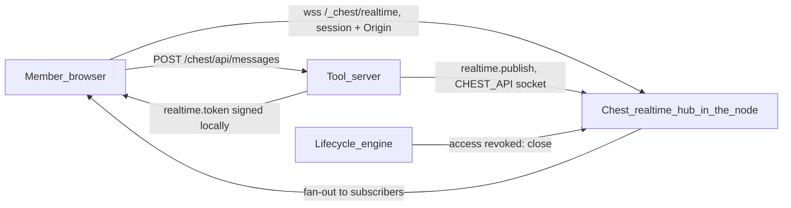

# Realtime

**Specified 29 September 2026 from Paul's question of the same day; for Paul
to decide, then to build** (batch RT in [status.md](../03_roadmap/status.md)).
Paul's question: to build a Slack equivalent with the SDK, tools need live
connections. This page answers in two lots:

- **RT1 — Socket pass-through.** The tool front relays WebSocket and
  Server-Sent Events (SSE) to the tool, with the member checked at the
  upgrade. The tool owns its sockets; any library works. Perseus Code's live
  preview (PB3) needs it for hot reload, so it comes early.
- **RT2 — Chest Realtime.** A service of the Chest, like Supabase Realtime:
  the tool publishes to channels, members' browsers subscribe through one
  Chest endpoint, the Chest does the fan-out and presence. The tool manages no
  socket, and nothing drops when it is redeployed.

It replaces the “Realtime” line of the
[SDK and agents vision](../98_travail/sdk-and-agents-vision.md) (P1 of
batch SDK+). How it is coded goes, once built, into
`03_code/01_chest-by-argentic/docs/architecture.md` (“Server tools”, Front).
Related: [Members and notifications](members-and-notifications.md) (badges,
inbox, lifecycle events), [Perseus Code](perseus-build.md#live-preview)
(draft hosts), [Develop and test tools](develop-and-test-tools.md) (previews,
`chest dev`, `testing`), [Security](security.md).

## What exists

| | Today (`docs/architecture.md`, “Server tools”, Front) |
|---|---|
| Upgrade | `Upgrade` refused with 501 on both hosts; the egress proxy refuses it too (400) |
| Long answers | The front relays through the instance's socket: 64 requests at a time per instance **and per host** (public and team have separate slots), 60 s to read a request, 5 min to answer. An SSE stream holds a slot and is cut at 5 minutes |
| Team host | `/chest/*` needs the member's session (`__Host-chest`, in-memory store of that host), `Team.Access` re-read at each request, `Sec-Fetch-Site: same-origin` and the host's `Origin` for anything but `GET`/`HEAD`; the `Chest-Member` assertion (60 s life) goes to the tool |
| Public front (`chest front`) | SNI relay, 512 connections at most, 5 min of inactivity, PROXY protocol v2 gives the portal the client's address |
| Lifecycle engine | The node compares what each tool sees at every team change (batch N): it knows at once who lost access to which tool |

## Research, in short

| Product | Model | What we take |
|---|---|---|
| **Supabase Realtime** | Broadcast, Presence, Postgres changes; private channels authorised by RLS on `realtime.messages`, evaluated **at join and cached** until reconnect or a new JWT; server publishes by REST or `realtime.send()`; `self` and `ack` options; limits per plan (e.g. 3 MB broadcast payload, 100 channels per connection, presence 5 calls per 30 s per client) | One endpoint, channels multiplexed on one socket, server-side publish, authorisation at join. Avoid: access kept until the token expires |
| **Pusher Channels** | public / `private-` / `presence-` channels; the app's auth endpoint signs `socket_id` + channel name | The tool, not the platform, decides who may join; presence as a channel property |
| **Ably** | Tokens carry a capability map (channel patterns × operations: subscribe, publish, presence, history), short TTL; key revocation terminates connections | Short-lived tokens with channel patterns and operations; revocation closes connections |
| **Phoenix Channels** | `topic:subtopic`, `join/3` authorises, socket authenticated by a signed token, PubSub across nodes, **at-most-once**, clients catch up by `last_seen_id` | At-most-once stated plainly; the tool's database is the truth; catch-up is the tool's |
| **Liveblocks** | Rooms, access tokens (app decides) or ID tokens (platform keeps room permissions) | Confirms the choice: the tool decides, the Chest enforces |

## RT1 — Socket pass-through

### Where it applies

| Host | WebSocket and SSE | Condition |
|---|---|---|
| **Team host** `<tool>-chest.<chest>…` | On `/chest` and below (the tool's private part) | None: part of every server tool. A socket is just a request of the private part, with the same checks |
| **Public host** `<tool>.<chest>…` and its custom domains | On any path the public part serves | Capability **`public.sockets`** (requires `public`), approved like any permission: “Keeps live connections open with visitors of its public part.” |
| **Draft hosts** `<project>--build-chest…` ([Perseus Code](perseus-build.md#live-preview)) and **previews** `<tool>--<branch>-chest…` ([Develop and test tools](develop-and-test-tools.md#level-3--previews-on-the-chest)) | On **any path** of the draft (the whole host is the dev server behind its ticket: Next.js `/_next/webpack-hmr`, Vite's HMR socket), on `/chest` for previews | The host's own entry (single-use ticket, then the host's cookie); same limits, counted in the team pool |

### Authentication at the upgrade

A WebSocket is not protected by CORS: a hostile page can open a socket to the
team host and the browser sends the member's cookie. The **exact `Origin`**
check is therefore the defence (cross-site WebSocket hijacking), not an extra.

On the team host, an upgrade request (`GET`, `Connection: Upgrade`,
`Upgrade: websocket`, `Sec-WebSocket-Version: 13`, HTTP/1.1) passes only if:

1. **Session**: exactly one `__Host-chest` cookie of this host, valid. No
   sign-in redirect for a socket: 401 without a session.
2. **Origin**: present and **exactly** the team host's origin (or its custom
   team address while one exists). Anything else, or absent → 403. When the
   browser sends `Sec-Fetch-Site`, it must be `same-origin`.
3. **Access**: the member is still in the Chest and `Team.Access` gives the
   tool (re-read now) → otherwise 403, the tool is not called.
4. **Caps** (below) not reached → otherwise 503 with `Retry-After`.

Then the session is settled (`core.Settle`, as for any request) and the
upgrade request goes to the tool with a fresh **`Chest-Member`** assertion
(v2, the organisation name included once that work lands, see
[below](#the-organisation-name)). The tool reads it at the upgrade with
`member(request)`; the assertion lives 60 s, the socket's identity is the one
the tool bound at the upgrade.

On the public host (with `public.sockets`): no session and no assertion (a
`Chest-Member` from the client is removed as always); `Origin` must be exactly
the public host or one of the tool's public custom domains, otherwise 403 — the
tool cannot widen it in RT1. Per-address caps apply (the portal knows the
client's address through the PROXY protocol).

SSE needs no upgrade: a `GET` on `/chest/*` with the same session and access
checks as today, whose response is `Content-Type: text/event-stream`.

### What the tool sees

- An ordinary HTTP/1.1 upgrade request on its own server: path, query and
  `Host` unchanged, `X-Forwarded-Proto` and `X-Forwarded-Host` set by the
  Chest, `Chest-Member` on the team host, `Sec-WebSocket-Key`, `-Version`,
  `-Protocol` (subprotocols) and `-Extensions` passed unchanged; the
  `__Host-chest` cookie and every client `Chest-*` header removed, as for any
  request.
- It answers `101 Switching Protocols` itself (10 s at most, else the client
  gets 502); any other answer is relayed as an ordinary response.
- After the upgrade, frames go both ways as the tool and the browser write
  them: **any library works** (`ws`, `socket.io`, `uWebSockets.js`, Hono,
  a custom Next.js server, Python's `websockets` later). Compression
  (`permessage-deflate`) is negotiated end to end; the Chest never
  decompresses.
- For SSE: the response is flushed as the tool writes it, never buffered.
- The tool never sees the member's address, cookie or session, and the
  Chest never originates frames except the close frames below.

### Limits

The front reads frame headers (never payloads) to enforce sizes and to close
cleanly. All limits are counted **after** the upgrade leaves the 64 request
slots: an open socket never takes a request slot.

| | Value | Beyond |
|---|---|---|
| Frame and message size (wire bytes, each direction) | 1 MiB | Close `1009` on both sides |
| Handshake answer from the tool | 10 s | 502 to the client |
| Idle: no frame (ping and pong included) either way / no byte of an SSE stream | 120 s | Close `1001` (“idle”); the SDK helpers heartbeat every 30 s, dev servers do too |
| Maximum lifetime | 24 h | Close `1001` (“lifetime”), the client reconnects and is checked again |
| Write stalled toward one side (slow consumer) | 30 s | Close `1001` (“slow”) on both sides |
| Sockets per member per tool (tabs) | 10 | 503 at the upgrade |
| Sockets per client address, public host | 20 per tool | 503 |
| Per-tool pools, per Chest total | [Limits per plan](#limits-per-plan) | 503 with `Retry-After` |

**Backpressure** comes from relaying without a queue: the front reads from
one side only when its last write to the other side is done (two fixed
buffers of 32 KiB per socket). A slow reader slows the writer through TCP,
never the node's memory; if a write stays blocked 30 s, both sides close.

### Closes the Chest sends

Standard codes only, so any library understands them; the reason text is
fixed.

| When | Code | Client should |
|---|---|---|
| New version of the tool in service, rollback, restart | `1012` service restart | Reconnect after a random 0–5 s |
| Node restart (Chest update) | TCP closed (the process goes) | Reconnect with backoff |
| Idle, lifetime, slow consumer | `1001` going away | Reconnect with backoff |
| Too large | `1009` | Not resend the same message |
| **Access removed**, member removed, session signed out, tool removed or its public part closed, draft ticket revoked | `1008` policy violation, reason `access_removed` | **Not** reconnect; show “Access removed” (the SDK helper does) |
| Caps reached | 503 at the upgrade (`1013` try again later if a cap drops while open) | Reconnect with backoff |

**Redeploy.** The new version starts beside the old one as today; new
sockets go to the new instance at once. The old instance's sockets receive
`1012`, **spread over 10 s** (not all at once) during its 30 s of drain, then
it stops. Clients reconnect with jitter to the new version. Nothing survives
a redeploy in RT1 — that is what RT2 is for.

**Revocation.** The front keeps a registry of open sockets by (tool, host,
member, session). The lifecycle engine, which already computes who lost what
at every team change, closes the matching sockets with `1008` **within a
second**; sign-out and session end do the same; as a safety net each socket's
member is re-checked every 60 s.

### The public front

`chest front` relays TLS bytes and cannot tell a socket from a page. Its
connection limit (512 today) becomes the plan's live-connection cap **plus 512**
for ordinary traffic, and its 5-minute inactivity rule stays (idle sockets are
closed at 120 s before it). Browsers open WebSockets over HTTP/1.1, one TLS
connection each; the portal does not offer WebSockets over HTTP/2 (RFC 8441)
in RT1.

### SDK helpers (`@argentic/chest-sdk/live`)

Small and optional; any library works without them.

| Side | Helper | Does |
|---|---|---|
| Browser | `reconnecting(url, {protocols?, onMessage, onOpen?, onClose?})` | A WebSocket that reconnects with full-jitter backoff (0.5 s → 30 s), 0–5 s after `1012`, stops on `1008` and calls `onClose({reason: "access_removed"})`; sends a heartbeat every 30 s; `send` buffers while reconnecting (bounded, 100 messages) |
| Server | `heartbeat(ws)` | Pings every 30 s, terminates a peer silent for 90 s (works with `ws`) |
| Server | `sse(response)` | Headers, flush, a comment line every 30 s, `event`/`data`/`id` writer |
| Tests | `fakeChest` | Accepts upgrades and SSE on its team host like the Chest (session, Origin, assertion, closes on demand) |

### Logs and metrics

No payload is ever logged, by the Chest or its agents API.

| Where | What |
|---|---|
| Tool's **Logs** tab (runtime log, Chest lines) | Refusals worth a builder's eye: caps reached, frames too large, handshake timeouts, one line per minute at most per kind; closes by redeploy (“412 connections moved to the new version”) |
| Tool's overview | “Live connections: 37” (team and public), refreshed like the rest of the overview |
| Node metrics ([Fleet monitoring](fleet-monitoring.md)) | Per tool and per Chest: open sockets and SSE streams by pool, peak, opened, closed by reason, refused by cap, bytes in and out — sampled every minute |
| Settings → Server | “Live connections: 380 of 2,000” among the details |
| Agents | `GET /api/v1/tools/{tool}/connections` (counts, caps, last refusals); MCP `health` includes them |

## RT2 — Chest Realtime

### Why a service on top of RT1

With RT1, a tool that fans out messages keeps every member's socket in its own
process: it loses them all at each redeploy, it must hold them in its 256 MiB,
and it must write presence and reconnection itself. RT2 moves the sockets
into the Chest: the tool **publishes**, the Chest **delivers**. Redeploys,
restarts and crashes of the tool do not disconnect anybody; the members'
browsers hold one connection per tool, to the Chest.

### The shape



- **In the node process**, like the AI gateway: one hub per Chest, no new
  service, no broker. A Chest is one server, so “across instances” means
  across the tool's instances, versions and restarts, which the node outlives.
- **One endpoint per tool**: `wss://<tool>-chest.<chest>…/_chest/realtime`,
  on the tool's team host, the same origin as its `/chest` pages. Channels of
  **that tool only** are reachable on it.
- **Permission** `realtime` in `chest.json`: “Sends live updates to the members
  who have access to it.” Without it, the endpoint answers 404 and the tool
  API 403 `capability_not_granted`.

```json
{ "capabilities": ["realtime"] }
```

### Channels

- Name: `[a-z0-9._:@-]{1,128}`, chosen by the tool (`ch:42`, `dm:mbr_a:mbr_b`,
  `doc:7`, `board`). Implicitly namespaced by the tool: tool A's `general` is
  not tool B's.
- Created on first use, gone when empty; nothing to declare.
- Operations: **subscribe** (receive what is published), **send** (ephemeral
  client messages: typing, cursors), **presence** (appear and carry a small
  state).

### Authorisation: the tool signs short-lived channel tokens

Chosen as the simplest safe design. Alternatives set aside: rules declared in
`chest.json` cannot express “the members of channel 42” (that lives in the
tool's database); a call from the Chest to the tool at each join (Phoenix's
`join/3`) makes joins fail whenever the tool is redeploying, which RT2 exists
to avoid.

```ts
// Server side, in a /chest route of the tool (the member is known)
import { member } from "@argentic/chest-sdk/member";
import * as realtime from "@argentic/chest-sdk/realtime";

const who = member(request);
const ids = await myChannelsOf(who.id);               // the tool's own rule, from its database
const token = realtime.token(who.id, [
  ...ids.map(id => ({ channel: `ch:${id}`, subscribe: true, send: true, presence: true })),
  { channel: "dm:*", subscribe: true },               // a prefix pattern ends with "*"
]);                                                     // default life 5 min, 15 min at most
return Response.json({ token });
```

| Rule | Decision |
|---|---|
| Signature | Compact JWS HS256 under HMAC-SHA256(“Chest-Realtime v1”) of `CHEST_TOKEN`, computed **in the tool's process** (no call); the Chest accepts the keys of the tool's instances in service (both during a switchover) |
| Claims | `aud` tool, `sub` member id, `iat`, `exp` (≤ 15 min), `ch`: up to 100 entries `{c, s?, w?, p?}` (channel or prefix pattern `…*`; subscribe, send, presence) |
| Binding | The Chest accepts a token only on a socket whose **session member is `sub`**: a token leaked to another member is useless |
| Where it travels | In the socket's messages (`auth`), never in a URL; the client module keeps it in memory, never in storage |
| When it counts | **At join.** A subscription lasts until the member leaves, is kicked, loses access to the tool, or the socket ends. Tokens are refreshed only for new joins and reconnects |
| Kick | `realtime.kick(channel, memberIds)` ends those members' subscription and presence at once, and refuses tokens for that (channel, member) issued before the kick. This is how a tool removes someone from a Slack channel without waiting for a token to expire (Supabase's weak spot) |

The member's own **direct lane** needs no token: `realtime.send(memberIds,
event, payload)` reaches every connection of those members on this tool
(unread counts, a DM notification, “you were added to #design”).

### Server side: `@argentic/chest-sdk/realtime`

Through `CHEST_API`, the instance is the identity.

| SDK | Chest route (tool API) | Answer / notes |
|---|---|---|
| `realtime.token(memberId, grants, {ttl?})` | — (signed locally) | A string |
| `realtime.publish(channel, event, payload, {except?})` | `POST /realtime/publish` | `{seq}`. `event` `[a-z0-9._:-]{1,64}`; `payload` JSON, 64 KiB at most; `except`: a member id not to deliver to (the author, already shown optimistically) |
| `realtime.publishMany([{channel, event, payload}])` | `POST /realtime/publish` (array) | Up to 100 at once |
| `realtime.send(memberIds, event, payload)` | `POST /realtime/send` | Direct lane; 1 to 500 members; those without access are skipped silently |
| `realtime.presence(channel)` | `GET /realtime/presence/{channel}` | `{members: [{id, state, since}], count}` (500 listed at most, `count` exact) |
| `realtime.online(memberIds)` | `POST /realtime/online` | `{online: string[]}`: members with at least one live connection to this tool (any channel). What decides whether to `notify` |
| `realtime.kick(channel, memberIds)` | `POST /realtime/kick` | 204 |
| `realtime.stats()` | `GET /realtime/stats` | Connections, channels, deliveries this minute |

Errors: 403 `capability_not_granted`, 400 `invalid_channel` / `invalid_event`,
413 `too_large`, 429 `rate_limited` with `Retry-After`, 503 `unavailable`.
The tool never learns which member is connected to which channel beyond
`presence`, `online` and its own tokens.

### Browser side: `@argentic/chest-sdk/realtime/client`

```ts
import { connect } from "@argentic/chest-sdk/realtime/client";

const rt = connect({
  token: () => fetch("/chest/api/realtime-token").then(r => r.json()).then(j => j.token),
});                                   // opens /_chest/realtime on this host; one socket per tab

const ch = rt.channel("ch:42");
ch.on("message.created", m => render(m));
ch.on("typing", ({ from }) => showTyping(from));   // `from` is set by the Chest, never by the sender
ch.presence.track({ viewing: true });
ch.presence.on("sync", list => renderOnline(list));
ch.send("typing", {});                            // ephemeral, to the others in the channel
rt.on("direct", (event, payload) => …);           // realtime.send from the server
rt.on("resync", () => refetchSinceLastId());      // after a reconnect or a node restart
rt.on("closed", ({ reason }) => …);               // "access_removed": do not retry
```

It reconnects with backoff, re-fetches a token and re-joins its channels by
itself, then emits `resync` so the page catches up from the tool (below).

### Wire protocol (for other languages)

Subprotocol `chest-realtime.v1`, JSON text frames, one object each, a `ref`
for replies: `auth {token}`, `join {ch, presence?}`, `leave {ch}`,
`send {ch, event, payload}`, `track {ch, state}`, `ping`; the Chest answers
`ok {ref}` / `error {ref, code}` and pushes `msg {ch, event, payload, seq,
from?}`, `direct {event, payload}`, `presence {ch, joins, leaves}` or
`presence_state {ch, members}`, `kicked {ch}`, `epoch {id}`. Documented in
the SDK repository with the client.

### Semantics

| | Decision |
|---|---|
| Delivery | **At most once.** A message published while a member is disconnected is not delivered to them later. The tool's database is the truth; realtime is a hint that something changed |
| Order | Per channel, in the order the node accepted publishes: each message carries `seq`, increasing per channel within an `epoch` (the node's run). A gap in `seq`, or a new `epoch`, tells the client to resync |
| Acknowledgement | `publish` returns once the node has accepted it (not once delivered) |
| Self | A member's own `send` is not echoed back; `publish` reaches everyone unless `except` |
| History | **None** in RT2. Catch-up is the tool's: “messages after id N” from its database. A bounded replay buffer (e.g. last 100 per channel, 5 min) is a later option if tools struggle |
| Presence | Per channel, per **member** (merged across tabs and devices): present while at least one connection tracks; `state` JSON ≤ 1 KiB, updated at most 5 times per 10 s per connection; a leave is announced after 10 s of absence, so a reconnect does not flicker |
| Typing indicators | Ephemeral `send("typing")`, shown 5 s by the receivers; not presence state (cheaper, no leave to wait for) |

### Limits

| | Value |
|---|---|
| Payload of `publish` / `send` (server) | 64 KiB (a message carries ids and short text; files go through [tool storage](tool-storage.md)) |
| Payload of a client `send` | 4 KiB |
| Channels per connection | 100 |
| Client `send` per connection | 20 a second (burst 40) |
| Joins per connection | 10 a second |
| Connections per member per tool | 10 |
| Outbound queue per connection | 256 messages or 1 MiB; overflow → close `1013` and the client resyncs |
| Publishes per tool, deliveries per Chest | [Limits per plan](#limits-per-plan) |

Rate counters are in memory (a restart starts them over), like the AI gateway's.

### Security

- Same upgrade checks as RT1 on the team host: session, exact `Origin`,
  `Team.Access`, caps. The endpoint belongs to the Chest (`/_chest/`), the tool
  never sees the socket.
- **Cross-tool isolation**: the endpoint lives on the tool's own host (another
  tool's session cookie means nothing there), the token's `aud` must be the
  tool, channel names are per tool, the tool API publishes only into its own
  namespace. Tool B can neither read nor publish tool A's channels.
- **Members without access**: 403 at the upgrade; the tool's `send` and
  `publish` never reach them (subscriptions exist only for connected members
  with access).
- **Revoked access closes immediately**: the lifecycle engine closes that
  member's realtime sockets for the tool with `1008 access_removed` within a
  second, as in RT1; member removed, sign-out, tool removed, capability
  withdrawn by a new version: the same.
- **Unforgeable sender**: `from` on client `send` and presence is the session's
  member id, set by the Chest.
- **Content is opaque** to the Chest: never logged, never interpreted. The tool
  renders it; escaping is the tool's job (the SDK README says so).

### Notifications and events

Realtime reaches members who are **looking**; notifications reach the others.

| Need | Primitive |
|---|---|
| Update an open page now | `realtime.publish` / `realtime.send` |
| Tell a member who is **not** online | `realtime.online(ids)` then `notify(offline, {…, key})` (inbox under the bell) |
| A count on the tool's tile | `badge.setMany` (idempotent state; coalesce: at most one write per member every 5 s, the SDK recipe shows it, within the 600 writes a minute) |
| The member read it | `notifications.withdraw(key, [id])`, badge set again |
| Something happened in another tool, or to a member | [Events](members-and-notifications.md#5-member-lifecycle-events) (server to server, at least once, signed). Not realtime: realtime never goes to a tool's server |

Later, the portal's own bell may subscribe to a Chest channel instead of
polling every 30 s — not in these lots.

### Public channels, later

Visitors of a public part (a support chat, a live page) would use
`/_chest/realtime` on the public host with tool-signed tokens for an
anonymous or `acc_…` subject, capability `realtime.public`, per-address caps.
Not before **public accounts** (P2): without them there is no identity to
bind a token to.

## A Slack-like tool, end to end

**Manifest**: `"capabilities": ["database", "members", "notifications",
"realtime", "files"]`. Tables: `channels(id, name, private)`,
`channel_members(channel, member)`, `messages(id, channel, author, text,
created)`, `reads(channel, member, last_read)`. Member ids, never copied names.

1. **Opening** `/chest`: the page renders with `member(request)` — the header
   shows the **organisation name** from the assertion (next section) and the
   member's photo; the sidebar lists the member's channels and DMs with unread
   counts from `reads`.
2. **Connecting**: the page calls `/chest/api/realtime-token`; the tool signs
   a token for `ch:<id>` of every channel the member belongs to (subscribe,
   send, presence) and `dm:<pair>` for their DMs, then `connect()` joins them.
3. **Sending**: `POST /chest/api/messages` → insert → `realtime.publish("ch:42",
   "message.created", {id, author, text, created}, {except: author})`. Every
   member viewing gets it in well under a second; the author already shows it.
4. **Typing**: `ch.send("typing", {})` on keystrokes (at most every 2 s);
   receivers show “Camille is typing…” for 5 s.
5. **Presence**: every page tracks a `presence` channel with
   `{status: "active"}`; the DM list shows a filled or hollow dot (black and
   white, no colour).
6. **Unread counts**: on each message, for channel members not viewing it
   (presence state `viewing`), `realtime.send(ids, "unread", {channel, count})`
   updates their sidebar; `badge.setMany` (coalesced) puts total unread DMs and
   mentions on the tool's tile in the Chest home.
7. **Offline**: for DM recipients and `@mentions`, `realtime.online(ids)` →
   `notify(offline, {title: "Camille in #design", body: text.slice(0, 280),
   path: "/chest/c/42#m981", key: "ch:42"})`; the key replaces the item instead
   of stacking one per message. Reading the channel → `withdraw("ch:42",
   [id])` and the badge goes down.
8. **Channel membership**: adding someone → new token on their next join
   (`realtime.send([id], "channels.changed")` tells their page to refresh it);
   removing → `realtime.kick("ch:42", [id])`, effective at once.
9. **Reconnect or redeploy**: a redeploy of the tool changes nothing for open
   pages; a node restart or a network drop → `resync` → the page fetches
   messages after its last id.
10. **Access revoked** in Team: the socket closes with `access_removed`; the
    page shows the Chest's “Access removed” sentence; the next navigation gets
    the Chest's page.
11. **Search, files, threads**: Postgres full-text (SDK recipe), browser
    uploads ([tool storage](tool-storage.md)), `thread:<id>` channels.

The same tool on RT1 alone is possible (its own `ws` server) but loses every
socket at each deployment and must write presence; the catalogue's chat tool
uses RT2.

## The organisation name

The organisation name is the Chest's, not a member's: a tool reads it with
the SDK's `chest.organization.name` (with the Chest's time zone and
language, SDK 0.3.0), which the Chest gives every tool in its environment,
so a tool like Slack can show it in its header. RT1 and RT2 need nothing
more: it is there on the upgrade request and on the token route alike, and
in a job outside any request.

## Limits per plan

A socket costs the node about **40 KiB** (two goroutines, buffers, registry
entry; RT2 adds its subscriptions and queue). The caps keep live connections
under ~2 % of the server's memory, inside the 1.5 GiB the capacity guard
already reserves for the Chest ([Owner space and billing](owner-space-and-billing.md)
for the plans).

| | Starter (VPS-1, 4 GB) | Team (VPS-2, 8 GB) | Business (VPS-3, 12 GB) | Scale (VPS-4, 24 GB) |
|---|---|---|---|---|
| Live connections per Chest (RT1 sockets and SSE + RT2) | 2,000 | 5,000 | 10,000 | 20,000 |
| Per tool, team pool (default) | 500 | 1,500 | 3,000 | 6,000 |
| Per tool, public pool (default, with `public.sockets`) | 200 | 500 | 1,000 | 2,000 |
| RT2 publishes per tool | 100 / s | 200 / s | 400 / s | 800 / s |
| RT2 deliveries (fan-out) per Chest | 5,000 / s | 10,000 / s | 20,000 / s | 40,000 / s |
| `chest front` connections | 2,512 | 5,512 | 10,512 | 20,512 |

The owner or an admin can lower or raise a tool's pools on its Settings
(within the Chest's cap). The public pool never takes the team pool's places:
anonymous traffic cannot lock members out, as for request slots today.

## Failure modes

| Failure | What happens |
|---|---|
| Tool redeployed | RT1: `1012`, clients reconnect to the new version within seconds. RT2: nothing (sockets are the Chest's); publishes during the switchover come from whichever instance serves |
| Tool crashed or restarting | RT1: sockets drop, reconnect fails (502) until supervision restarts it, backoff up to 30 s. RT2: sockets stay; publishes stop; the page keeps its data |
| Node restarted (Chest update) | Every socket drops; clients reconnect with backoff; team host sessions are in memory, so members sign in again first (the helper sees 401 and reloads the page); RT2 `epoch` changes → `resync` |
| Caps reached | 503 at the upgrade, a Logs line for the tool, the metric; existing sockets unaffected |
| Slow member (bad network) | RT1: closed after 30 s of blocked write. RT2: queue overflow → `1013` → reconnect and resync. Neither grows the node's memory |
| Burst publish from a tool | 429 `rate_limited` to the tool; nothing queued in the node |
| Memory pressure on the server | The caps bound the node's share; the health sentence counts live connections |
| Token signed by an old instance | Accepted while that instance is in service; afterwards the client fetches a new one (5 min life) |
| Access revoked while a message is in flight | The close happens before any later delivery; at most the message already written to the socket arrives |

## Testing

- **Chest (Go)**: frame-header relay and limits (size, idle, lifetime, slow
  consumer), Origin and session checks at the upgrade, pools and caps, revocation
  registry, `1012` spread on switchover; RT2 hub: token verification (binding,
  `aud`, patterns, kick “not before”), fan-out order and `seq`, presence merge
  and the 10 s leave, queue overflow, rate limits.
- **SDK**: `realtime.token` against a vector signed by the Chest (like the
  assertion); the client module against a fake hub; `fakeChest` gains
  upgrades, SSE and an in-process realtime hub with the same limits.
- **Test bench** (`tests/apps/testweb`): an echo WebSocket, an SSE clock, a
  small two-channel chat on RT2.
- **VM browser proof, two members** (Playwright, two browser contexts):
  A and B open the chat; A sends → B sees it; typing shown to B; presence of
  both; B without access → 403 at the upgrade; A's access revoked in Team →
  A's socket closes with `access_removed` within a second and A's page says
  so; a token of tool X refused on tool Y's endpoint; a wrong `Origin` refused;
  tool redeployed → RT1 echo reconnects, RT2 chat untouched; node restarted
  → both reconnect and the chat resyncs; caps lowered to 1 → 503.
- **PB3**: hot reload of a Next.js draft through the draft host.

## What to build, in lots

| Lot | Content | Depends on |
|---|---|---|
| **RT1a Team pass-through** | `chest/toolfront`: upgrade on `/chest/*` of team hosts and on draft and preview hosts (any path of a draft), checks at the upgrade, assertion on the upgrade, frame-header relay, sizes, idle, lifetime, slow consumer, pools out of request slots, SSE streamed and out of the 5-min answer limit, socket registry, `1012` on switchover, `1008` on revocation from the lifecycle engine; `chest front` cap per plan; metrics, Logs lines, overview count, `/api/v1/tools/{tool}/connections`; SDK `live` helpers and `fakeChest` upgrades; test bench echo and SSE; VM proof | — |
| **RT1b Public sockets** | Capability `public.sockets` (sentence en/fr, approval, `chest check`), public host upgrade with exact public Origins, per-address caps, public pool | RT1a |
| **RT2a Chest Realtime** | Capability `realtime`; hub in the node; `/_chest/realtime` endpoint; tokens, channels, `publish`, `send`, `online`, `kick`, `stats`; `seq` and `epoch`; SDK `realtime` and `realtime/client`; `fakeChest` hub; test bench chat; two-member browser proof | RT1a (shares the upgrade checks, registry, caps) |
| **RT2b Presence** | Presence per channel, `track`, merged per member, 10 s leave, `presence()` | RT2a |
| **RT2c Catalogue chat** | A Slack-like catalogue tool (`chest-by-argentic/chat`) as the proof of RT2 with notifications, badges and uploads | RT2b, N, ST |
| *Later* | Public channels (`realtime.public`, after public accounts), bounded replay, portal bell on realtime, WebSockets over HTTP/2 | — |

**Where it fits (proposal):** RT1a **before PB3** — PB3 (live preview, week of
19 October) needs hot reload through draft hosts; RT1a is about a week, so the
week of 12 October beside PB-B/PB1's remaining work, deployed with PB3. RT1b
when a public tool asks for it. RT2a and RT2b after PB4, as part of SDK+ P1
with the delivery engine, then RT2c with the catalogue, since each catalogue
tool is the proof of the primitive it needs.

## Changes to other pages (when built)

- `docs/architecture.md`: the front's upgrade and SSE rules, the pools, the
  realtime hub, tokens (“Chest-Realtime v1”).
- [SDK and agents vision](../98_travail/sdk-and-agents-vision.md): the Realtime
  line points here (done with this page).
- [Perseus Code](perseus-build.md): PB3's dependency “front WebSocket support” = RT1a.
- SDK README: `live`, `realtime`, `realtime/client`, the Slack recipe.

## Open questions for Paul

1. **Order**: RT1a before PB3 (proposed), RT2 after PB4 with SDK+ P1 — or RT2
   earlier if the chat catalogue tool is wanted for the first pilot?
2. **Public sockets without RT2**: `public.sockets` (RT1b) allows a public
   live page today with the tool's own sockets; ship it only on demand
   (proposed) or with RT1a?
3. **History**: none (proposed), or a small replay buffer from the start?
4. **Caps per plan**: the values above are estimates from memory per socket;
   to confirm by a load test on a VPS-1 (2,000 idle sockets, 100 publishes a
   second to 50 members).
