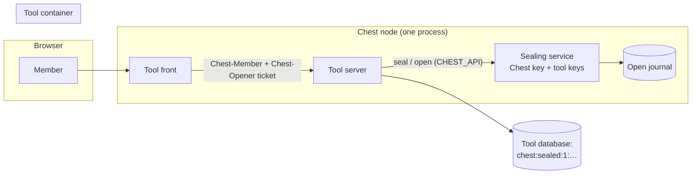

# Sealed data

**Specified 7 October 2026, decided by Paul the same day (option 1: the
Chest holds the keys); core built in batch SEAL**
([status.md](../03_roadmap/status.md)), Paul's questions open below with
their defaults. How the code does it goes into
`03_code/01_chest-by-argentic/docs/architecture.md` (Server tools,
“Sealed values”); the SDK's side into its README (`sealed`).

Paul (7 October): *“super important, especially if we imagine that the data
of an internal Slack must be encrypted.”* The store needs it too
([store gap](../../98_travail/store-gap-2026-10.md)): IBANs in Expenses,
payslips and personal records in People, sensitive roles and an audit trail.

Related: [Security](security.md), [Tool storage](tool-storage.md),
[Realtime](realtime.md), [Members and notifications](members-and-notifications.md),
[Perseus Code](perseus-build.md).

## The decision in short

**Paul's decision (7 October 2026): the Chest manages encryption and holds
the keys** — per-tool data keys wrapped by a Chest key the node holds.
End-to-end encryption (keys only in browsers) is **rejected**: it breaks
server-side search, notifications that quote content, Perseus, a new
member reading history, recovery of a lost device, and lawful access a
company owes to its authorities.

A tool **seals** a value through its Chest and stores the sealed text in its
own database, in any text column. The value is encrypted by the Chest with
a key of that tool, which never leaves the Chest's process. Only the tool
**opens** it again, through its Chest, **at runtime, for a member its own
rules allow** — a member who has the tool, on one of their requests; when
the value was sealed for some roles, only for a member who holds one of
them. Every open is journaled, never its content.

**The product rule: an admin or the owner never sees members' sealed
content in the Chest.** The database console and the Data tab, the agents'
SQL and data APIs, the logs, Perseus (builders and drafts) and the backups
show a sealed value as **Sealed** (`chest:sealed:1:…`), never in clear.
What could bypass it through the tool itself is closed by three guardrails:

1. **Every new version of a tool that declares sealed data waits for an
   explicit approval** by the owner or an admin, whoever wrote it and
   wherever it comes from (Perseus Code, GitHub, the catalogue), with the
   sentence “This version can read sealed data”.
2. **Every open is journaled** (tool, member, count, time) and the owner
   sees the totals per member: a tool that opens far more than its members
   read shows.
3. **Perseus drafts never get the real keys**: a draft seals and opens with
   a key of its own, on its own data and its fake members.

It is a *server-side* seal: it stops the people and copies that look at
the data **beside** the tool; it does not stop whoever controls the running
server (the threat model says exactly what).

### Why every version, not only the versions that touch sealing

Any line of a tool's code runs with the tool's rights: a change to a
template or a logging call can print what an `open` returned. Nothing the
Chest can read in a version tells reliably whether it “touches sealing”.
So the rule is the simple and safe one: **a tool that declares `sealed`
never changes code without one click of the owner or an admin**, and that
click names what it means. An owner or admin who publishes or updates
themselves sees the same sentence and confirms it in the same gesture.

## Threat model

What each option protects against. “Yes” means the attacker gets only
ciphertext; “partial” is explained under the table.

| Threat | Today (encrypted backups) | Disk encryption (LUKS, TDE) | Sealed, key in backups | **Sealed, key escrowed to the owner (chosen)** |
|---|---|---|---|---|
| A stolen backup archive, without the backup identity | yes (age) | yes | yes | **yes** |
| A stolen backup **with** the backup identity (the operator's workstation) | no | no | no | **yes** (¹) |
| A stolen disk or a provider's disk snapshot | no | yes (²) | no | **no** (³) |
| A database dump (`pg_dump`, a copy of the cluster, a tool's SQL injection) | no | no | yes | **yes** |
| A compromised tool container | no | no | partial (⁴) | **partial** (⁴) |
| A curious builder, admin or owner in the database console, the Data tab or the agents' SQL and data APIs | no | no | yes | **yes** (⁵) |
| A builder or admin shipping code that prints what it opens | no | no | approval (⁶) | **approval** (⁶) |
| Argentic operators | no | no | no | **backups only** (⁷) |
| The host's root, on the running server | no | no | no | **no** |
| What still works: search, schedules, Perseus, AI, the Data tab | all | all | all but on sealed values | **all but on sealed values** |

1. The archive carries the Chest key only under the owner's recovery code.
   Until the owner has saved the code (“pending”, below), the code itself
   travels in the archive so that a restore never loses data: during that
   window the backup identity can open sealed values.
2. Only when the key is not on the same disk: unlocked at boot from
   elsewhere (Clevis and Tang on the central, for instance). A key typed by
   hand at each boot does not fit an unattended server.
3. The Chest key is a file on the server's disk: the node must open values
   after a restart without anyone typing a code. Disk encryption is the
   layer for this row.
4. The tool's code *is* the reader of the data (“code that runs sees the
   data”, [security](security.md#builders-admins-and-agents)). A compromised
   tool cannot take the key away and cannot open anything while no member is
   using it; every open it makes is journaled; role-restricted values open
   only on the requests of members who hold the role. But it sees whatever
   is opened while it is compromised, and could collect the members'
   tickets (60 seconds each) to open more meanwhile — which the journal's
   totals show.
5. An admin or the owner who also *has the tool* reads, through the tool's
   own screens, what the tool's rules show them, like any member: that is
   the tool deciding, journaled. The Chest's own screens never open a value.
6. Every new version of a tool that declares `sealed` waits for the owner
   or an admin, who are told it can read sealed data (guardrail 1).
7. Operators run the servers (they are root, below). What they cannot do is
   read sealed values from the backups they keep.

**Root, on the running server**, reads the process's memory and the key
file: no server-side scheme stops it — Slack EKM, Supabase Vault and AWS
envelope encryption make the same admission. Only confidential computing
(memory encrypted by the CPU; not offered on the VPSs we use) would. We say
so plainly to customers.

## Research

| System | What it does | What we take |
|---|---|---|
| **Slack EKM** | Messages and files encrypted with keys derived from the customer's AWS KMS key, scoped to a channel and a time window; Slack's servers ask KMS each time; the customer reads every use in CloudTrail and can revoke a scope | Keys per scope, the customer's view of every use, the customer as key holder. Slack still decrypts on its servers: EKM is about control and visibility |
| **AWS KMS envelope encryption** | A data key per object, wrapped by a master key that stays in KMS; an *encryption context* bound as additional data; every decrypt logged | Exactly our structure: a data key per tool, wrapped by the Chest key, the tool's *context* bound to each value, every open journaled |
| **Supabase Vault and pgsodium** | Vault stores secrets encrypted in a table, the root key outside the database; a decrypted view serves them to privileged SQL. Supabase now advises against pgsodium's Transparent Column Encryption — too complex and easy to misconfigure — and keeps Vault | A dump holds ciphertext; but whoever has SQL rights reads the decrypted view. We keep decryption **out** of the database: no SQL role can open |
| **PostgreSQL TDE** | Not in community PostgreSQL. EDB, Cybertec and Percona (`pg_tde`, its own server packages) encrypt tables and WAL on disk | Protects files only, never a dump or a SQL session; would replace our pinned PostgreSQL image. Not for us |
| **1Password** | Vault keys derived from the master password **and** a 128-bit Secret Key printed in the Emergency Kit | The owner's recovery code: high-entropy, shown once, kept on paper |
| **Bitwarden** | Client-side vault; organization keys shared wrapped; *Key Connector* lets a company host the key for SSO | A code only the owner keeps; a key the customer hosts is the later “bring your own key” |
| **Google Workspace CSE, Signal, Matrix** | End-to-end: keys in browsers or devices | Rejected (above): no server-side search, AI, previews, integrations; Matrix shows the recovery-key pattern we reuse for the escrow |

## How it works



### Keys

| Key | What | Where | In the backup |
|---|---|---|---|
| **Chest key** | 32 random bytes, created when the first value is sealed | `installation/sealing.key` (0600), in the node's memory | **never** |
| **Escrow** | The Chest key, encrypted under a key derived from the owner's recovery code | `installation/sealing.escrow` | yes |
| **Recovery code** | 160 random bits, written in groups (`7KQ2M-…`), shown to the owner | until the owner saves it: `installation/sealing.recovery`; then nowhere on the server | until saved (¹ above) |
| **Tool key** | 32 random bytes per tool, wrapped by the Chest key, bound to the tool's name | `apps/<tool>/sealed-values.key`, gone with the tool | yes (wrapped) |
| **Draft key** | 32 random bytes per Perseus Code project, never wrapped by the Chest key: a draft holds nothing that opens a tool's values | beside the project, gone with it | with the project |
| **Ticket key** | 32 random bytes per tool and run of the node, signs the open tickets | memory only | no |

Primitives: XChaCha20-Poly1305 for values (`golang.org/x/crypto`, a random
24-byte nonce per value: no limit on how many values a key seals),
AES-256-GCM for wrapping keys, HKDF-SHA256 to turn the recovery code into a
key, HMAC-SHA256 for tickets — all from Go's standard library or
`x/crypto`. Nothing of our own.

### A sealed value

`chest:sealed:1:<roles>:<base64url(nonce ‖ ciphertext ‖ tag)>` — one line of
ASCII, stored in any text column. `<roles>` is empty, or the roles the value
was sealed for, comma-separated (`hr,payroll`): readable, so that the
console says “Sealed · hr”, and authenticated, so that nobody changes them
without breaking the value. The additional data binds the format, the tool,
the roles and the tool's **context**: a value sealed for `employee:42`
does not open as `employee:43` — a curious admin who copies a colleague's
sealed salary into their own row (the agents' API may write rows) gets
nothing.

Size: a 34-character IBAN becomes about 120 characters.

### Who seals, who opens

| | Seal | Open |
|---|---|---|
| The tool, on a member's request | yes | yes: the member must still have the tool, and one of the value's roles if it has some |
| The tool on its public part, its schedules, its events | yes | **no** (no member is there): see question 3 |
| The Data tab and its console, the agents' SQL and rows APIs, the logs, the backups, a builder, an admin, the owner, Perseus | — | never: they read `chest:sealed:…`, shown as *Sealed* |
| A draft of Perseus Code | its own key, never the Chest's nor the tool's | its fake members only, on its own data; not journaled |

**The ticket.** On every request of a member, the tool front adds
`Chest-Opener` beside `Chest-Member`: the member's identifier and an expiry
(60 seconds, the assertion's), signed with a key only the node knows. The
tool cannot forge one — it can forge `Chest-Member`, whose key it holds to
verify it. The SDK passes the ticket of the request it is given. At each
open, the Chest checks the signature, the tool, the expiry, then reads the
team **now**: the member still has the tool, and their role (set by the
owner or an admin, never by the tool) is among the value's roles.

### The journal of opens

**Every open is journaled**: one line per call of the tool — the time, the
member on whose behalf, how many values were opened and how many refused,
the roles of the role-restricted ones. Never a value, never a context.
Kept 90 days in `installation/sealed-journal/<tool>.jsonl`, written by the
node alone (the tool cannot reach it), archived with the installation.

The owner reads it **in aggregate** on the tool's **Data** tab, “Sealed
values opened, last 30 days”: per member, how many values, on how many
days, and the last time. A tool that opens every value of its database for
one member while that member reads ten a day stands out; so does a member
the owner did not expect.

### New versions

A version of a tool whose `chest.json` declares `sealed` is **never put in
service without the owner or an admin**: its build — from a push, Perseus
Code's Publish, a catalogue update or an Update by hand — waits on the
tool's Deployments as a version to approve, “This version can read sealed
data”, and the owner and the admins are told in their inbox (the existing
mechanism for builders who cannot see data, widened). The person who
approves may be the one who wrote it: the click is the explicit approval.
Rolling back to a version that already ran needs no new approval. The
installation's approval says the same sentence beside the permission.

### What the SDK gives

```ts
import { seal, sealMany, open, openMany, isSealed } from "@argentic/chest-sdk/sealed";

// "capabilities": ["database", "sealed"], "roles": ["hr", "member"]
const iban = await seal("FR76 3000 6000 0112 3456 7890 189", { context: `employee:${id}`, roles: ["hr"] });
await sql`update employees set iban = ${iban} where id = ${id}`;

// On a request of a member: the ticket comes with it.
const plain = await open(request, row.iban, { context: `employee:${row.id}` });
const page = await openMany(request, rows.map(r => ({ sealed: r.iban, context: `employee:${r.id}` })));
// → string | null each: null for a value this member may not open
```

Errors: `MemberRequired` (no member on the request), `NotAllowed` (a role
the member lacks, or the member lost the tool), `SealedInvalid` (altered,
another tool's, another context), `SealedLocked` (the Chest key awaits the
recovery code). `fakeChest` seals and opens with the same rules, its members'
roles included. `isSealed(text)` needs no Chest.

The manifest declares the capability `sealed`, approved with the sentence
“Seals sensitive values: only members who have it open them, never the
database console or agents”.

### Search on sealed values

**None.** A sealed value is never searchable on the server: no index, no
`LIKE`, no sort. The rule for tool authors (README, Perseus's knowledge):
seal what nobody searches — an IBAN, a salary, a medical note, a
confidential message —, keep in clear what lists and filters need (a name,
a date, a status). A tool may open one page of values and filter it in
memory.

A **blind index** (an HMAC of the normalized value, for equality: “find the
employee with this IBAN”, “is this IBAN already used”) is the known next
step; it leaks which rows are equal and, for small sets of values (amounts,
yes/no), the values themselves through a dictionary. Not built until a tool
needs it: question 5.

### Realtime

The realtime service ([realtime](realtime.md)) keeps its backfill **in
memory, 2 minutes at most, never on disk**; its change log is a table of the
tool's own database (`chest_realtime.changes`, a week), copying the declared
columns of a feed's rows as the tool stored them: a sealed value there is
the sealed form, never opened, backed up as the tool's rows are. Rules for
it to keep:

- a sealed value crossing a channel or a database feed stays sealed: the
  page asks its tool to open it (with the member's ticket); the service never
  opens a value;
- if a backfill or any message store of the service is ever written to
  disk outside the tool's own database, it is sealed under the tool's key,
  and that store is left out of the backups like the Chest key's file is
  not;
- a confidential channel of an internal Slack stores its messages sealed in
  the tool's database and sends only their ids live: the page fetches and
  opens them through its tool.

### Backups, restore, the owner's recovery code

1. The first time a tool seals, the Chest creates its key, a recovery code
   and the escrow. The owner's **Settings → General** shows “Recovery code
   for sealed data”: **Show the code**, then **I saved it**. Until then the
   line says that Argentic's backups can still recover sealed data.
2. Once saved, the code leaves the server: the following archives carry the
   escrow only.
3. **Restore** (on the same or a new server): the archive comes back without
   the Chest key. If the code was not saved yet, the node unlocks itself
   from it. Otherwise sealed data is **locked**: tools answer “sealed data
   is locked” to seal and open, everything else works, and the owner sees
   “Sealed data is locked since this Chest was restored” with a field for the
   code. One correct code unlocks; the key is written back.
4. **A new code** (the owner lost theirs, or wants to change it): “Make a new
   code” replaces the escrow under a new code, pending again until saved.
   The values are not touched.
5. **Lost key and lost code after a restore**: the sealed values are lost for
   good — the rest of the Chest, the tools' clear data included, is intact.
   The Chest never creates a new key over sealed values it cannot open.

### Rotation

- The **recovery code** is replaced by the owner (above).
- The **Chest key** would be replaced by re-wrapping every tool key — cheap,
  but useless alone: whoever had the Chest key had the tool keys. Not built.
- A **tool key** is replaced only by opening and sealing every value again,
  which the tool does (a schedule cannot open: a migration screen of the
  tool, run by a member). Not built; the format's version leaves room.

### Performance and memory

Measured on the Mac (`go test -bench . ./chest/toolseal`): sealing then
opening an IBAN takes about 1 µs; a call over the tool's socket, whatever
it carries, costs more than the crypto. A page of 100 values is
one call. The node keeps 32 bytes per tool that seals, nothing per value.
Bounds: a call carries 4 MiB at most (a page of values, not a fixed count);
a value is text, 1 MiB at most once sealed.

## Disk encryption, as a complementary layer

The only rows sealing leaves open, beside root, are a **stolen disk** and a
provider's **snapshot**. Options with our setup (rootless Podman, the tools'
PostgreSQL in a container, AlmaLinux on OVH VPSs):

| Option | Cost | Verdict |
|---|---|---|
| PostgreSQL TDE (Percona `pg_tde`) | Another PostgreSQL distribution in our pinned image; tables and WAL only | No |
| `fscrypt` on the tools' data directory | AlmaLinux's root file system is XFS, which has no `fscrypt` | No |
| LUKS on the whole VPS disk | Set up at install, an unlock at every boot: by hand (unattended restarts break) or network-bound (Clevis, Tang served by the central) | Possible; the boot path of a VPS is fragile to change |
| **LUKS on the additional data disk** of the storage packs ([owner space](owner-space-and-billing.md)), unlocked by Clevis/Tang from the central | Root, once, at the disk's setup; AES-NI makes it nearly free at run time | **Recommended, when storage packs are built**: the tools' database and files move to that disk |

The VPS's hypervisor can read the memory of a running server whatever we
do: disk encryption only protects disks at rest (resale, snapshots,
theft). Not a code feature of the Chest: a step of the server's
preparation (`deploy/preparation.md`) when it comes.

## Paul's questions

1. **Who can recover sealed data after a lost server?** *Default: the
   owner, with the recovery code; Argentic only until the owner saved it.*
   The alternative — the key in every backup — makes every restore work
   with no one's help, and loses the protection against whoever holds the
   backup identity.
2. **Approval of every version of a sealed tool** (guardrail 1): *Default:
   every version, from anyone, one click with the sentence.* Narrower
   rules (only versions whose code “touches sealing”) cannot be checked.
3. **May a tool open sealed values with no member present** (its schedules,
   its events: a nightly payroll export, a reminder that quotes a sealed
   amount)? *Default: no.* A yes would be a separate permission at approval
   (“Opens sealed values by itself”), every such open journaled.
4. **Sealed files** (payslips are PDFs): *Default: next, in the same
   design* — `files.put(name, body, {sealed: true, roles})`, the bytes
   encrypted under the tool key, served only through a member's link.
5. **A blind index for equality search on sealed values?** *Default: not
   until a tool needs it* (the dictionary risk above).
6. **The internal Slack**: seal every message (no server search, AI cannot
   summarize a channel), or keep messages in clear and seal only the
   channels marked confidential? *Default: confidential channels sealed,
   the others in clear, disk encryption under both.*
7. **Bring your own key** (a customer's KMS or HSM holds the Chest key, as
   Slack EKM): *Default: later, for the Scale plan.*
8. **Disk encryption**: *Default: with the storage packs' additional disk,
   not before.*
